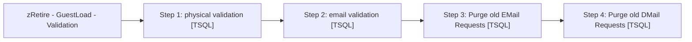

# Job: zRetire - GuestLoad - Validation

**Enabled:** No  
**Server:** papamart  
**Description:** This job verifies the guest information from the data warehouse to that in the CRM database.  

## Architecture Diagram



## Steps

### Step 1: physical validation
**Subsystem:** TSQL  

```sql
exec dbo.spGuestLoad_VLDTN_Physical_Addr
```

### Step 2: email validation
**Subsystem:** TSQL  

```sql
exec dbo.spGuestLoad_VLDTN_Email_Addr
```

### Step 3: Purge old EMail Requests
**Subsystem:** TSQL  

```sql
exec spGuestLoad_Generate_EMail_Purge_Tables
```

### Step 4: Purge old DMail Requests
**Subsystem:** TSQL  

```sql
exec spGuestLoad_Generate_DMail_Purge_Tables
```

