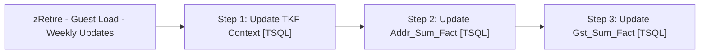

# Job: zRetire - Guest Load - Weekly Updates

**Enabled:** No  
**Server:** papamart  
**Description:** Take care of any weekly housekeeping for the Guest Load tables. This should run about an hour after NearestStoreHistoricalInsert  

## Architecture Diagram



## Steps

### Step 1: Update TKF Context
**Subsystem:** TSQL  

```sql
exec dw.dbo.spGuestLoad_Fix_TKF_CNTXT null
```

### Step 2: Update Addr_Sum_Fact
**Subsystem:** TSQL  

```sql
truncate table dw.dbo.addr_sum_fact
exec dw.dbo.spGuestLoad_Build_ADDR_SUM_FACT 1,1
```

### Step 3: Update Gst_Sum_Fact
**Subsystem:** TSQL  

```sql
truncate table dw.dbo.gst_sum_fact
exec dw.dbo.spGuestLoad_Build_GST_SUM_FACT 1,1
```

