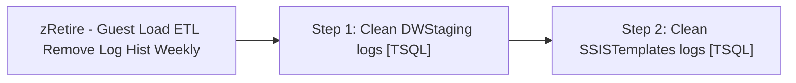

# Job: zRetire - Guest Load ETL Remove Log Hist Weekly

**Enabled:** No  
**Server:** papamart  
**Description:** Removes ETL log records older than a specified number of days. The purpose of this job is to keep the log tables growing extremely large. This job cleans tables in DWStaging and SSISTemplates.  

## Architecture Diagram



## Steps

### Step 1: Clean DWStaging logs
**Subsystem:** TSQL  

```sql
-- =====================================================================================================
-- Name: ETL Remove Log Hist Weekly
--
-- Description:	Removes ETL log records older than a specified number of days.
--				The purpose of this job is to keep the log tables growing extremely large.
--				This job cleans tables in DWStaging and SSISTemplates.
--
-- Input:	
--			@REF_DT		datetime	Reference date for determining the range of data to keep
--									The default is the current date
--			@KEEP		tinyint		Number of days data to keep
--									The default is 60 days.
-- Output: None
--
-- Dependencies: None
--
-- Revision History
--		Name:			Date:			Comments:
--		GaryD			09/17/2009		Initial version
-- =====================================================================================================
--DWStaging
DECLARE @REF_DT DATETIME, @KEEP TINYINT
--
SET @REF_DT = GETDATE()
SET @KEEP = 60

DELETE DWStaging.dbo.VLDTN_PRCS_INSTNC
WHERE DATEDIFF(d, INS_DT, @REF_DT) > @KEEP
AND DATEDIFF(d, UPDT_DT, @REF_DT) > @KEEP

DELETE DWStaging.dbo.VLDTN_PRCS_INSTNC_DTL_MISS_KEY
WHERE DATEDIFF(d, INS_DT, @REF_DT) > @KEEP
AND DATEDIFF(d, UPDT_DT, @REF_DT) > @KEEP

DELETE DWStaging.dbo.VLDTN_PRCS_INSTNC_DTL_PRCS_SPFC
WHERE DATEDIFF(d, INS_DT, @REF_DT) > @KEEP
AND DATEDIFF(d, UPDT_DT, @REF_DT) > @KEEP

DELETE DWStaging.dbo.VLDTN_PRCS_INSTNC_DTL_REC_CNT
WHERE DATEDIFF(d, INS_DT, @REF_DT) > @KEEP
AND DATEDIFF(d, UPDT_DT, @REF_DT) > @KEEP

DELETE DWStaging.dbo.VLDTN_PRCS_INSTNC_DTL_REF_INTGRTY
WHERE DATEDIFF(d, INS_DT, @REF_DT) > @KEEP
AND DATEDIFF(d, UPDT_DT, @REF_DT) > @KEEP

DELETE DWStaging.dbo.VLDTN_PRCS_INSTNC_DTL_TRN_SUM
WHERE DATEDIFF(d, INS_DT, @REF_DT) > @KEEP
AND DATEDIFF(d, UPDT_DT, @REF_DT) > @KEEP
```

### Step 2: Clean SSISTemplates logs
**Subsystem:** TSQL  

```sql
-- =====================================================================================================
-- Name: ETL Remove Log Hist Weekly
--
-- Description:	Removes ETL log records older than a specified number of days.
--				The purpose of this job is to keep the log tables growing extremely large.
--				This job cleans tables in DWStaging and SSISTemplates.
--
-- Input:	
--			@REF_DT		datetime	Reference date for determining the range of data to keep
--									The default is the current date
--			@KEEP		tinyint		Number of days data to keep
--									The default is 60 days.
-- Output: None
--
-- Dependencies: None
--
-- Revision History
--		Name:			Date:			Comments:
--		GaryD			09/17/2009		Initial version
--		GaryD			10/14/2009		Delete sysdtslog90 in batches to keep log from growing
-- =====================================================================================================
--DWStaging
DECLARE @REF_DT DATETIME, @KEEP TINYINT, @RowCnt INT, @Err INT
--
SET @REF_DT = GETDATE()
SET @KEEP = 60
SET @RowCnt = 99


--------------------SSISTemplates
DELETE c
FROM SSISTemplates.audit.CommandLog c
JOIN SSISTemplates.audit.ExecutionLog e
ON (e.LogID = c.LogID)
WHERE DATEDIFF(d, e.StartTime, @REF_DT) > @KEEP

DELETE p
FROM SSISTemplates.audit.ProcessLog p
JOIN SSISTemplates.audit.ExecutionLog e
ON (e.LogID = p.LogID)
WHERE DATEDIFF(d, e.StartTime, @REF_DT) > @KEEP

DELETE s
FROM SSISTemplates.audit.SSISLog s
JOIN SSISTemplates.audit.ExecutionLog e
ON (e.LogID = s.LogID)
WHERE DATEDIFF(d, e.StartTime, @REF_DT) > @KEEP

DELETE s
FROM SSISTemplates.audit.StatisticLog s
JOIN SSISTemplates.audit.ExecutionLog e
ON (e.LogID = s.LogID)
WHERE DATEDIFF(d, e.StartTime, @REF_DT) > @KEEP

DELETE e
FROM SSISTemplates.audit.ExecutionLog e
WHERE DATEDIFF(d, e.StartTime, @REF_DT) > @KEEP

WHILE @RowCnt > 0
BEGIN
	BEGIN TRAN

		SELECT @RowCnt = 0

		DELETE Top (10000) 
		FROM SSISTemplates.dbo.sysdtslog90
		WHERE DATEDIFF(d, endtime , @REF_DT) > @KEEP
		
		SELECT @RowCnt = @@RowCount, @Err = @@Error

	IF @Err = 0
	COMMIT TRAN
	ELSE
	BEGIN
		ROLLBACK TRAN
		BREAK
	END
	WAITFOR DELAY '00:00:05'

END
```

