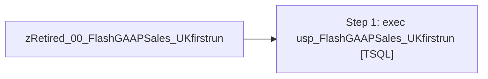

# Job: zRetired_00_FlashGAAPSales_UKfirstrun

**Enabled:** No  
**Server:** papamart  
**Description:** Executes usp_FlashGAAPSales_UKfirstrun which sends the flash gaap email to ukflashreport@buildabear.com  

## Architecture Diagram



## Steps

### Step 1: exec usp_FlashGAAPSales_UKfirstrun
**Subsystem:** TSQL  

```sql
exec usp_FlashGAAPSales_UKfirstrun
```

