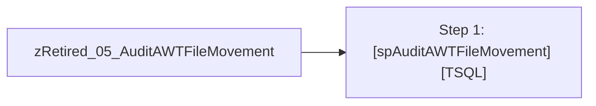

# Job: zRetired_05_AuditAWTFileMovement

**Enabled:** No  
**Server:** papamart  
**Description:** exec [spAuditAWTFileMovement]  

## Architecture Diagram



## Steps

### Step 1: [spAuditAWTFileMovement]
**Subsystem:** TSQL  

```sql
exec spAuditAWTFileMovement
```

