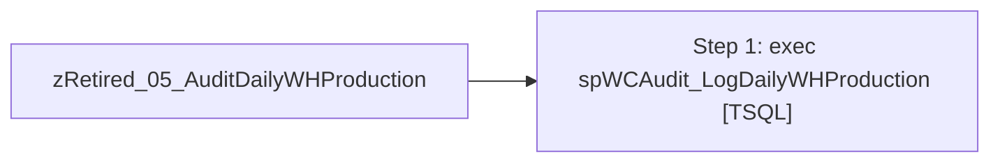

# Job: zRetired_05_AuditDailyWHProduction

**Enabled:** No  
**Server:** papamart  
**Description:** No description available.  

## Architecture Diagram



## Steps

### Step 1: exec spWCAudit_LogDailyWHProduction
**Subsystem:** TSQL  

```sql
exec spWCAudit_DailyWHProduction
```

