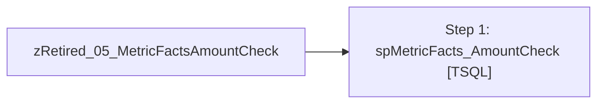

# Job: zRetired_05_MetricFactsAmountCheck

**Enabled:** No  
**Server:** papamart  
**Description:** Executes PAPAMART.DW.[dbo].[spMetricFacts_AmountCheck]<br><br> Runs two validations and sends emails if they fail.<br><br> Disabled on 12/14 by adelgado - questioning whether the underlying data that this job validates is in use. The validation takes 50 minutes to run daily.  

## Architecture Diagram



## Steps

### Step 1: spMetricFacts_AmountCheck
**Subsystem:** TSQL  

```sql
EXEC spMetricFacts_AmountCheck
```

