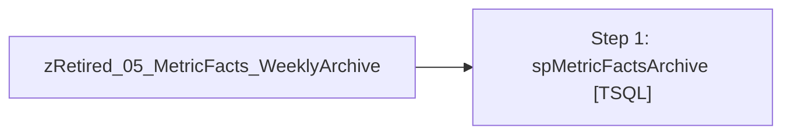

# Job: zRetired_05_MetricFacts_WeeklyArchive

**Enabled:** No  
**Server:** papamart  
**Description:** No description available.  

## Architecture Diagram



## Steps

### Step 1: spMetricFactsArchive
**Subsystem:** TSQL  

```sql
exec spMetricFactsArchive
```

