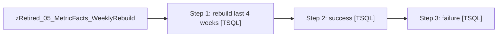

# Job: zRetired_05_MetricFacts_WeeklyRebuild

**Enabled:** No  
**Server:** papamart  
**Description:** No description available.  

## Architecture Diagram



## Steps

### Step 1: rebuild last 4 weeks
**Subsystem:** TSQL  

```sql
DECLARE @RC int
DECLARE @StartDate datetime
DECLARE @EndDate datetime
DECLARE @bDebugFl bit
-- Set parameter values
SET @StartDate = dateadd(dd, -28, getdate())
SET @EndDate = getdate()

EXEC @RC = dw.dbo.spMetricsBuild @StartDate, @EndDate, @bDebugFl
```

### Step 2: success
**Subsystem:** TSQL  

```sql
exec msdb.dbo.sp_send_dbmail  @recipients='databears@buildabear.com', @subject='success spMetricsBuild Weekly'
```

### Step 3: failure
**Subsystem:** TSQL  

```sql
exec msdb.dbo.sp_send_dbmail @recipients='databears@buildabear.com', @subject='failed spMetricsBuild Weekly'
```

