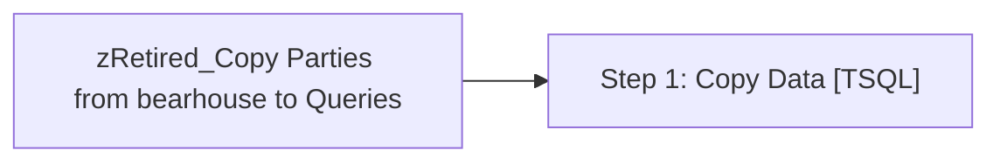

# Job: zRetired_Copy Parties from bearhouse to Queries

**Enabled:** No  
**Server:** papamart  
**Description:** Copy the PartyBookings from Bearhouse over to the Queries database for Brian Popp.  

## Architecture Diagram



## Steps

### Step 1: Copy Data
**Subsystem:** TSQL  

```sql
TRUNCATE TABLE queries.dbo.PartyBookings


INSERT INTO queries.dbo.PartyBookings
	(	iEventID,
		sCountry,
		iParentStore,
		created_merch_year,
		created_merch_period,
		created_merch_week,
		execute_merch_year,
		execute_merch_period,
		execute_merch_week,
		party_time,
		sparamval,
		sparamabbr,
		soccasion,
		iCreatedByEmpID,
		booking_source,
		guest_count,
		dollar_allowance_per_guest)

	SELECT
		iEventID,
		sCountry,
		iParentStore,
		created_merch_year,
		created_merch_period,
		created_merch_week,
		execute_merch_year,
		execute_merch_period,
		execute_merch_week,
		party_time,
		sparamval,
		sparamabbr,
		soccasion,
		0 as iCreatedByEmpID,
		booking_source,
		guest_count,
		dollar_allowance_per_guest
	FROM
		KODIAK.BearHouse.dbo.tmp_edin_party_counts_detail x WITH (NOLOCK)
```

