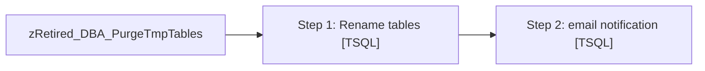

# Job: zRetired_DBA_PurgeTmpTables

**Enabled:** No  
**Server:** papamart  
**Description:** Looks for tmp prefixed tables that are older than a specified number of days and renames those tables. After a specified number of days, the renamed tables are dropped.  

## Architecture Diagram



## Steps

### Step 1: Rename tables
**Subsystem:** TSQL  

```sql
exec spDBA_PurgeTmpTables @Databases = 'dw, queries', @DaysBack = 6, @GracePeriod = 45
```

### Step 2: email notification
**Subsystem:** TSQL  

```sql
exec DBAUtility.dbo.spDBA_SendEmail @recipients = 'Databears@buildabear.com', @subject = 'INFORMATIONAL: Job failure: Temp table purge on papamart', @MessageTxt = 'The SQL backup job DBA_PurgeTmpTables had an error.  Check the job history for more information'
```

