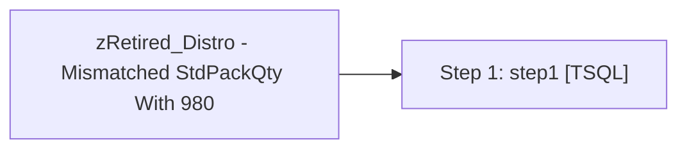

# Job: zRetired_Distro - Mismatched StdPackQty With 980

**Enabled:** No  
**Server:** papamart  
**Description:** No description available.  

## Architecture Diagram



## Steps

### Step 1: step1
**Subsystem:** TSQL  

```sql
exec spDistro_MismatchedStdPackQtyWith980
```

