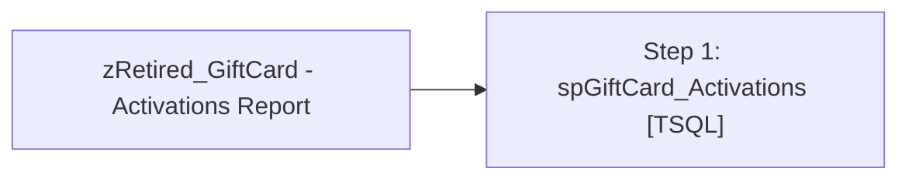

# Job: zRetired_GiftCard - Activations Report

**Enabled:** No  
**Server:** papamart  
**Description:** Execute package: GiftCard_Report  

## Architecture Diagram



## Steps

### Step 1: spGiftCard_Activations
**Subsystem:** TSQL  

```sql
EXEC dw.dbo.spGiftCard_Activations
```

