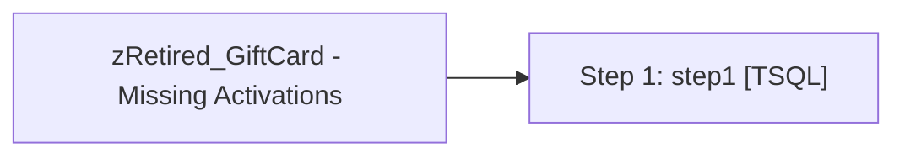

# Job: zRetired_GiftCard - Missing Activations

**Enabled:** No  
**Server:** papamart  
**Description:** No description available.  

## Architecture Diagram



## Steps

### Step 1: step1
**Subsystem:** TSQL  

```sql
exec spGiftCardMissingActivations
```

