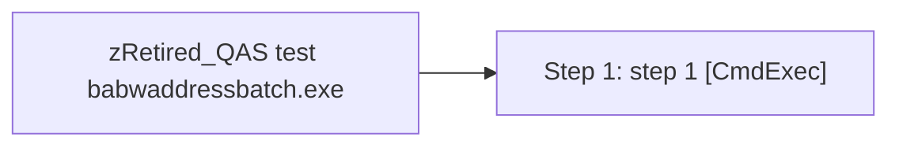

# Job: zRetired_QAS test babwaddressbatch.exe

**Enabled:** No  
**Server:** papamart  
**Description:** No description available.  

## Architecture Diagram



## Steps

### Step 1: step 1
**Subsystem:** CmdExec  

```sql
"c:\run_batch.bat"
```

