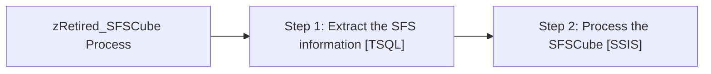

# Job: zRetired_SFSCube Process

**Enabled:** No  
**Server:** papamart  
**Description:** This job will extract the SFSCube information from dw and construct the cube HAVE BLOCKED OUT THE CUBE BUILD PROCESS.  

## Architecture Diagram



## Steps

### Step 1: Extract the SFS information
**Subsystem:** TSQL  

```sql
exec spSFSCube_Populate_Data
```

### Step 2: Process the SFSCube
**Subsystem:** SSIS  

```sql
/FILE "\\papamart\c$\Projects\BuildABear\SFSCube\Sync SFSCube Partitions.dtsx" /CHECKPOINTING OFF /REPORTING E
```

