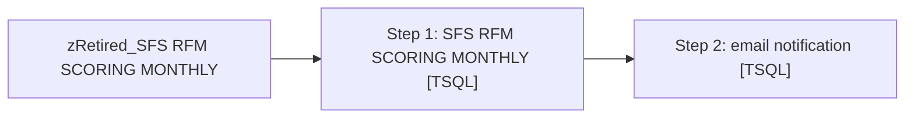

# Job: zRetired_SFS RFM SCORING MONTHLY

**Enabled:** No  
**Server:** papamart  
**Description:** No description available.  

## Architecture Diagram



## Steps

### Step 1: SFS RFM SCORING MONTHLY
**Subsystem:** TSQL  

```sql
exec dbo.Spsfs_rfmscoring
```

### Step 2: email notification
**Subsystem:** TSQL  

```sql
exec DBAUtility.dbo.spDBA_SendEmail @recipients = 'Databears@buildabear.com', @subject = 'INFORMATIONAL: Job failure on papamart', @MessageTxt = 'The SQL backup job ( SFS RFM SCORING MONTHLY ) had an error.  Check the job history for more information'
```

