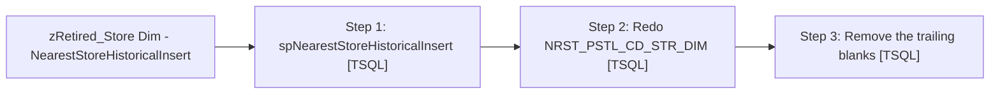

# Job: zRetired_Store Dim - NearestStoreHistoricalInsert

**Enabled:** No  
**Server:** papamart  
**Description:** No description available.  

## Architecture Diagram



## Steps

### Step 1: spNearestStoreHistoricalInsert
**Subsystem:** TSQL  

```sql
exec spNearestStoreHistoricalInsert
```

### Step 2: Redo NRST_PSTL_CD_STR_DIM
**Subsystem:** TSQL  

```sql
exec dw.dbo.spGuestLoad_Insert_NRST_PSTL_CD_STR_DIM
```

### Step 3: Remove the trailing blanks
**Subsystem:** TSQL  

```sql
UPDATE NRST_PSTL_CD_STR_DIM
       SET PSTL_CD = LTRIM(RTRIM(PSTL_CD))
WHERE
       RIGHT(PSTL_CD, 1) = ' '
```

