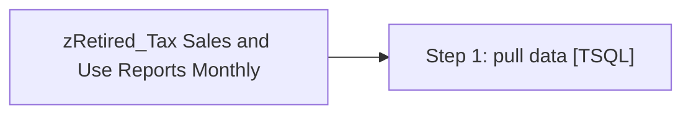

# Job: zRetired_Tax Sales and Use Reports Monthly

**Enabled:** No  
**Server:** papamart  
**Description:** Pulls sales and use tax data along with tax exempt certificate information. Pull takes place 3 days after fiscal month close.  

## Architecture Diagram



## Steps

### Step 1: pull data
**Subsystem:** TSQL  

```sql
exec spTax_Report_Master @recipients = 'JackM@buildabear.com; DanV@buildabear.com', @copy_recipients = 'edinp@buildabear.com'
```

