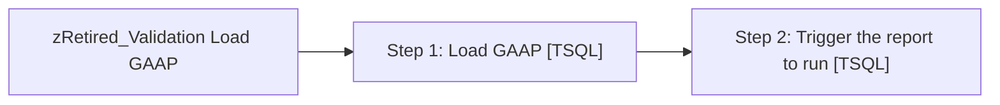

# Job: zRetired_Validation Load GAAP

**Enabled:** No  
**Server:** papamart  
**Description:** Load source and destination GAAP data for use by validation reports. The intent is to run this process during off hours to minimize the impact on other processes. Then trigger the Validation Report to run.  

## Architecture Diagram



## Steps

### Step 1: Load GAAP
**Subsystem:** TSQL  

```sql
DECLARE @StartDate	DATETIME
DECLARE @EndDate	DATETIME


SET @EndDate = CONVERT(VARCHAR(25), GETDATE(), 101)
--SET @StartDate = CONVERT(VARCHAR(25),DATEADD(dd,-(DAY(DATEADD(mm,1,@EndDate))-1),DATEADD(mm,-1,@EndDate)),101) --set startdate using months back parameter
SET @StartDate = CONVERT(VARCHAR(25), DATEADD(day, -30, @EndDate), 101) --set startdate rolling 30 days

EXEC spValidation_GAAPRptData  @StartDate, 	@EndDate
```

### Step 2: Trigger the report to run
**Subsystem:** TSQL  

```sql
EXEC [stl-sql-p-04\sql2008r2].msdb.dbo.sp_start_job @job_name = '94CEEFBC-F5C3-47C2-A10B-5DEFDF7B3361'
```

