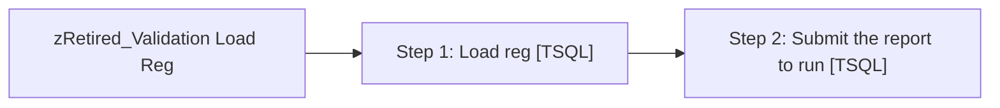

# Job: zRetired_Validation Load Reg

**Enabled:** No  
**Server:** papamart  
**Description:** Load source and destination kiosk data for use by validation reports. The intent is to run this process during off hours to minimize the impact on other processes. Then trigger the report to run.  

## Architecture Diagram



## Steps

### Step 1: Load reg
**Subsystem:** TSQL  

```sql
DECLARE @StartDate	DATETIME
DECLARE @EndDate	DATETIME


SET @EndDate = CONVERT(VARCHAR(25), GETDATE(), 101)
SET @StartDate = CONVERT(VARCHAR(25),DATEADD(dd,-(DAY(DATEADD(mm,1,@EndDate))-1),DATEADD(mm,-1,@EndDate)),101) --set startdate using months back parameter

EXEC spValidation_KskAllStores  @StartDate, 	@EndDate
```

### Step 2: Submit the report to run
**Subsystem:** TSQL  

```sql
EXEC [stl-sql-p-04\sql2008r2].msdb.dbo.sp_start_job @job_name = '0B3942B6-DFEA-428E-B48B-26C6CCDFABA1'
```

