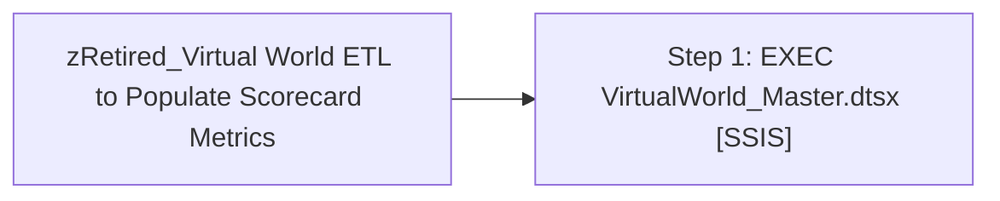

# Job: zRetired_Virtual World ETL to Populate Scorecard Metrics

**Enabled:** No  
**Server:** papamart  
**Description:** Run SSIS package Virtual World ETL to Populate Scorecard Metrics  

## Architecture Diagram



## Steps

### Step 1: EXEC VirtualWorld_Master.dtsx
**Subsystem:** SSIS  

```sql
/FILE "\"\\kermode\FileRepository\Projects\BuildABear\BABW Virtual Worlds\VirtualWorld_Master.dtsx\"" /MAXCONCURRENT " -1 " /CHECKPOINTING OFF /REPORTING E
```

