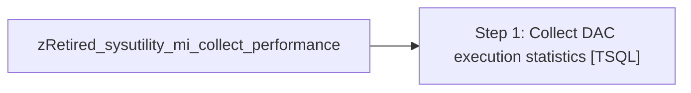

# Job: zRetired_sysutility_mi_collect_performance

**Enabled:** No  
**Server:** papamart  
**Description:** Collect performance information  

## Architecture Diagram



## Steps

### Step 1: Collect DAC execution statistics
**Subsystem:** TSQL  

```sql
EXEC [msdb].[dbo].[sp_sysutility_mi_collect_dac_execution_statistics_internal]
```

