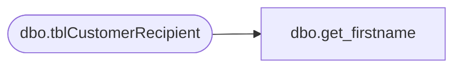

# dbo.get_firstname

**Database:** DBAUtility  
**Server:** papamart  

## Architecture Diagram



## Table Dependencies

| Referenced Table |
|---|
| dbo.tblCustomerRecipient |

## Stored Procedure Code

```sql
CREATE procedure get_firstname
as

declare @title varchar(100)
declare @string varchar(100)
declare @length int

declare title_cursor cursor for
select sRAnimalName
from babw.dbo.tblCustomerRecipient
--order by title_id

open title_cursor
fetch next from title_cursor into @title

set @length = 0

while @@fetch_status = 0
begin
set @length = charindex(' ',@title,1)
select @string = left(@title,@length)
print @string

fetch next from title_cursor into @title
end

close title_cursor
deallocate title_cursor
```

