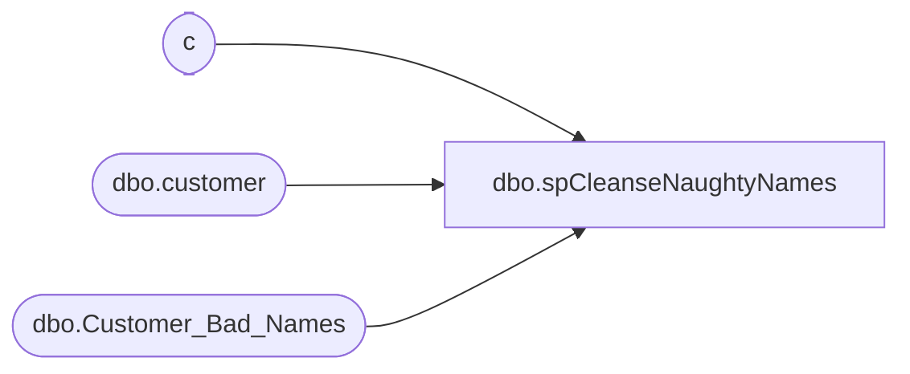

# dbo.spCleanseNaughtyNames

**Database:** DBAUtility  
**Server:** papamart  

## Architecture Diagram



## Table Dependencies

| Referenced Table |
|---|
| c |
| dbo.customer |
| dbo.Customer_Bad_Names |

## Stored Procedure Code

```sql
CREATE PROCEDURE [dbo].[spCleanseNaughtyNames] AS
-- =============================================================================================================
-- Name: spCleanseNaughtyNames
--
-- Description:	
--
-- Input:	N/A
--
-- Output: N/A
--
-- Dependencies: 
--
-- Revision History
--		Name:			Date:			Comments:
--		Gary Derikito	05/19/2008		Modify to point to new crm database.
-- =============================================================================================================


Update c
Set c.first_name=null,c.last_name=null
--from mw.dbo.customer c
from crm.dbo.customer c
INNER JOIN DBAUtility.dbo.Customer_Bad_Names b
on upper(c.last_name)=upper(b.bad_name) collate  Latin1_General_BIN


Update c
Set c.first_name=null,c.last_name=null
--from mw.dbo.customer c
from crm.dbo.customer c
INNER JOIN DBAUtility.dbo.Customer_Bad_Names b
on upper(c.first_name)=upper(b.bad_name) collate  Latin1_General_BIN
```

