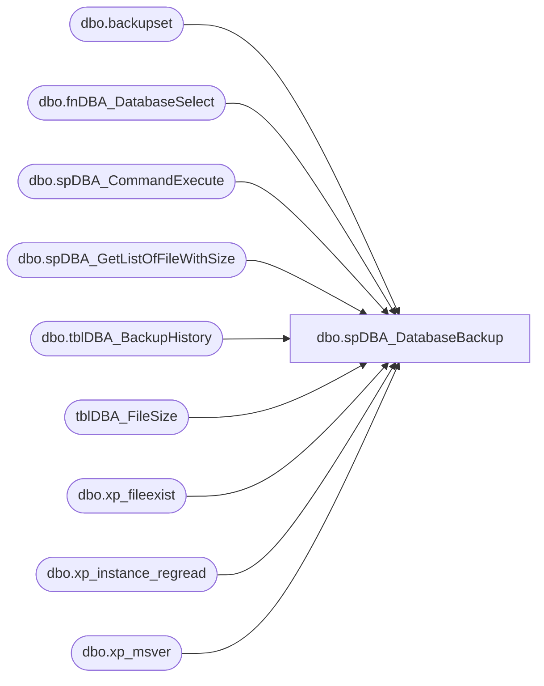

# dbo.spDBA_DatabaseBackup

**Database:** DBAUtility  
**Server:** papamart  

## Architecture Diagram



## Table Dependencies

| Referenced Table |
|---|
| dbo.backupset |
| dbo.fnDBA_DatabaseSelect |
| dbo.spDBA_CommandExecute |
| dbo.spDBA_GetListOfFileWithSize |
| dbo.tblDBA_BackupHistory |
| tblDBA_FileSize |
| dbo.xp_fileexist |
| dbo.xp_instance_regread |
| dbo.xp_msver |

## Stored Procedure Code

```sql
CREATE PROCEDURE [dbo].[spDBA_DatabaseBackup]
	@Databases nvarchar(max),
	@Directory nvarchar(max) = NULL,
	@BackupType nvarchar(max) = 'FULL',
	@Verify nvarchar(max) = 'N',
	@CleanupTime int = NULL,
	@Compress nvarchar(max) = NULL,
	@CopyOnly nvarchar(max) = 'N',
	@ChangeBackupType nvarchar(max) = 'N',
	@BackupSoftware nvarchar(max) = NULL,
	@CheckSum nvarchar(max) = 'N',
	@BlockSize int = NULL,
	@BufferCount int = NULL,
	@MaxTransferSize int = NULL,
	@NumberOfFiles int = -1,
	@CompressionLevel int = NULL,
	@Description nvarchar(max) = NULL,
	@Threads int = NULL,
	@Throttle int = NULL,
	@Encrypt nvarchar(max) = 'N',
	@EncryptionType nvarchar(max) = NULL,
	@EncryptionKey nvarchar(max) = NULL,
	@LogToTable nvarchar(max) = 'N',
	@Execute nvarchar(max) = 'Y',
	@SecondaryDirectory nvarchar(max) = NULL
AS

-- =============================================================================================================
-- Name: spDBA_DatabaseBackup
--
-- Description:	Performs backups, verification, and delete old files.
--  Works on the Standard, Enterprise, Workgroup, Express, 
--  and Developer Editions of SQL Server 2008 and SQL Server 2005 SP2 running (does not work with SQL 2005 RTM)
--  on X86, X64, or IA64 platforms. The solution is supported on the same OSs 
--  that SQL Server supports. 
-- Output: Optional error logging.
--	@Databases:
--		'ReturnVersion' = Does not do backup, just returns revision of backup script
--		'USER_DATABASES'  = all user databases
--		'SYSTEM_ DATABASES' = all system databases
--		'USER_DATABASES, -Database1, -Database2' = execlude Database1 and Database2.
--		The hyphen (-) character is used to exclude databases, and the percent (%) character is used for wildcard selection. 
--		All of these operations can be combined by using the comma (,) character.
--	@Directory = backup root directory, If no directory is specified, then the SQL Server default backup directory is used.
--		DatabaseBackup creates a directory structure with instance name, database name and backup type under the backup root directory.
--	@BackupType = Full, Diff, or Log
--		FULL = Full backup 
--		DIFF = Differential backup 
--		LOG = Transaction log backup 
--	@Verify  = Y or N for whether the backup should be verified.
--	@CleanupTime  = Specify the time, in hours, after which the backup files are deleted. If no time is specified, then no backup files are deleted.
--	@Compress = Compress the backup. If no value is specified, then the backup compression default in sys.configurations is used.
--	@CopyOnly Perform a copy-only backup.
--		Y = Perform a copy-only backup. 
--		N = Perform a normal backup. This is the default. 
--	@ChangeBackupType = Change the backup type if a differential or transaction-log backup cannot be performed.
--	@BackupSoftware - Specify third-party backup software; otherwise, SQL Server native backup is performed.
--		NULL SQL Server native backup. This is the default. 
--		HYPERBAC = Red Gate SQL HyperBac 
--		LITESPEED = Quest LiteSpeed for SQL Server 
--		SQLBACKUP = Red Gate SQL Backup 
--		SQLSAFE = Idera SQL safe backup
--	@CheckSum Enable backup checksumss uses the CHECKSUM option in the SQL Server BACKUP command.
--		Y Enable backup checksums. 
--		N Do not enable backup checksums. This is the default. 
--	@BlockSize Specify the physical blocksize in bytes, uses the BLOCKSIZE option in the SQL Server BACKUP command.
--	@BufferCount Specify the number of I/O buffers to be used for the backup operation, uses the BUFFERCOUNT option in the SQL Server BACKUP command.
--	@MaxTransferSize Specify the largest unit of transfer, in bytes, to be used between SQL Server and the backup media, uses the MAXTRANSFERSIZE option in the SQL Server BACKUP command.
--	@NumberOfFiles Specify the number of backup files. The default is one file and the maximum is 64 files. 
--		-1 = Automatic, if the used size of the database is greater than 3 gig (roughly takes a 1 hour to backup 3 gig on Slow server)
--	@CompressionLevel Set the Quest LiteSpeed for SQL Server, Red Gate SQL Backup, or Idera SQL safe backup compression level.
--		In Quest LiteSpeed for SQL Server the compression levels 0 to 10 are supported, in Red Gate SQL Backup 0 to 4 and in Idera SQL safe backup 1 to 4.
--	@Description Enter a description for the backup. uses the DESCRIPTION option in the SQL Server BACKUP command.
--	@Threads Specify the Quest LiteSpeed for SQL Server, Red Gate SQL Backup, or Idera SQL safe backup number of threads. The maximum number of threads is 32.
--	@Throttle Specify the Quest LiteSpeed for SQL Server maximum CPU usage, as a percentage.
--	@Encrypt Encrypt the backup.
--		Y Encrypt the backup. 
--		N Do not encrypt the backup. This is the default. 
--	@EncryptionType Specify the type of encryption.
--		NULL No encryption. This is the default. 
--		RC2-40 RC2 40-bit encryption (Quest LiteSpeed for SQL Server). 
--		RC2-56 RC2 56-bit encryption (Quest LiteSpeed for SQL Server). 
--		RC2-112 RC2 112-bit encryption (Quest LiteSpeed for SQL Server). 
--		RC2-128 RC2 128-bit encryption (Quest LiteSpeed for SQL Server). 
--		3DES-168 3DES 168-bit encryption (Quest LiteSpeed for SQL Server). 
--		RC4-128 RC4 128-bit encryption (Quest LiteSpeed for SQL Server). 
--		AES-128 AES 128-bit encryption (Quest LiteSpeed for SQL Server, Red Gate SQL Backup, or Idera SQL safe backup). 
--		AES-192 AES 192-bit encryption (Quest LiteSpeed for SQL Server). 
--		AES-256 AES 256-bit encryption (Quest LiteSpeed for SQL Server, Red Gate SQL Backup, or Idera SQL safe backup). 
--	@EncryptionKey Enter the key that is used to encrypt the backup.
--	@LogToTable Log commands to the table DBAUtility.dbo.tblDBA_CommandLog & DBAUtility.dbo.tblDBA_BackupHistory
--		Y Log commands to the table. This is the default. 
--		N Do not log commands to the table. 
--	@Execute Execute commands. By default, the commands are executed normally. If this parameter is set to N, the commands are printed only.
--		Y Execute commands. This is the default. 
--		N Only print commands. 


-- Available actions:
--	
-- Dependencies: 
--	spDBA_CommandExecute
--	fnDBA_DatabaseSelect
--	spDBA_GetListOfFileWithSize
--	DBAUtility.dbo.tblDBA_CommandLog
--	DBAUtility.dbo.tblDBA_BackupHistory
--
----------------------------------------------------------------------------------------------------
--// Original Source: http://ola.hallengren.com                                                          //--
----------------------------------------------------------------------------------------------------
--
-- Revision History
--		Name:			Date:			Comments:
--		Mike Pelikan	02/10/2012		Created based on SQL Server Backup Script from  http://ola.hallengren.com  
--										Modified to store backup information into central repository database
--										Added Functionality to save to local harddrive, then copy to secondary location
--		Mike Pelikan	02/17/2012		Added backup file size to repository database
--										Added automated file split			
--		Mike Pelikan	03/07/2012		Corrected sub directory creation , put primary first, then secondary directory
--										Added logic to return version date of backup script if @Databases = 'ReturnVersion'
--										Added logic to remove SIMPLE databases from LOG backups
--		Mike Pelikan	04/09/2012		Added spDBA_GetListOfFileWithSize to list of dependencies
--		Mike Pelikan	05/14/2012		Capalitized COREDB01_MAINT connection to work with Case Sensitive Servers
--		Mike Pelikan	05/24/2012		Updated for modified spDBA_GetListOfFileWithSize
--		Mike Pelikan	05/29/2012		Corrected some COLLATE issues
--		Mike Pelikan	06/07/2012		Added Robocopy logic
--		Mike Pelikan	06/11/2012		Changed Default of Number of Files to auto
--		Mike Pelikan	06/13/2012		Changed repository to local collection table
--		Mike Pelikan	01/02/2013		Added @intMaxNumberOfFiles variable to limit max streams for all backups
--		Mike Pelikan	11/18/2014		Corrected Update of Backup Repository

DECLARE @Revision DATETIME
SET @Revision = '11/18/2014'

----------------------------------------------------------------------------------------------------
--Testing Variable Declaration/Seting:
--DECLARE 	@Databases nvarchar(max),
--	@Directory nvarchar(max),
--	@BackupType nvarchar(max),
--	@Verify nvarchar(max),
--	@CleanupTime int,
--	@Compress nvarchar(max),
--	@CopyOnly nvarchar(max),
--	@ChangeBackupType nvarchar(max),
--	@BackupSoftware nvarchar(max),
--	@CheckSum nvarchar(max),
--	@BlockSize int,
--	@BufferCount int,
--	@MaxTransferSize int,
--	@NumberOfFiles int,
--	@CompressionLevel int,
--	@Description nvarchar(max),
--	@Threads int,
--	@Throttle int,
--	@Encrypt nvarchar(max),
--	@EncryptionType nvarchar(max),
--	@EncryptionKey nvarchar(max),
--	@LogToTable nvarchar(max),
--	@Execute nvarchar(max),
--	@SecondaryDirectory nvarchar(max)

--SELECT 
--	@Directory  = NULL,
--	@BackupType = 'FULL',
--	@Verify = 'N',
--	@CleanupTime = NULL,
--	@Compress = NULL,
--	@CopyOnly  = 'N',
--	@ChangeBackupType = 'N',
--	@BackupSoftware = NULL,
--	@CheckSum = 'N',
--	@BlockSize = NULL,
--	@BufferCount = NULL,
--	@MaxTransferSize = NULL,
--	@NumberOfFiles = 1,
--	@CompressionLevel = NULL,
--	@Description  = NULL,
--	@Threads = NULL,
--	@Throttle  = NULL,
--	@Encrypt = 'N',
--	@EncryptionType = NULL,
--	@EncryptionKey = NULL,
--	@LogToTable  = 'N',
--	@Execute = 'Y',
--	@SecondaryDirectory = NULL

--SELECT 
--@Databases = 'DBAUtility', 
--@Directory = 'C:\mssql\backup',
--@BackupType = 'FULL',
--@Verify = 'N',
--@CleanupTime = 24,
--@CheckSum = 'Y', 
--@LogToTable = 'Y',
--@Execute = 'Y' --,
--@SecondaryDirectory = '\\10.0.0.188\backup\stl\SQL'
-----------------------------------------------------------------------------------------------------
BEGIN
	SET NOCOUNT ON

	DECLARE @StartMessage nvarchar(max)
	DECLARE @EndMessage nvarchar(max)
	DECLARE @DatabaseMessage nvarchar(max)
	DECLARE @ErrorMessage nvarchar(max)

	DECLARE @Version numeric(18,10)

	DECLARE @DefaultDirectory nvarchar(4000)
	DECLARE @CheckDirectory nvarchar(4000)

	DECLARE @CurrentID int
	DECLARE @CurrentDatabaseID int
	DECLARE @CurrentDatabaseName nvarchar(max)
	DECLARE @CurrentBackupType nvarchar(max)
	DECLARE @CurrentFileExtension nvarchar(max)
	DECLARE @CurrentFileNumber int
	DECLARE @CurrentDifferentialLSN numeric(25,0)
	DECLARE @CurrentLogLSN numeric(25,0)
	DECLARE @CurrentLatestBackup datetime
	DECLARE @CurrentDatabaseNameFS nvarchar(max)
	DECLARE @CurrentDirectory nvarchar(max)
	DECLARE @CurrentSecondaryDirectory varchar(max)
	DECLARE @CurrentFilePath nvarchar(max)
	DECLARE @CurrentDate datetime
	DECLARE @CurrentCleanupDate datetime
	DECLARE @CurrentIsDatabaseAccessible bit
	DECLARE @CurrentMirroringRole nvarchar(max)

	DECLARE @CurrentCommand01 nvarchar(max)
	DECLARE @CurrentCommand02 nvarchar(max)
	DECLARE @CurrentCommand03 nvarchar(max)
	DECLARE @CurrentCommand04 nvarchar(max)
	DECLARE @CurrentCommand05 nvarchar(max)

	DECLARE @CurrentCommandOutput01 int
	DECLARE @CurrentCommandOutput02 int
	DECLARE @CurrentCommandOutput03 int
	DECLARE @CurrentCommandOutput04 int
	DECLARE @CurrentCommandOutput05 int

	DECLARE @CurrentCommandType01 nvarchar(max)
	DECLARE @CurrentCommandType02 nvarchar(max)
	DECLARE @CurrentCommandType03 nvarchar(max)
	DECLARE @CurrentCommandType04 nvarchar(max)
	DECLARE @CurrentCommandType05 nvarchar(max)

	DECLARE @RepositoryID INT

	DECLARE @DirectoryInfo TABLE (FileExists bit,
								FileIsADirectory bit,
								ParentDirectoryExists bit)

	DECLARE @tmpDatabases TABLE (ID int IDENTITY PRIMARY KEY,
							   DatabaseName nvarchar(max),
							   Completed bit, UsedSpaceGB DECIMAL(15,4))

	DECLARE @CurrentFiles TABLE (CurrentFilePath nvarchar(max))

	DECLARE @WorkingDirectory VARCHAR(MAX)
	DECLARE @WorkingNumberOfFiles INT
	DECLARE @intFileSizeCutOff INT
	DECLARE @intMaxNumberOfFiles INT

	DECLARE @Error int
	DECLARE @ReturnCode int

	SET @Error = 0
	SET @ReturnCode = 0
	SET @intFileSizeCutOff = 3		--Currently set to 3 gigs, if a file is bigger than 3 gig, cut the backup into multple pieces
	SET @Version = CAST(LEFT(CAST(SERVERPROPERTY('ProductVersion') AS nvarchar(max)),CHARINDEX('.',CAST(SERVERPROPERTY('ProductVersion') AS nvarchar(max))) - 1) + '.' + REPLACE(RIGHT(CAST(SERVERPROPERTY('ProductVersion') AS nvarchar(max)), LEN(CAST(SERVERPROPERTY('ProductVersion') AS nvarchar(max))) - CHARINDEX('.',CAST(SERVERPROPERTY('ProductVersion') AS nvarchar(max)))),'.','') AS numeric(18,10))

	--This limits the number of file streams that can be written.
	SET @intMaxNumberOfFiles = 10

	SET @CurrentCommandOutput01 = 0
	SET @CurrentCommandOutput02 = 0
	SET @CurrentCommandOutput03 = 0
	SET @CurrentCommandOutput04 = 0
	SET @CurrentCommandOutput05 = 0

	----------------------------------------------------------------------------------------------------
	--// Revision Return		                                                                    //--
	----------------------------------------------------------------------------------------------------
	IF @Databases = 'ReturnVersion' GOTO Logging
	
	----------------------------------------------------------------------------------------------------
	--// Log initial information                                                                    //--
	----------------------------------------------------------------------------------------------------

	SET @StartMessage = 'DateTime: ' + CONVERT(nvarchar,GETDATE(),120) + CHAR(13) + CHAR(10)
	SET @StartMessage = @StartMessage + 'Server: ' + CAST(SERVERPROPERTY('ServerName') AS nvarchar) + CHAR(13) + CHAR(10)
	SET @StartMessage = @StartMessage + 'Version: ' + CAST(SERVERPROPERTY('ProductVersion') AS nvarchar) + CHAR(13) + CHAR(10)
	SET @StartMessage = @StartMessage + 'Edition: ' + CAST(SERVERPROPERTY('Edition') AS nvarchar) + CHAR(13) + CHAR(10)
	SET @StartMessage = @StartMessage + 'Procedure: ' + QUOTENAME(DB_NAME(DB_ID())) + '.' + (SELECT QUOTENAME(schemas.name) FROM sys.schemas schemas INNER JOIN sys.objects objects ON schemas.[schema_id] = objects.[schema_id] WHERE [object_id] = @@PROCID) + '.' + QUOTENAME(OBJECT_NAME(@@PROCID)) + CHAR(13) + CHAR(10)
	SET @StartMessage = @StartMessage + 'Parameters: @Databases = ' + ISNULL('''' + REPLACE(@Databases,'''','''''') + '''','NULL')
	SET @StartMessage = @StartMessage + ', @Directory = ' + ISNULL('''' + REPLACE(@Directory,'''','''''') + '''','NULL')
	SET @StartMessage = @StartMessage + ', @BackupType = ' + ISNULL('''' + REPLACE(@BackupType,'''','''''') + '''','NULL')
	SET @StartMessage = @StartMessage + ', @Verify = ' + ISNULL('''' + REPLACE(@Verify,'''','''''') + '''','NULL')
	SET @StartMessage = @StartMessage + ', @CleanupTime = ' + ISNULL(CAST(@CleanupTime AS nvarchar),'NULL')
	SET @StartMessage = @StartMessage + ', @Compress = ' + ISNULL('''' + REPLACE(@Compress,'''','''''') + '''','NULL')
	SET @StartMessage = @StartMessage + ', @CopyOnly = ' + ISNULL('''' + REPLACE(@CopyOnly,'''','''''') + '''','NULL')
	SET @StartMessage = @StartMessage + ', @ChangeBackupType = ' + ISNULL('''' + REPLACE(@ChangeBackupType,'''','''''') + '''','NULL')
	SET @StartMessage = @StartMessage + ', @BackupSoftware = ' + ISNULL('''' + REPLACE(@BackupSoftware,'''','''''') + '''','NULL')
	SET @StartMessage = @StartMessage + ', @CheckSum = ' + ISNULL('''' + REPLACE(@CheckSum,'''','''''') + '''','NULL')
	SET @StartMessage = @StartMessage + ', @BlockSize = ' + ISNULL(CAST(@BlockSize AS nvarchar),'NULL')
	SET @StartMessage = @StartMessage + ', @BufferCount = ' + ISNULL(CAST(@BufferCount AS nvarchar),'NULL')
	SET @StartMessage = @StartMessage + ', @MaxTransferSize = ' + ISNULL(CAST(@MaxTransferSize AS nvarchar),'NULL')
	SET @StartMessage = @StartMessage + ', @NumberOfFiles = ' + ISNULL(CAST(@NumberOfFiles AS nvarchar),'NULL')
	SET @StartMessage = @StartMessage + ', @CompressionLevel = ' + ISNULL(CAST(@CompressionLevel AS nvarchar),'NULL')
	SET @StartMessage = @StartMessage + ', @Description = ' + ISNULL('''' + REPLACE(@Description,'''','''''') + '''','NULL')
	SET @StartMessage = @StartMessage + ', @Threads = ' + ISNULL(CAST(@Threads AS nvarchar),'NULL')
	SET @StartMessage = @StartMessage + ', @Throttle = ' + ISNULL(CAST(@Throttle AS nvarchar),'NULL')
	SET @StartMessage = @StartMessage + ', @Encrypt = ' + ISNULL('''' + REPLACE(@Encrypt,'''','''''') + '''','NULL')
	SET @StartMessage = @StartMessage + ', @EncryptionType = ' + ISNULL('''' + REPLACE(@EncryptionType,'''','''''') + '''','NULL')
	SET @StartMessage = @StartMessage + ', @EncryptionKey = ' + ISNULL('''' + REPLACE(@EncryptionKey,'''','''''') + '''','NULL')
	SET @StartMessage = @StartMessage + ', @LogToTable = ' + ISNULL('''' + REPLACE(@LogToTable,'''','''''') + '''','NULL')
	SET @StartMessage = @StartMessage + ', @Execute = ' + ISNULL('''' + REPLACE(@Execute,'''','''''') + '''','NULL') + CHAR(13) + CHAR(10)
	SET @StartMessage = @StartMessage + 'Source: http://ola.hallengren.com' + CHAR(13) + CHAR(10) + ' '
	SET @StartMessage = REPLACE(@StartMessage,'%','%%')
	RAISERROR(@StartMessage,10,1) WITH NOWAIT

	----------------------------------------------------------------------------------------------------
	--// Check core requirements                                                                    //--
	----------------------------------------------------------------------------------------------------

	IF SERVERPROPERTY('EngineEdition') = 5
	BEGIN
		SET @ErrorMessage = 'SQL Azure is not supported.' + CHAR(13) + CHAR(10) + ' '
		RAISERROR(@ErrorMessage,16,1) WITH NOWAIT
		SET @Error = @@ERROR
	END

	IF @Error <> 0
	BEGIN
		SET @ReturnCode = @Error
		GOTO Logging
	END

	IF NOT EXISTS (SELECT * FROM sys.objects objects INNER JOIN sys.schemas schemas ON objects.[schema_id] = schemas.[schema_id] WHERE objects.[type] = 'P' AND schemas.[name] = 'dbo' AND objects.[name] = 'spDBA_CommandExecute')
	BEGIN
		SET @ErrorMessage = 'The stored procedure spDBA_CommandExecute is missing. Download http://ola.hallengren.com/scripts/CommandExecute.sql.' + CHAR(13) + CHAR(10) + ' '
		RAISERROR(@ErrorMessage,16,1) WITH NOWAIT
		SET @Error = @@ERROR
	END

	IF EXISTS (SELECT * FROM sys.objects objects INNER JOIN sys.schemas schemas ON objects.[schema_id] = schemas.[schema_id] WHERE objects.[type] = 'P' AND schemas.[name] = 'dbo' AND objects.[name] = 'spDBA_CommandExecute' AND OBJECT_DEFINITION(objects.[object_id]) NOT LIKE '%@LogToTable%')
	BEGIN
		SET @ErrorMessage = 'The stored procedure spDBA_CommandExecute needs to be updated. Download http://ola.hallengren.com/scripts/CommandExecute.sql.' + CHAR(13) + CHAR(10) + ' '
		RAISERROR(@ErrorMessage,16,1) WITH NOWAIT
		SET @Error = @@ERROR
	END

	IF NOT EXISTS (SELECT * FROM sys.objects objects INNER JOIN sys.schemas schemas ON objects.[schema_id] = schemas.[schema_id] WHERE objects.[type] = 'TF' AND schemas.[name] = 'dbo' AND objects.[name] = 'fnDBA_DatabaseSelect')
	BEGIN
		SET @ErrorMessage = 'The function fnDBA_DatabaseSelect is missing. Download http://ola.hallengren.com/scripts/DatabaseSelect.sql.' + CHAR(13) + CHAR(10) + ' '
		RAISERROR(@ErrorMessage,16,1) WITH NOWAIT
		SET @Error = @@ERROR
	END

	IF @Error <> 0
	BEGIN
		SET @ReturnCode = @Error
		GOTO Logging
	END

  ----------------------------------------------------------------------------------------------------
  --// Select databases                                                                           //--
  ----------------------------------------------------------------------------------------------------

	IF @Databases IS NULL OR @Databases = ''
	BEGIN
		SET @ErrorMessage = 'The value for parameter @Databases is not supported.' + CHAR(13) + CHAR(10) + ' '
		RAISERROR(@ErrorMessage,16,1) WITH NOWAIT
		SET @Error = @@ERROR
	END

	INSERT INTO @tmpDatabases (DatabaseName, Completed, UsedSpaceGB)
	SELECT DatabaseName AS DatabaseName, 0 AS Completed, 0 AS UsedSpaceGB
	FROM dbo.fnDBA_DatabaseSelect (@Databases)
	ORDER BY DatabaseName ASC

	IF @@ERROR <> 0
	BEGIN
		SET @ErrorMessage = 'Error selecting databases.' + CHAR(13) + CHAR(10) + ' '
		RAISERROR(@ErrorMessage,16,1) WITH NOWAIT
		SET @Error = @@ERROR
	END
  ----------------------------------------------------------------------------------------------------
  --// Remove SIMPLE recovery Model DBs                                                           //--
  ----------------------------------------------------------------------------------------------------

	IF @BackupType = 'LOG'
	BEGIN
		DELETE FROM @tmpDatabases WHERE DatabaseName IN 
			( SELECT name COLLATE SQL_Latin1_General_CP1_CI_AS  FROM master.dbo.sysdatabases WHERE DATABASEPROPERTYEX(name, 'RECOVERY') = 'SIMPLE')
	END

	SET @ErrorMessage = ''
	
	SELECT @ErrorMessage = @ErrorMessage + QUOTENAME(DatabaseName) + ', '
	FROM @tmpDatabases
	WHERE REPLACE(REPLACE(REPLACE(REPLACE(REPLACE(REPLACE(REPLACE(REPLACE(REPLACE(REPLACE(DatabaseName,'\',''),'/',''),':',''),'*',''),'?',''),'"',''),'<',''),'>',''),'|',''),' ','') = ''
	ORDER BY DatabaseName ASC
	
	IF @@ROWCOUNT > 0
	BEGIN
		SET @ErrorMessage = 'The names of the following databases are not supported; ' + LEFT(@ErrorMessage,LEN(@ErrorMessage)-1) + '.' + CHAR(13) + CHAR(10) + ' '
		RAISERROR(@ErrorMessage,16,1) WITH NOWAIT
		SET @Error = @@ERROR
	END

	SET @ErrorMessage = '';
	
	WITH tmpDatabasesCTE
	AS
	(
		SELECT name AS DatabaseName,
		UPPER(REPLACE(REPLACE(REPLACE(REPLACE(REPLACE(REPLACE(REPLACE(REPLACE(REPLACE(REPLACE(name,'\',''),'/',''),':',''),'*',''),'?',''),'"',''),'<',''),'>',''),'|',''),' ','')) AS DatabaseNameFS
		FROM sys.databases
	)
	SELECT @ErrorMessage = @ErrorMessage + QUOTENAME(DatabaseName) + ', '
	FROM tmpDatabasesCTE
	WHERE DatabaseNameFS IN(SELECT DatabaseNameFS FROM tmpDatabasesCTE GROUP BY DatabaseNameFS HAVING COUNT(*) > 1)
	AND DatabaseNameFS IN(SELECT UPPER(REPLACE(REPLACE(REPLACE(REPLACE(REPLACE(REPLACE(REPLACE(REPLACE(REPLACE(REPLACE(DatabaseName COLLATE DATABASE_DEFAULT,'\',''),'/',''),':',''),'*',''),'?',''),'"',''),'<',''),'>',''),'|',''),' ','')) FROM @tmpDatabases)
	AND DatabaseNameFS <> ''
	ORDER BY DatabaseNameFS ASC, DatabaseName ASC
	
	IF @@ROWCOUNT > 0
	BEGIN
		SET @ErrorMessage = 'The names of the following databases are not unique in the file system; ' + LEFT(@ErrorMessage,LEN(@ErrorMessage)-1) + '.' + CHAR(13) + CHAR(10) + ' '
		RAISERROR(@ErrorMessage,16,1) WITH NOWAIT
		SET @Error = @@ERROR
	END

  ----------------------------------------------------------------------------------------------------
  --// Get default backup directory                                                               //--
  ----------------------------------------------------------------------------------------------------

	IF @Directory IS NULL
	BEGIN
		EXECUTE [master].dbo.xp_instance_regread N'HKEY_LOCAL_MACHINE', N'SOFTWARE\Microsoft\MSSQLServer\MSSQLServer', N'BackupDirectory', @DefaultDirectory OUTPUT
		SET @Directory = @DefaultDirectory
	END

  ----------------------------------------------------------------------------------------------------
  --// Get default compression                                                                    //--
  ----------------------------------------------------------------------------------------------------

	IF @Compress IS NULL
	BEGIN
		SELECT @Compress = CASE
		WHEN @BackupSoftware IS NULL AND EXISTS(SELECT * FROM sys.configurations WHERE name = 'backup compression default' AND value_in_use = 1) THEN 'Y'
		WHEN @BackupSoftware IS NULL AND NOT EXISTS(SELECT * FROM sys.configurations WHERE name = 'backup compression default' AND value_in_use = 1) THEN 'N'
		WHEN @BackupSoftware IS NOT NULL AND (@CompressionLevel IS NULL OR @CompressionLevel > 0)  THEN 'Y'
		WHEN @BackupSoftware IS NOT NULL AND @CompressionLevel = 0  THEN 'N'
		END
	END

  ----------------------------------------------------------------------------------------------------
  --// Check directory                                                                            //--
  ----------------------------------------------------------------------------------------------------

	IF NOT (@Directory LIKE '_:' OR @Directory LIKE '_:\%' OR @Directory LIKE '\\%\%') OR @Directory IS NULL OR LEFT(@Directory,1) = ' ' OR RIGHT(@Directory,1) = ' '
	BEGIN
		SET @ErrorMessage = 'The value for parameter @Directory is not supported.' + CHAR(13) + CHAR(10) + ' '
		RAISERROR(@ErrorMessage,16,1) WITH NOWAIT
		SET @Error = @@ERROR
	END

	SET @CheckDirectory = @Directory

	INSERT INTO @DirectoryInfo (FileExists, FileIsADirectory, ParentDirectoryExists)
	EXECUTE [master].dbo.xp_fileexist @CheckDirectory

	IF NOT EXISTS (SELECT * FROM @DirectoryInfo WHERE FileExists = 0 AND FileIsADirectory = 1 AND ParentDirectoryExists = 1)
	BEGIN
		SET @ErrorMessage = 'The directory does not exist.' + CHAR(13) + CHAR(10) + ' '
		RAISERROR(@ErrorMessage,16,1) WITH NOWAIT
		SET @Error = @@ERROR
	END

	----------------------------------------------------------------------------------------------------
	--// Check input parameters                                                                     //--
	----------------------------------------------------------------------------------------------------

	IF @BackupType NOT IN ('FULL','DIFF','LOG') OR @BackupType IS NULL
	BEGIN
		SET @ErrorMessage = 'The value for parameter @BackupType is not supported.' + CHAR(13) + CHAR(10) + ' '
		RAISERROR(@ErrorMessage,16,1) WITH NOWAIT
		SET @Error = @@ERROR
	END

	IF @Verify NOT IN ('Y','N') OR @Verify IS NULL OR (@BackupSoftware = 'SQLSAFE' AND @Encrypt = 'Y' AND @Verify = 'Y')
	BEGIN
		SET @ErrorMessage = 'The value for parameter @Verify is not supported.' + CHAR(13) + CHAR(10) + ' '
		RAISERROR(@ErrorMessage,16,1) WITH NOWAIT
		SET @Error = @@ERROR
	END

	IF @CleanupTime < 0
	BEGIN
		SET @ErrorMessage = 'The value for parameter @CleanupTime is not supported.' + CHAR(13) + CHAR(10) + ' '
		RAISERROR(@ErrorMessage,16,1) WITH NOWAIT
		SET @Error = @@ERROR
	END

	IF @Compress NOT IN ('Y','N') OR @Compress IS NULL OR (@Compress = 'Y' AND @BackupSoftware IS NULL AND NOT ((@Version >= 10 AND @Version < 10.5 AND SERVERPROPERTY('EngineEdition') = 3) OR (@Version >= 10.5 AND (SERVERPROPERTY('EngineEdition') = 3 OR SERVERPROPERTY('EditionID') = -1534726760)))) OR (@Compress = 'N' AND @BackupSoftware IS NOT NULL AND (@CompressionLevel IS NULL OR @CompressionLevel >= 1)) OR (@Compress = 'Y' AND @BackupSoftware IS NOT NULL AND @CompressionLevel = 0)
	BEGIN
		SET @ErrorMessage = 'The value for parameter @Compress is not supported.' + CHAR(13) + CHAR(10) + ' '
		RAISERROR(@ErrorMessage,16,1) WITH NOWAIT
		SET @Error = @@ERROR
	END

	IF @Compress = 'Y' AND @BackupSoftware IS NULL AND NOT ((@Version >= 10 AND @Version < 10.5 AND SERVERPROPERTY('EngineEdition') = 3) OR (@Version >= 10.5 AND (SERVERPROPERTY('EngineEdition') = 3 OR SERVERPROPERTY('EditionID') = -1534726760)))
	BEGIN
		SET @ErrorMessage = 'Backup compression is only supported in SQL Server 2008 Enterprise and Developer Edition and in SQL Server 2008 R2 Standard, Enterprise, Developer and Datacenter Edition.' + CHAR(13) + CHAR(10) + ' '
		RAISERROR(@ErrorMessage,16,1) WITH NOWAIT
		SET @Error = @@ERROR
	END

	IF @CopyOnly NOT IN ('Y','N') OR @CopyOnly IS NULL
	BEGIN
		SET @ErrorMessage = 'The value for parameter @CopyOnly is not supported.' + CHAR(13) + CHAR(10) + ' '
		RAISERROR(@ErrorMessage,16,1) WITH NOWAIT
		SET @Error = @@ERROR
	END

	IF @ChangeBackupType NOT IN ('Y','N') OR @ChangeBackupType IS NULL
	BEGIN
		SET @ErrorMessage = 'The value for parameter @ChangeBackupType is not supported.' + CHAR(13) + CHAR(10) + ' '
		RAISERROR(@ErrorMessage,16,1) WITH NOWAIT
		SET @Error = @@ERROR
	END

	IF @BackupSoftware NOT IN ('LITESPEED','SQLBACKUP','HYPERBAC','SQLSAFE')
	BEGIN
		SET @ErrorMessage = 'The value for parameter @BackupSoftware is not supported.' + CHAR(13) + CHAR(10) + ' '
		RAISERROR(@ErrorMessage,16,1) WITH NOWAIT
		SET @Error = @@ERROR
	END

	IF @BackupSoftware = 'LITESPEED' AND NOT EXISTS (SELECT * FROM [master].sys.objects WHERE [type] = 'X' AND [name] = 'xp_backup_database')
	BEGIN
		SET @ErrorMessage = 'LiteSpeed is not installed. Download http://www.quest.com/litespeed-for-sql-server/.' + CHAR(13) + CHAR(10) + ' '
		RAISERROR(@ErrorMessage,16,1) WITH NOWAIT
		SET @Error = @@ERROR
	END

	IF @BackupSoftware = 'SQLBACKUP' AND NOT EXISTS (SELECT * FROM [master].sys.objects WHERE [type] = 'X' AND [name] = 'sqlbackup')
	BEGIN
		SET @ErrorMessage = 'SQLBackup is not installed. Download http://www.red-gate.com/products/dba/sql-backup/.' + CHAR(13) + CHAR(10) + ' '
		RAISERROR(@ErrorMessage,16,1) WITH NOWAIT
		SET @Error = @@ERROR
	END

	IF @BackupSoftware = 'SQLSAFE' AND NOT EXISTS (SELECT * FROM [master].sys.objects WHERE [type] = 'X' AND [name] = 'xp_ss_backup')
	BEGIN
		SET @ErrorMessage = 'SQLsafe is not installed. Download http://www.idera.com/Products/SQL-Server/SQL-safe-backup/.' + CHAR(13) + CHAR(10) + ' '
		RAISERROR(@ErrorMessage,16,1) WITH NOWAIT
		SET @Error = @@ERROR
	END

	IF @CheckSum NOT IN ('Y','N') OR @CheckSum IS NULL
	BEGIN
		SET @ErrorMessage = 'The value for parameter @CheckSum is not supported.' + CHAR(13) + CHAR(10) + ' '
		RAISERROR(@ErrorMessage,16,1) WITH NOWAIT
		SET @Error = @@ERROR
	END

	IF @BlockSize NOT IN (512,1024,2048,4096,8192,16384,32768,65536) OR (@BlockSize IS NOT NULL AND @BackupSoftware = 'SQLBACKUP') OR (@BlockSize IS NOT NULL AND @BackupSoftware = 'SQLSAFE')
	BEGIN
		SET @ErrorMessage = 'The value for parameter @BlockSize is not supported.' + CHAR(13) + CHAR(10) + ' '
		RAISERROR(@ErrorMessage,16,1) WITH NOWAIT
		SET @Error = @@ERROR
	END

	IF @BufferCount <= 0 OR @BufferCount > 2147483647 OR (@BufferCount IS NOT NULL AND @BackupSoftware = 'SQLBACKUP') OR (@BufferCount IS NOT NULL AND @BackupSoftware = 'SQLSAFE')
	BEGIN
		SET @ErrorMessage = 'The value for parameter @BufferCount is not supported.' + CHAR(13) + CHAR(10) + ' '
		RAISERROR(@ErrorMessage,16,1) WITH NOWAIT
		SET @Error = @@ERROR
	END

	IF @MaxTransferSize < 65536 OR @MaxTransferSize > 4194304 OR @MaxTransferSize % 65536 > 0 OR (@MaxTransferSize IS NOT NULL AND @BackupSoftware = 'SQLBACKUP') OR (@MaxTransferSize IS NOT NULL AND @BackupSoftware = 'SQLSAFE')
	BEGIN
		SET @ErrorMessage = 'The value for parameter @MaxTransferSize is not supported.' + CHAR(13) + CHAR(10) + ' '
		RAISERROR(@ErrorMessage,16,1) WITH NOWAIT
		SET @Error = @@ERROR
	END

	IF @NumberOfFiles < -1 OR @NumberOfFiles = 0 OR @NumberOfFiles > @intMaxNumberOfFiles  OR (@NumberOfFiles > @intMaxNumberOfFiles AND @BackupSoftware = 'SQLBACKUP') OR @NumberOfFiles IS NULL
	BEGIN
		SET @ErrorMessage = 'The value for parameter @NumberOfFiles is not supported.' + CHAR(13) + CHAR(10) + ' '
		RAISERROR(@ErrorMessage,16,1) WITH NOWAIT
		SET @Error = @@ERROR
	END

	IF (@BackupSoftware IS NULL AND @CompressionLevel IS NOT NULL) OR (@BackupSoftware = 'HYPERBAC' AND @CompressionLevel IS NOT NULL) OR (@BackupSoftware = 'LITESPEED' AND (@CompressionLevel < 0 OR @CompressionLevel > 10)) OR (@BackupSoftware = 'SQLBACKUP' AND (@CompressionLevel < 0 OR @CompressionLevel > 4)) OR (@BackupSoftware = 'SQLSAFE' AND (@CompressionLevel < 1 OR @CompressionLevel > 4))
	BEGIN
		SET @ErrorMessage = 'The value for parameter @CompressionLevel is not supported.' + CHAR(13) + CHAR(10) + ' '
		RAISERROR(@ErrorMessage,16,1) WITH NOWAIT
		SET @Error = @@ERROR
	END

	IF LEN(@Description) > 255 OR (@BackupSoftware = 'LITESPEED' AND LEN(@Description) > 128)
	BEGIN
		SET @ErrorMessage = 'The value for parameter @Description is not supported.' + CHAR(13) + CHAR(10) + ' '
		RAISERROR(@ErrorMessage,16,1) WITH NOWAIT
		SET @Error = @@ERROR
	END

	IF @Threads IS NOT NULL AND (@BackupSoftware NOT IN('LITESPEED','SQLBACKUP','SQLSAFE') OR @BackupSoftware IS NULL) OR @Threads < 2 OR @Threads > 32
	BEGIN
		SET @ErrorMessage = 'The value for parameter @Threads is not supported.' + CHAR(13) + CHAR(10) + ' '
		RAISERROR(@ErrorMessage,16,1) WITH NOWAIT
		SET @Error = @@ERROR
	END

	IF @Throttle IS NOT NULL AND (@BackupSoftware NOT IN('LITESPEED') OR @BackupSoftware IS NULL) OR @Throttle < 1 OR @Throttle > 100
	BEGIN
		SET @ErrorMessage = 'The value for parameter @Throttle is not supported.' + CHAR(13) + CHAR(10) + ' '
		RAISERROR(@ErrorMessage,16,1) WITH NOWAIT
		SET @Error = @@ERROR
	END

	IF @Encrypt NOT IN('Y','N') OR @Encrypt IS NULL OR (@Encrypt = 'Y' AND @BackupSoftware IS NULL)
	BEGIN
		SET @ErrorMessage = 'The value for parameter @Encrypt is not supported.' + CHAR(13) + CHAR(10) + ' '
		RAISERROR(@ErrorMessage,16,1) WITH NOWAIT
		SET @Error = @@ERROR
	END

	IF (@EncryptionType IS NOT NULL AND @BackupSoftware IS NULL) OR (@EncryptionType IS NOT NULL AND @BackupSoftware = 'HYPERBAC') OR (@EncryptionType IS NOT NULL AND @Encrypt = 'N') OR ((@EncryptionType NOT IN('RC2-40','RC2-56','RC2-112','RC2-128','3DES-168','RC4-128','AES-128','AES-192','AES-256') OR @EncryptionType IS NULL) AND @Encrypt = 'Y' AND @BackupSoftware = 'LITESPEED') OR ((@EncryptionType NOT IN('AES-128','AES-256') OR @EncryptionType IS NULL) AND @Encrypt = 'Y' AND @BackupSoftware = 'SQLBACKUP') OR ((@EncryptionType NOT IN('AES-128','AES-256') OR @EncryptionType IS NULL) AND @Encrypt = 'Y' AND @BackupSoftware = 'SQLSAFE')
	BEGIN
		SET @ErrorMessage = 'The value for parameter @EncryptionType is not supported.' + CHAR(13) + CHAR(10) + ' '
		RAISERROR(@ErrorMessage,16,1) WITH NOWAIT
		SET @Error = @@ERROR
	END

	IF (@EncryptionKey IS NOT NULL AND @BackupSoftware IS NULL) OR (@EncryptionKey IS NOT NULL AND @BackupSoftware = 'HYPERBAC') OR (@EncryptionKey IS NOT NULL AND @Encrypt = 'N') OR (@EncryptionKey IS NULL AND @Encrypt = 'Y' AND @BackupSoftware IN('LITESPEED','SQLBACKUP','SQLSAFE'))
	BEGIN
		SET @ErrorMessage = 'The value for parameter @EncryptionKey is not supported.' + CHAR(13) + CHAR(10) + ' '
		RAISERROR(@ErrorMessage,16,1) WITH NOWAIT
		SET @Error = @@ERROR
	END

	IF @LogToTable NOT IN('Y','N') OR @LogToTable IS NULL
	BEGIN
		SET @ErrorMessage = 'The value for parameter @LogToTable is not supported.' + CHAR(13) + CHAR(10) + ' '
		RAISERROR(@ErrorMessage,16,1) WITH NOWAIT
		SET @Error = @@ERROR
	END

	IF @Execute NOT IN('Y','N') OR @Execute IS NULL
	BEGIN
		SET @ErrorMessage = 'The value for parameter @Execute is not supported.' + CHAR(13) + CHAR(10) + ' '
		RAISERROR(@ErrorMessage,16,1) WITH NOWAIT
		SET @Error = @@ERROR
	END

	IF @Error <> 0
	BEGIN
		SET @ErrorMessage = 'The documentation is available on http://ola.hallengren.com/Documentation.html.' + CHAR(13) + CHAR(10) + ' '
		RAISERROR(@ErrorMessage,16,1) WITH NOWAIT
		SET @ReturnCode = @Error
		GOTO Logging
	END

  ----------------------------------------------------------------------------------------------------
  --// Update working database table with used space, if NumberOfFiles is set to auto			  //--
  ----------------------------------------------------------------------------------------------------
	DECLARE @TempFiles TABLE ( DBName [nvarchar](128) NULL, [Name] [nvarchar](128) NULL, [DatabaseID] [int] NULL, 
	[Type] [nvarchar](60) NULL, [State] [nvarchar](60) NULL, [SizeMB] [float] NULL, [SizeUsedMB] [float] NULL, [MaxSizeMB] [float] NULL,
	[AutoGrowSize] [float] NULL, [PercentGrowth] [bit] NULL, [ReadOnly] [bit] NULL, [FilesystemPath] [nvarchar](260) NULL) 

	IF @NumberOfFiles = -1
	BEGIN
		INSERT INTO @TempFiles ( DBName, [Name],[DatabaseID],[Type],[State],[SizeMB],[SizeUsedMB],[MaxSizeMB],[AutoGrowSize],[PercentGrowth],[ReadOnly],[FilesystemPath])
		EXEC sp_MSforeachdb 'USE [?]; SELECT ''?'' DBName, [name],
			DB_ID() as [DatabaseID],
			[type_desc] as [Type],
			[state_desc] as [State],
			[size]/128.00 as [SizeMB],
			fileproperty([name],''SpaceUsed'')/128.00 as [SizeUsedMB],
			CASE WHEN [max_size] = -1 then [max_size] ELSE [max_size]/128.00 END as [MaxSizeMB],
			CASE WHEN [is_percent_growth] = 1 THEN [growth] ELSE [growth]/128.00 END as [AutoGrowSize],
			[is_percent_growth] as [PercentGrowth],
			CASE WHEN [is_media_read_only] = 1 OR [is_read_only] = 1 THEN 1 ELSE 0 END as [ReadOnly],
			[physical_name] as [FilesystemPath]
			FROM sys.database_files'

		UPDATE @tmpDatabases
		SET UsedSpaceGB = tf.UsedSpaceGB
		FROM @tmpDatabases t
		INNER JOIN 
		(
			SELECT DBName, [Type], DatabaseID, Sum(SizeUsedMB)/1024 UsedSpaceGB 
			FROM @TempFiles  
			GROUP BY DBName, [Type], DatabaseID
			HAVING Sum(SizeUsedMB)/1024 >= @intFileSizeCutOff
		)tf ON t.DatabaseName = tf.DBName
	END


  ----------------------------------------------------------------------------------------------------
  --// Execute backup commands                                                                    //--
  ----------------------------------------------------------------------------------------------------

	WHILE EXISTS (SELECT * FROM @tmpDatabases WHERE Completed = 0)
	BEGIN
		SELECT TOP 1 @CurrentID = ID,
		@CurrentDatabaseName = DatabaseName
		FROM @tmpDatabases
		WHERE Completed = 0
		ORDER BY ID ASC

		SET @CurrentDatabaseID = DB_ID(@CurrentDatabaseName)

		IF EXISTS (SELECT * FROM sys.database_recovery_status WHERE database_id = @CurrentDatabaseID AND database_guid IS NOT NULL)
		BEGIN
			SET @CurrentIsDatabaseAccessible = 1
		END
		ELSE
		BEGIN
			SET @CurrentIsDatabaseAccessible = 0
		END

		SELECT @CurrentMirroringRole = mirroring_role_desc
		FROM sys.database_mirroring
		WHERE database_id = @CurrentDatabaseID

		SELECT @CurrentDifferentialLSN = differential_base_lsn
		FROM sys.master_files
		WHERE database_id = @CurrentDatabaseID
		AND [type] = 0
		AND [file_id] = 1

		-- Workaround for a bug in SQL Server 2005
		IF @Version >= 9 AND @Version < 10
		AND (SELECT differential_base_lsn FROM sys.master_files WHERE database_id = @CurrentDatabaseID AND [type] = 0 AND [file_id] = 1) = (SELECT differential_base_lsn FROM sys.master_files WHERE database_id = DB_ID('model') AND [type] = 0 AND [file_id] = 1)
		AND (SELECT differential_base_guid FROM sys.master_files WHERE database_id = @CurrentDatabaseID AND [type] = 0 AND [file_id] = 1) = (SELECT differential_base_guid FROM sys.master_files WHERE database_id = DB_ID('model') AND [type] = 0 AND [file_id] = 1)
		AND (SELECT differential_base_time FROM sys.master_files WHERE database_id = @CurrentDatabaseID AND [type] = 0 AND [file_id] = 1) IS NULL
		BEGIN
			SET @CurrentDifferentialLSN = NULL
		END

		-- If a VSS snapshot has been taken since the last full backup, a differential backup cannot be performed
		IF EXISTS (SELECT * FROM msdb.dbo.backupset WHERE database_name = @CurrentDatabaseName AND [type] = 'D' AND is_snapshot = 1 AND checkpoint_lsn = @CurrentDifferentialLSN)
		BEGIN
		SET @CurrentDifferentialLSN = NULL
		END

		SELECT @CurrentLogLSN = last_log_backup_lsn
		FROM sys.database_recovery_status
		WHERE database_id = @CurrentDatabaseID

		SET @CurrentBackupType = @BackupType

		IF @ChangeBackupType = 'Y'
		BEGIN
			IF @CurrentBackupType = 'LOG' AND DATABASEPROPERTYEX(@CurrentDatabaseName,'Recovery') <> 'SIMPLE' AND @CurrentLogLSN IS NULL AND @CurrentDatabaseName <> 'master'
			BEGIN
				SET @CurrentBackupType = 'DIFF'
			END
			IF @CurrentBackupType = 'DIFF' AND @CurrentDifferentialLSN IS NULL AND @CurrentDatabaseName <> 'master'
			BEGIN
				SET @CurrentBackupType = 'FULL'
			END
		END

		IF @CurrentBackupType = 'LOG'
		BEGIN
			SELECT @CurrentLatestBackup = MAX(backup_finish_date)
			FROM msdb.dbo.backupset
			WHERE [type] IN('D','I')
			AND is_copy_only = 0
			AND is_snapshot = 0
			AND is_damaged = 0
			AND database_name = @CurrentDatabaseName
		END

		-- Set database message
		SET @DatabaseMessage = 'DateTime: ' + CONVERT(nvarchar,GETDATE(),120) + CHAR(13) + CHAR(10)
		SET @DatabaseMessage = @DatabaseMessage + 'Database: ' + QUOTENAME(@CurrentDatabaseName) + CHAR(13) + CHAR(10)
		SET @DatabaseMessage = @DatabaseMessage + 'Status: ' + CAST(DATABASEPROPERTYEX(@CurrentDatabaseName,'Status') AS nvarchar) + CHAR(13) + CHAR(10)
		SET @DatabaseMessage = @DatabaseMessage + 'Mirroring role: ' + ISNULL(@CurrentMirroringRole,'N/A') + CHAR(13) + CHAR(10)
		SET @DatabaseMessage = @DatabaseMessage + 'Standby: ' + CASE WHEN DATABASEPROPERTYEX(@CurrentDatabaseName,'IsInStandBy') = 1 THEN 'Yes' ELSE 'No' END + CHAR(13) + CHAR(10)
		SET @DatabaseMessage = @DatabaseMessage + 'Updateability: ' + CAST(DATABASEPROPERTYEX(@CurrentDatabaseName,'Updateability') AS nvarchar) + CHAR(13) + CHAR(10)
		SET @DatabaseMessage = @DatabaseMessage + 'User access: ' + CAST(DATABASEPROPERTYEX(@CurrentDatabaseName,'UserAccess') AS nvarchar) + CHAR(13) + CHAR(10)
		SET @DatabaseMessage = @DatabaseMessage + 'Is accessible: ' + CASE WHEN @CurrentIsDatabaseAccessible = 1 THEN 'Yes' ELSE 'No' END + CHAR(13) + CHAR(10)
		SET @DatabaseMessage = @DatabaseMessage + 'Recovery model: ' + CAST(DATABASEPROPERTYEX(@CurrentDatabaseName,'Recovery') AS nvarchar) + CHAR(13) + CHAR(10)
		SET @DatabaseMessage = @DatabaseMessage + 'Differential base LSN: ' + ISNULL(CAST(@CurrentDifferentialLSN AS nvarchar),'N/A') + CHAR(13) + CHAR(10)
		SET @DatabaseMessage = @DatabaseMessage + 'Last log backup LSN: ' + ISNULL(CAST(@CurrentLogLSN AS nvarchar),'N/A') + CHAR(13) + CHAR(10) + ' '
		SET @DatabaseMessage = REPLACE(@DatabaseMessage,'%','%%')
		RAISERROR(@DatabaseMessage,10,1) WITH NOWAIT

		IF DATABASEPROPERTYEX(@CurrentDatabaseName,'Status') = 'ONLINE'
		AND NOT (DATABASEPROPERTYEX(@CurrentDatabaseName,'UserAccess') = 'SINGLE_USER' AND @CurrentIsDatabaseAccessible = 0)
		AND DATABASEPROPERTYEX(@CurrentDatabaseName,'IsInStandBy') = 0
		AND NOT (@CurrentBackupType = 'LOG' AND (DATABASEPROPERTYEX(@CurrentDatabaseName,'Recovery') = 'SIMPLE' OR @CurrentLogLSN IS NULL))
		AND NOT (@CurrentBackupType = 'DIFF' AND @CurrentDifferentialLSN IS NULL)
		AND NOT (@CurrentBackupType IN('DIFF','LOG') AND @CurrentDatabaseName = 'master')
		BEGIN
			-- Set variables
			SET @CurrentDate = GETDATE()

			IF @CleanupTime IS NULL OR (@CurrentBackupType = 'LOG' AND @CurrentLatestBackup IS NULL)
			BEGIN
				SET @CurrentCleanupDate = NULL
			END
			ELSE
				IF @CurrentBackupType = 'LOG'
				BEGIN
					SET @CurrentCleanupDate = (SELECT MIN([Date]) FROM(SELECT DATEADD(hh,-(@CleanupTime),@CurrentDate) AS [Date] UNION SELECT @CurrentLatestBackup AS [Date]) Dates)
				END
				ELSE
				BEGIN
					SET @CurrentCleanupDate = DATEADD(hh,-(@CleanupTime),@CurrentDate)
				END

				SET @CurrentDatabaseNameFS = REPLACE(REPLACE(REPLACE(REPLACE(REPLACE(REPLACE(REPLACE(REPLACE(REPLACE(REPLACE(@CurrentDatabaseName,'\',''),'/',''),':',''),'*',''),'?',''),'"',''),'<',''),'>',''),'|',''),' ','')

				SELECT @CurrentFileExtension = CASE
				WHEN @BackupSoftware IS NULL AND @CurrentBackupType = 'FULL' THEN 'bak'
				WHEN @BackupSoftware IS NULL AND @CurrentBackupType = 'DIFF' THEN 'bak'
				WHEN @BackupSoftware IS NULL AND @CurrentBackupType = 'LOG' THEN 'trn'
				WHEN @BackupSoftware = 'LITESPEED' AND @CurrentBackupType = 'FULL' THEN 'bak'
				WHEN @BackupSoftware = 'LITESPEED' AND @CurrentBackupType = 'DIFF' THEN 'bak'
				WHEN @BackupSoftware = 'LITESPEED' AND @CurrentBackupType = 'LOG' THEN 'trn'
				WHEN @BackupSoftware = 'SQLBACKUP' AND @CurrentBackupType = 'FULL' THEN 'sqb'
				WHEN @BackupSoftware = 'SQLBACKUP' AND @CurrentBackupType = 'DIFF' THEN 'sqb'
				WHEN @BackupSoftware = 'SQLBACKUP' AND @CurrentBackupType = 'LOG' THEN 'sqb'
				WHEN @BackupSoftware = 'HYPERBAC' AND @CurrentBackupType = 'FULL' AND @Encrypt = 'N' THEN 'hbc'
				WHEN @BackupSoftware = 'HYPERBAC' AND @CurrentBackupType = 'DIFF' AND @Encrypt = 'N' THEN 'hbc'
				WHEN @BackupSoftware = 'HYPERBAC' AND @CurrentBackupType = 'LOG' AND @Encrypt = 'N' THEN 'hbc'
				WHEN @BackupSoftware = 'HYPERBAC' AND @CurrentBackupType = 'FULL' AND @Encrypt = 'Y' THEN 'hbe'
				WHEN @BackupSoftware = 'HYPERBAC' AND @CurrentBackupType = 'DIFF' AND @Encrypt = 'Y' THEN 'hbe'
				WHEN @BackupSoftware = 'HYPERBAC' AND @CurrentBackupType = 'LOG' AND @Encrypt = 'Y' THEN 'hbe'
				WHEN @BackupSoftware = 'SQLSAFE' AND @CurrentBackupType = 'FULL' THEN 'safe'
				WHEN @BackupSoftware = 'SQLSAFE' AND @CurrentBackupType = 'DIFF' THEN 'safe'
				WHEN @BackupSoftware = 'SQLSAFE' AND @CurrentBackupType = 'LOG' THEN 'safe'
				END

				SET @CurrentDirectory = @Directory + CASE WHEN RIGHT(@Directory,1) = '\' THEN '' ELSE '\' END + REPLACE(CAST(SERVERPROPERTY('servername') AS nvarchar),'\','$') + '\' + @CurrentDatabaseNameFS + '\' + UPPER(@CurrentBackupType) + CASE WHEN @CopyOnly = 'Y' THEN '_COPY_ONLY' ELSE '' END

				SET @CurrentFileNumber = 0
				IF @NumberOfFiles = -1 
				BEGIN
					--Check File Size of Current Database Name to how many
					SET @WorkingNumberOfFiles = 1
					SELECT @WorkingNumberOfFiles = CASE WHEN t.UsedSpaceGB/@intFileSizeCutOff > @intMaxNumberOfFiles THEN @intMaxNumberOfFiles ELSE CEILING(t.UsedSpaceGB/@intFileSizeCutOff) END 
					FROM @tmpDatabases t 
					WHERE t.DatabaseName = @CurrentDatabaseName
					AND t.UsedSpaceGB >= 3
					--PRINT 'WorkingNumberOfFiles: ' + CAST(@WorkingNumberOfFiles AS VARCHAR(2))
				END
				ELSE
					SET @WorkingNumberOfFiles = @NumberOfFiles
					
				WHILE @CurrentFileNumber < @WorkingNumberOfFiles
				BEGIN
					SET @CurrentFileNumber = @CurrentFileNumber + 1

					SET @CurrentFilePath = @CurrentDirectory + '\' + REPLACE(CAST(SERVERPROPERTY('servername') AS nvarchar),'\','$') + '_' + @CurrentDatabaseNameFS + '_' + UPPER(@CurrentBackupType) + CASE WHEN @CopyOnly = 'Y' THEN '_COPY_ONLY' ELSE '' END + '_' + REPLACE(REPLACE(REPLACE((CONVERT(nvarchar,@CurrentDate,120)),'-',''),' ','_'),':','') + CASE WHEN @WorkingNumberOfFiles > 1 AND @WorkingNumberOfFiles <= 9 THEN '_' + CAST(@CurrentFileNumber AS nvarchar) WHEN @WorkingNumberOfFiles >= 10 THEN '_' + RIGHT('0' + CAST(@CurrentFileNumber AS nvarchar),2) ELSE '' END + '.' + @CurrentFileExtension

					IF LEN(@CurrentFilePath) > 259
					BEGIN
						SET @CurrentFilePath = @CurrentDirectory + '\' + REPLACE(CAST(SERVERPROPERTY('servername') AS nvarchar),'\','$') + '_' + LEFT(@CurrentDatabaseNameFS,CASE WHEN (LEN(@CurrentDatabaseNameFS) + 259 - LEN(@CurrentFilePath) - 3) < 20 THEN 20 ELSE (LEN(@CurrentDatabaseNameFS) + 259 - LEN(@CurrentFilePath) - 3) END) + '...' + '_' + UPPER(@CurrentBackupType) + CASE WHEN @CopyOnly = 'Y' THEN '_COPY_ONLY' ELSE '' END + '_' + REPLACE(REPLACE(REPLACE((CONVERT(nvarchar,@CurrentDate,120)),'-',''),' ','_'),':','') + CASE WHEN @WorkingNumberOfFiles > 1 AND @WorkingNumberOfFiles <= 9 THEN '_' + CAST(@CurrentFileNumber AS nvarchar) WHEN @WorkingNumberOfFiles >= 10 THEN '_' + RIGHT('0' + CAST(@CurrentFileNumber AS nvarchar),2) ELSE '' END + '.' + @CurrentFileExtension
					END

					INSERT INTO @CurrentFiles (CurrentFilePath)
					SELECT @CurrentFilePath
				END

				-- Create directory
				SET @CurrentCommandType01 = 'xp_create_subdir'
				SET @CurrentCommand01 = 'DECLARE @ReturnCode int EXECUTE @ReturnCode = [master].dbo.xp_create_subdir N''' + REPLACE(@CurrentDirectory,'''','''''') + ''' IF @ReturnCode <> 0 RAISERROR(''Error creating directory.'', 16, 1)'
				EXECUTE @CurrentCommandOutput01 = [dbo].[spDBA_CommandExecute] @Command = @CurrentCommand01, @CommandType = @CurrentCommandType01, @Mode = 1, @DatabaseName = @CurrentDatabaseName, @LogToTable = @LogToTable, @Execute = @Execute
				SET @Error = @@ERROR
				IF @Error <> 0 SET @CurrentCommandOutput01 = @Error
				IF @CurrentCommandOutput01 <> 0 SET @ReturnCode = @CurrentCommandOutput01

				IF @SecondaryDirectory IS NOT NULL AND @CurrentCommandOutput01 = 0
				BEGIN
					-- Create directory
					SET @CurrentCommandType01 = 'xp_create_subdir'
					SET @CurrentCommand01 = 'DECLARE @ReturnCode int EXECUTE @ReturnCode = [master].dbo.xp_create_subdir N''' + REPLACE(REPLACE(@CurrentDirectory, @Directory, @SecondaryDirectory),'''','''''') + ''' IF @ReturnCode <> 0 RAISERROR(''Error creating directory.'', 16, 1)'
					EXECUTE @CurrentCommandOutput01 = [dbo].[spDBA_CommandExecute] @Command = @CurrentCommand01, @CommandType = @CurrentCommandType01, @Mode = 1, @DatabaseName = @CurrentDatabaseName, @LogToTable = @LogToTable, @Execute = @Execute
					SET @Error = @@ERROR
					IF @Error <> 0 SET @CurrentCommandOutput01 = @Error
					IF @CurrentCommandOutput01 <> 0 SET @ReturnCode = @CurrentCommandOutput01
				END
				-- Perform a backup
				IF @CurrentCommandOutput01 = 0
				BEGIN
					IF @LogToTable = 'Y' AND @Execute = 'Y'
					BEGIN
						INSERT INTO DBAUtility.dbo.tblDBA_BackupHistory (InstanceName, DatabaseName, BackupStarted, BackupType, StatusID, BackupFileLocation)
						SELECT @@SERVERNAME, @CurrentDatabaseName, GETDATE(), @CurrentBackupType, 0, REPLACE (CurrentFilePath, @Directory, ISNULL(@SecondaryDirectory, @Directory))
						FROM @CurrentFiles
					END

					IF @BackupSoftware IS NULL
					BEGIN
						SELECT @CurrentCommandType02 = CASE
						WHEN @CurrentBackupType IN('DIFF','FULL') THEN 'BACKUP_DATABASE'
						WHEN @CurrentBackupType = 'LOG' THEN 'BACKUP_LOG'
					END

					SELECT @CurrentCommand02 = CASE
					WHEN @CurrentBackupType IN('DIFF','FULL') THEN 'BACKUP DATABASE ' + QUOTENAME(@CurrentDatabaseName) + ' TO'
					WHEN @CurrentBackupType = 'LOG' THEN 'BACKUP LOG ' + QUOTENAME(@CurrentDatabaseName) + ' TO'
					END

					SELECT @CurrentCommand02 = @CurrentCommand02 + ' DISK = N''' + REPLACE(CurrentFilePath,'''','''''') + '''' + CASE WHEN ROW_NUMBER() OVER (ORDER BY CurrentFilePath ASC) <> @WorkingNumberOfFiles THEN ',' ELSE '' END
					FROM @CurrentFiles
					ORDER BY CurrentFilePath ASC

					SET @CurrentCommand02 = @CurrentCommand02 + ' WITH '
					IF @CheckSum = 'Y' SET @CurrentCommand02 = @CurrentCommand02 + 'CHECKSUM'
					IF @CheckSum = 'N' SET @CurrentCommand02 = @CurrentCommand02 + 'NO_CHECKSUM'
					IF @Compress = 'Y' SET @CurrentCommand02 = @CurrentCommand02 + ', COMPRESSION'
					IF @Compress = 'N' AND @Version >= 10 SET @CurrentCommand02 = @CurrentCommand02 + ', NO_COMPRESSION'
					IF @CurrentBackupType = 'DIFF' SET @CurrentCommand02 = @CurrentCommand02 + ', DIFFERENTIAL'
					IF @CopyOnly = 'Y' SET @CurrentCommand02 = @CurrentCommand02 + ', COPY_ONLY'
					IF @BlockSize IS NOT NULL SET @CurrentCommand02 = @CurrentCommand02 + ', BLOCKSIZE = ' + CAST(@BlockSize AS nvarchar)
					IF @BufferCount IS NOT NULL SET @CurrentCommand02 = @CurrentCommand02 + ', BUFFERCOUNT = ' + CAST(@BufferCount AS nvarchar)
					IF @MaxTransferSize IS NOT NULL SET @CurrentCommand02 = @CurrentCommand02 + ', MAXTRANSFERSIZE = ' + CAST(@MaxTransferSize AS nvarchar)
					IF @Description IS NOT NULL SET @CurrentCommand02 = @CurrentCommand02 + ', DESCRIPTION = N''' + REPLACE(@Description,'''','''''') + ''''
				END

				IF @BackupSoftware = 'LITESPEED'
				BEGIN
					SELECT @CurrentCommandType02 = CASE
					WHEN @CurrentBackupType IN('DIFF','FULL') THEN 'xp_backup_database'
					WHEN @CurrentBackupType = 'LOG' THEN 'xp_backup_log'
					END

					SELECT @CurrentCommand02 = CASE
					WHEN @CurrentBackupType IN('DIFF','FULL') THEN 'DECLARE @ReturnCode int EXECUTE @ReturnCode = [master].dbo.xp_backup_database @database = N''' + REPLACE(@CurrentDatabaseName,'''','''''') + ''''
					WHEN @CurrentBackupType = 'LOG' THEN 'DECLARE @ReturnCode int EXECUTE @ReturnCode = [master].dbo.xp_backup_log @database = N''' + REPLACE(@CurrentDatabaseName,'''','''''') + ''''
					END

					SELECT @CurrentCommand02 = @CurrentCommand02 + ', @filename = N''' + REPLACE(CurrentFilePath,'''','''''') + ''''
					FROM @CurrentFiles
					ORDER BY CurrentFilePath ASC

					SET @CurrentCommand02 = @CurrentCommand02 + ', @with = '''
					IF @CheckSum = 'Y' SET @CurrentCommand02 = @CurrentCommand02 + 'CHECKSUM'
					IF @CheckSum = 'N' SET @CurrentCommand02 = @CurrentCommand02 + 'NO_CHECKSUM'
					IF @CurrentBackupType = 'DIFF' SET @CurrentCommand02 = @CurrentCommand02 + ', DIFFERENTIAL'
					IF @CopyOnly = 'Y' SET @CurrentCommand02 = @CurrentCommand02 + ', COPY_ONLY'
					IF @BlockSize IS NOT NULL SET @CurrentCommand02 = @CurrentCommand02 + ', BLOCKSIZE = ' + CAST(@BlockSize AS nvarchar)
					IF @BufferCount IS NOT NULL SET @CurrentCommand02 = @CurrentCommand02 + ', BUFFERCOUNT = ' + CAST(@BufferCount AS nvarchar)
					IF @MaxTransferSize IS NOT NULL SET @CurrentCommand02 = @CurrentCommand02 + ', MAXTRANSFERSIZE = ' + CAST(@MaxTransferSize AS nvarchar)
					SET @CurrentCommand02 = @CurrentCommand02 + ''''
					IF @CompressionLevel IS NOT NULL SET @CurrentCommand02 = @CurrentCommand02 + ', @compressionlevel = ' + CAST(@CompressionLevel AS nvarchar)
					IF @Threads IS NOT NULL SET @CurrentCommand02 = @CurrentCommand02 + ', @threads = ' + CAST(@Threads AS nvarchar)
					IF @Throttle IS NOT NULL SET @CurrentCommand02 = @CurrentCommand02 + ', @throttle = ' + CAST(@Throttle AS nvarchar)
					IF @Description IS NOT NULL SET @CurrentCommand02 = @CurrentCommand02 + ', @desc = N''' + REPLACE(@Description,'''','''''') + ''''

					IF @EncryptionType IS NOT NULL SET @CurrentCommand02 = @CurrentCommand02 + ', @cryptlevel = ' + CASE
					WHEN @EncryptionType = 'RC2-40' THEN '0'
					WHEN @EncryptionType = 'RC2-56' THEN '1'
					WHEN @EncryptionType = 'RC2-112' THEN '2'
					WHEN @EncryptionType = 'RC2-128' THEN '3'
					WHEN @EncryptionType = '3DES-168' THEN '4'
					WHEN @EncryptionType = 'RC4-128' THEN '5'
					WHEN @EncryptionType = 'AES-128' THEN '6'
					WHEN @EncryptionType = 'AES-192' THEN '7'
					WHEN @EncryptionType = 'AES-256' THEN '8'
					END

					IF @EncryptionKey IS NOT NULL SET @CurrentCommand02 = @CurrentCommand02 + ', @encryptionkey = N''' + REPLACE(@EncryptionKey,'''','''''') + ''''
					
					SET @CurrentCommand02 = @CurrentCommand02 + ' IF @ReturnCode <> 0 RAISERROR(''Error performing LiteSpeed backup.'', 16, 1)'
				END

				IF @BackupSoftware = 'SQLBACKUP'
				BEGIN
					SET @CurrentCommandType02 = 'sqlbackup'

					SELECT @CurrentCommand02 = CASE
					WHEN @CurrentBackupType IN('DIFF','FULL') THEN 'BACKUP DATABASE ' + QUOTENAME(@CurrentDatabaseName) + ' TO'
					WHEN @CurrentBackupType = 'LOG' THEN 'BACKUP LOG ' + QUOTENAME(@CurrentDatabaseName) + ' TO'
					END

					SELECT @CurrentCommand02 = @CurrentCommand02 + ' DISK = N''' + REPLACE(CurrentFilePath,'''','''''') + '''' + CASE WHEN ROW_NUMBER() OVER (ORDER BY CurrentFilePath ASC) <> @WorkingNumberOfFiles THEN ',' ELSE '' END
					FROM @CurrentFiles
					ORDER BY CurrentFilePath ASC

					SET @CurrentCommand02 = @CurrentCommand02 + ' WITH '
					IF @CheckSum = 'Y' SET @CurrentCommand02 = @CurrentCommand02 + 'CHECKSUM'
					IF @CheckSum = 'N' SET @CurrentCommand02 = @CurrentCommand02 + 'NO_CHECKSUM'
					IF @CurrentBackupType = 'DIFF' SET @CurrentCommand02 = @CurrentCommand02 + ', DIFFERENTIAL'
					IF @CopyOnly = 'Y' SET @CurrentCommand02 = @CurrentCommand02 + ', COPY_ONLY'
					IF @CompressionLevel IS NOT NULL SET @CurrentCommand02 = @CurrentCommand02 + ', COMPRESSION = ' + CAST(@CompressionLevel AS nvarchar)
					IF @Threads IS NOT NULL SET @CurrentCommand02 = @CurrentCommand02 + ', THREADCOUNT = ' + CAST(@Threads AS nvarchar)
					IF @Description IS NOT NULL SET @CurrentCommand02 = @CurrentCommand02 + ', DESCRIPTION = N''' + REPLACE(@Description,'''','''''') + ''''

					IF @EncryptionType IS NOT NULL SET @CurrentCommand02 = @CurrentCommand02 + ', KEYSIZE = ' + CASE
					WHEN @EncryptionType = 'AES-128' THEN '128'
					WHEN @EncryptionType = 'AES-256' THEN '256'
					END

					IF @EncryptionKey IS NOT NULL SET @CurrentCommand02 = @CurrentCommand02 + ', PASSWORD = N''' + REPLACE(@EncryptionKey,'''','''''') + ''''
					SET @CurrentCommand02 = 'DECLARE @ReturnCode int EXECUTE @ReturnCode = [master].dbo.sqlbackup N''-SQL "' + REPLACE(@CurrentCommand02,'''','''''') + '"''' + ' IF @ReturnCode <> 0 RAISERROR(''Error performing SQLBackup backup.'', 16, 1)'
				END

				IF @BackupSoftware = 'HYPERBAC'
				BEGIN
					SET @CurrentCommandType02 = 'BACKUP_DATABASE'

					SELECT @CurrentCommand02 = CASE
					WHEN @CurrentBackupType IN('DIFF','FULL') THEN 'BACKUP DATABASE ' + QUOTENAME(@CurrentDatabaseName) + ' TO'
					WHEN @CurrentBackupType = 'LOG' THEN 'BACKUP LOG ' + QUOTENAME(@CurrentDatabaseName) + ' TO'
					END

					SELECT @CurrentCommand02 = @CurrentCommand02 + ' DISK = N''' + REPLACE(CurrentFilePath,'''','''''') + '''' + CASE WHEN ROW_NUMBER() OVER (ORDER BY CurrentFilePath ASC) <> @WorkingNumberOfFiles THEN ',' ELSE '' END
					FROM @CurrentFiles
					ORDER BY CurrentFilePath ASC

					SET @CurrentCommand02 = @CurrentCommand02 + ' WITH '
					IF @CheckSum = 'Y' SET @CurrentCommand02 = @CurrentCommand02 + 'CHECKSUM'
					IF @CheckSum = 'N' SET @CurrentCommand02 = @CurrentCommand02 + 'NO_CHECKSUM'
					IF @CurrentBackupType = 'DIFF' SET @CurrentCommand02 = @CurrentCommand02 + ', DIFFERENTIAL'
					IF @CopyOnly = 'Y' SET @CurrentCommand02 = @CurrentCommand02 + ', COPY_ONLY'
					IF @BlockSize IS NOT NULL SET @CurrentCommand02 = @CurrentCommand02 + ', BLOCKSIZE = ' + CAST(@BlockSize AS nvarchar)
					IF @BufferCount IS NOT NULL SET @CurrentCommand02 = @CurrentCommand02 + ', BUFFERCOUNT = ' + CAST(@BufferCount AS nvarchar)
					IF @MaxTransferSize IS NOT NULL SET @CurrentCommand02 = @CurrentCommand02 + ', MAXTRANSFERSIZE = ' + CAST(@MaxTransferSize AS nvarchar)
					IF @Description IS NOT NULL SET @CurrentCommand02 = @CurrentCommand02 + ', DESCRIPTION = N''' + REPLACE(@Description,'''','''''') + ''''
				END

				IF @BackupSoftware = 'SQLSAFE'
				BEGIN
					SET @CurrentCommandType02 = 'xp_ss_backup'

					SET @CurrentCommand02 = 'DECLARE @ReturnCode int EXECUTE @ReturnCode = [master].dbo.xp_ss_backup @database = N''' + REPLACE(@CurrentDatabaseName,'''','''''') + ''''

					SELECT @CurrentCommand02 = @CurrentCommand02 + ', ' + CASE WHEN ROW_NUMBER() OVER (ORDER BY CurrentFilePath ASC) = 1 THEN '@filename' ELSE '@backupfile' END + ' = N''' + REPLACE(CurrentFilePath,'''','''''') + ''''
					FROM @CurrentFiles
					ORDER BY CurrentFilePath ASC

					SET @CurrentCommand02 = @CurrentCommand02 + ', @backuptype = ' + CASE WHEN @CurrentBackupType = 'FULL' THEN '''Full''' WHEN @CurrentBackupType = 'DIFF' THEN '''Differential''' WHEN @CurrentBackupType = 'LOG' THEN '''Log''' END
					SET @CurrentCommand02 = @CurrentCommand02 + ', @checksum = ' + CASE WHEN @CheckSum = 'Y' THEN '1' WHEN @CheckSum = 'N' THEN '0' END
					SET @CurrentCommand02 = @CurrentCommand02 + ', @copyonly = ' + CASE WHEN @CopyOnly = 'Y' THEN '1' WHEN @CopyOnly = 'N' THEN '0' END
					IF @CompressionLevel IS NOT NULL SET @CurrentCommand02 = @CurrentCommand02 + ', @compressionlevel = ' + CAST(@CompressionLevel AS nvarchar)
					IF @Threads IS NOT NULL SET @CurrentCommand02 = @CurrentCommand02 + ', @threads = ' + CAST(@Threads AS nvarchar)
					IF @Description IS NOT NULL SET @CurrentCommand02 = @CurrentCommand02 + ', @desc = N''' + REPLACE(@Description,'''','''''') + ''''

					IF @EncryptionType IS NOT NULL SET @CurrentCommand02 = @CurrentCommand02 + ', @encryptiontype = N''' + CASE
					WHEN @EncryptionType = 'AES-128' THEN 'AES128'
					WHEN @EncryptionType = 'AES-256' THEN 'AES256'
					END + ''''

					IF @EncryptionKey IS NOT NULL SET @CurrentCommand02 = @CurrentCommand02 + ', @encryptedbackuppassword = N''' + REPLACE(@EncryptionKey,'''','''''') + ''''
					SET @CurrentCommand02 = @CurrentCommand02 + ' IF @ReturnCode <> 0 RAISERROR(''Error performing SQLsafe backup.'', 16, 1)'
				END

				EXECUTE @CurrentCommandOutput02 = [dbo].[spDBA_CommandExecute] @Command = @CurrentCommand02, @CommandType = @CurrentCommandType02, @Mode = 1, @DatabaseName = @CurrentDatabaseName, @LogToTable = @LogToTable, @Execute = @Execute
				SET @Error = @@ERROR
				IF @Error <> 0 SET @CurrentCommandOutput02 = @Error
				
			END

			-- Verify the backup
			IF @CurrentCommandOutput02 = 0 AND @Verify = 'Y'
			BEGIN
				IF @BackupSoftware IS NULL
				BEGIN
					SET @CurrentCommandType03 = 'RESTORE_VERIFYONLY'

					SET @CurrentCommand03 = 'RESTORE VERIFYONLY FROM'

					SELECT @CurrentCommand03 = @CurrentCommand03 + ' DISK = N''' + REPLACE(CurrentFilePath,'''','''''') + '''' + CASE WHEN ROW_NUMBER() OVER (ORDER BY CurrentFilePath ASC) <> @WorkingNumberOfFiles THEN ',' ELSE '' END
					FROM @CurrentFiles
					ORDER BY CurrentFilePath ASC
				END

				IF @BackupSoftware = 'LITESPEED'
				BEGIN
					SET @CurrentCommandType03 = 'xp_restore_verifyonly'

					SET @CurrentCommand03 = 'DECLARE @ReturnCode int EXECUTE @ReturnCode = [master].dbo.xp_restore_verifyonly'

					SELECT @CurrentCommand03 = @CurrentCommand03 + ' @filename = N''' + REPLACE(CurrentFilePath,'''','''''') + '''' + CASE WHEN ROW_NUMBER() OVER (ORDER BY CurrentFilePath ASC) <> @WorkingNumberOfFiles THEN ',' ELSE '' END
					FROM @CurrentFiles
					ORDER BY CurrentFilePath ASC

					IF @EncryptionKey IS NOT NULL SET @CurrentCommand03 = @CurrentCommand03 + ', @encryptionkey = N''' + REPLACE(@EncryptionKey,'''','''''') + ''''

					SET @CurrentCommand03 = @CurrentCommand03 + ' IF @ReturnCode <> 0 RAISERROR(''Error verifying LiteSpeed backup.'', 16, 1)'
				END

				IF @BackupSoftware = 'SQLBACKUP'
				BEGIN
					SET @CurrentCommandType03 = 'sqlbackup'

					SET @CurrentCommand03 = 'RESTORE VERIFYONLY FROM'

					SELECT @CurrentCommand03 = @CurrentCommand03 + ' DISK = N''' + REPLACE(CurrentFilePath,'''','''''') + '''' + CASE WHEN ROW_NUMBER() OVER (ORDER BY CurrentFilePath ASC) <> @WorkingNumberOfFiles THEN ',' ELSE '' END
					FROM @CurrentFiles
					ORDER BY CurrentFilePath ASC

					IF @EncryptionKey IS NOT NULL SET @CurrentCommand03 = @CurrentCommand03 + ' WITH PASSWORD = N''' + REPLACE(@EncryptionKey,'''','''''') + ''''

					SET @CurrentCommand03 = 'DECLARE @ReturnCode int EXECUTE @ReturnCode = [master].dbo.sqlbackup N''-SQL "' + REPLACE(@CurrentCommand03,'''','''''') + '"''' + ' IF @ReturnCode <> 0 RAISERROR(''Error verifying SQLBackup backup.'', 16, 1)'
				END

				IF @BackupSoftware = 'HYPERBAC'
				BEGIN
					SET @CurrentCommandType03 = 'RESTORE_VERIFYONLY'

					SET @CurrentCommand03 = 'RESTORE VERIFYONLY FROM'

					SELECT @CurrentCommand03 = @CurrentCommand03 + ' DISK = N''' + REPLACE(CurrentFilePath,'''','''''') + '''' + CASE WHEN ROW_NUMBER() OVER (ORDER BY CurrentFilePath ASC) <> @WorkingNumberOfFiles THEN ',' ELSE '' END
					FROM @CurrentFiles
					ORDER BY CurrentFilePath ASC
				END

				IF @BackupSoftware = 'SQLSAFE'
				BEGIN
					SET @CurrentCommandType03 = 'xp_ss_verify'

					SET @CurrentCommand03 = 'DECLARE @ReturnCode int EXECUTE @ReturnCode = [master].dbo.xp_ss_verify @database = N''' + REPLACE(@CurrentDatabaseName,'''','''''') + ''''

					SELECT @CurrentCommand03 = @CurrentCommand03 + ', ' + CASE WHEN ROW_NUMBER() OVER (ORDER BY CurrentFilePath ASC) = 1 THEN '@filename' ELSE '@backupfile' END + ' = N''' + REPLACE(CurrentFilePath,'''','''''') + ''''
					FROM @CurrentFiles
					ORDER BY CurrentFilePath ASC

					SET @CurrentCommand03 = @CurrentCommand03 + ' IF @ReturnCode <> 0 RAISERROR(''Error verifying SQLsafe backup.'', 16, 1)'
				END

				EXECUTE @CurrentCommandOutput03 = [dbo].[spDBA_CommandExecute] @Command = @CurrentCommand03, @CommandType = @CurrentCommandType03, @Mode = 1, @DatabaseName = @CurrentDatabaseName, @LogToTable = @LogToTable, @Execute = @Execute
				SET @Error = @@ERROR
				IF @Error <> 0 SET @CurrentCommandOutput03 = @Error
				IF @CurrentCommandOutput03 <> 0 SET @ReturnCode = @CurrentCommandOutput03
			END

			-- Delete old backup files
			IF (@CurrentCommandOutput02 = 0 AND @Verify = 'N' AND @CurrentCleanupDate IS NOT NULL)
			OR (@CurrentCommandOutput02 = 0 AND @Verify = 'Y' AND @CurrentCommandOutput03 = 0 AND @CurrentCleanupDate IS NOT NULL)
			BEGIN
				IF @BackupSoftware IS NULL
				BEGIN
					SET @CurrentCommandType04 = 'xp_delete_file'

					SET @CurrentCommand04 = 'DECLARE @ReturnCode int EXECUTE @ReturnCode = [master].dbo.xp_delete_file 0, N''' + REPLACE(@CurrentDirectory,'''','''''') + ''', ''' + @CurrentFileExtension + ''', ''' + CONVERT(nvarchar(19),@CurrentCleanupDate,126) + ''' IF @ReturnCode <> 0 RAISERROR(''Error deleting files.'', 16, 1)'
				END

				IF @BackupSoftware = 'LITESPEED'
				BEGIN
					SET @CurrentCommandType04 = 'xp_slssqlmaint'

					SET @CurrentCommand04 = 'DECLARE @ReturnCode int EXECUTE @ReturnCode = [master].dbo.xp_slssqlmaint N''-MAINTDEL -DELFOLDER "' + REPLACE(@CurrentDirectory,'''','''''') + '" -DELEXTENSION "' + @CurrentFileExtension + '" -DELUNIT "' + CAST(DATEDIFF(mi,@CurrentCleanupDate,GETDATE()) + 1 AS nvarchar) + '" -DELUNITTYPE "minutes" -DELUSEAGE'' IF @ReturnCode <> 0 RAISERROR(''Error deleting LiteSpeed backup files.'', 16, 1)'
				END

				IF @BackupSoftware = 'SQLBACKUP'
				BEGIN
					SET @CurrentCommandType04 = 'sqbutility'

					SET @CurrentCommand04 = 'DECLARE @ReturnCode int EXECUTE @ReturnCode = [master].dbo.sqbutility 1032, N''' + REPLACE(@CurrentDatabaseName,'''','''''') + ''', N''' + REPLACE(@CurrentDirectory,'''','''''') + ''', ''' + CASE WHEN @CurrentBackupType = 'FULL' THEN 'D' WHEN @CurrentBackupType = 'DIFF' THEN 'I' WHEN @CurrentBackupType = 'LOG' THEN 'L' END + ''', ''' + CAST(DATEDIFF(hh,@CurrentCleanupDate,GETDATE()) + 1 AS nvarchar) + 'h'', ' + ISNULL('''' + REPLACE(@EncryptionKey,'''','''''') + '''','NULL') + ' IF @ReturnCode <> 0 RAISERROR(''Error deleting SQLBackup backup files.'', 16, 1)'
				END

				IF @BackupSoftware = 'HYPERBAC'
				BEGIN
					SET @CurrentCommandType04 = 'xp_delete_file'

					SET @CurrentCommand04 = 'DECLARE @ReturnCode int EXECUTE @ReturnCode = [master].dbo.xp_delete_file 0, N''' + REPLACE(@CurrentDirectory,'''','''''') + ''', ''' + @CurrentFileExtension + ''', ''' + CONVERT(nvarchar(19),@CurrentCleanupDate,126) + ''' IF @ReturnCode <> 0 RAISERROR(''Error deleting files.'', 16, 1)'
				END

				IF @BackupSoftware = 'SQLSAFE'
				BEGIN
					SET @CurrentCommandType04 = 'xp_ss_delete'

					SET @CurrentCommand04 = 'DECLARE @ReturnCode int EXECUTE @ReturnCode = [master].dbo.xp_ss_delete @filename = N''' + REPLACE(@CurrentDirectory,'''','''''') + '\*.' + @CurrentFileExtension + ''', @age = ''' + CAST(DATEDIFF(mi,@CurrentCleanupDate,GETDATE()) + 1 AS nvarchar) + 'Minutes'' IF @ReturnCode <> 0 RAISERROR(''Error deleting SQLsafe backup files.'', 16, 1)'
				END

				EXECUTE @CurrentCommandOutput04 = [dbo].[spDBA_CommandExecute] @Command = @CurrentCommand04, @CommandType = @CurrentCommandType04, @Mode = 1, @DatabaseName = @CurrentDatabaseName, @LogToTable = @LogToTable, @Execute = @Execute
				SET @Error = @@ERROR
				IF @Error <> 0 SET @CurrentCommandOutput04 = @Error
				IF @CurrentCommandOutput04 <> 0 SET @ReturnCode = @CurrentCommandOutput04
			END

			--Move backup to secondary (SAN/DD) location
			IF @SecondaryDirectory IS NOT NULL 
			AND 
			(
			(@CurrentCommandOutput02 = 0 AND @Verify = 'N' --AND @CurrentCleanupDate IS NOT NULL 
			AND 
			--ISNULL(
			@CurrentCommandOutput04
			--,0) 
			= 0)
			OR (@CurrentCommandOutput02 = 0 AND @Verify = 'Y' AND @CurrentCommandOutput03 = 0 --AND @CurrentCleanupDate IS NOT NULL 
			AND 
			--ISNULL(
			@CurrentCommandOutput04
			--,0) 
			= 0)
			)
			BEGIN
				--SELECT TOP 1 @CurrentCommand05 = REPLACE(CurrentFilePath, '_1','')
				--FROM @CurrentFiles
				--ORDER BY CurrentFilePath ASC
				DECLARE @isROBOCOPY INT
				EXEC master.dbo.xp_fileexist 'c:\winnt\SYSTEM32\robocopy.exe', @isROBOCOPY OUTPUT

				IF @isROBOCOPY = 0
					EXEC master.dbo.xp_fileexist 'c:\WINDOWS\SYSTEM32\robocopy.exe', @isROBOCOPY OUTPUT
				IF @isROBOCOPY = 0
				BEGIN
					SELECT @CurrentCommand05 
					= 'EXEC xp_cmdshell ''' + 'XCOPY /Y ' + @CurrentDirectory + '\*.' + @CurrentFileExtension + ' ' 
						+ REPLACE(@CurrentDirectory, @Directory, ISNULL(@SecondaryDirectory, @Directory)) + '\' + '''' 
				END
				ELSE
				BEGIN			
					DECLARE @OSVersion VARCHAR(20)
					DECLARE @tblResults TABLE (IndexColumn INT, Name VARCHAR(100), InternalValue BIGINT, Character_Value VARCHAR(100))
					INSERT INTO @tblResults
					EXEC master.dbo.xp_msver 'WindowsVersion' 

					SELECT @OSVersion = LEFT(Character_Value, CHARINDEX(' ', Character_Value)) FROM @tblResults					
					IF CAST(@OSVersion AS NUMERIC(4,2)) > 6.0 --if OS is 2008 R2
					BEGIN
						-- use multithreaded copy
						SELECT @CurrentCommand05 
						= 'EXEC xp_cmdshell ''' + 'robocopy ' + @CurrentDirectory + ' ' 
							+ REPLACE(@CurrentDirectory, @Directory, ISNULL(@SecondaryDirectory, @Directory)) + ' *.' + @CurrentFileExtension + ' /MT /z /R:3 /W:10 /XO' + '''' 
					END
					ELSE
					BEGIN
						SELECT @CurrentCommand05 
						= 'EXEC xp_cmdshell ''' + 'robocopy ' + @CurrentDirectory + ' ' 
							+ REPLACE(@CurrentDirectory, @Directory, ISNULL(@SecondaryDirectory, @Directory)) + ' *.' + @CurrentFileExtension + ' /z /R:3 /W:10 /XO' + '''' 
					
					END
				END
				
				EXECUTE @CurrentCommandOutput05 = [dbo].[spDBA_CommandExecute] @Command = @CurrentCommand05, @CommandType = 'MoveFilesToSeconday', @Mode = 1, @DatabaseName = @CurrentDatabaseName, @LogToTable = @LogToTable, @Execute = @Execute
				SET @Error = @@ERROR
				IF @Error <> 0 SET @CurrentCommandOutput05 = @Error
				
				SELECT @CurrentCommand05 
					= 'EXEC xp_cmdshell ''' + 'DEL /Q ' + @CurrentDirectory + '\*.' + @CurrentFileExtension + '''' 
				
				EXECUTE @CurrentCommandOutput05 = [dbo].[spDBA_CommandExecute] @Command = @CurrentCommand05, @CommandType = 'DeletePrimaryFile', @Mode = 1, @DatabaseName = @CurrentDatabaseName, @LogToTable = @LogToTable, @Execute = @Execute
				SET @Error = @@ERROR
				IF @Error <> 0 SET @CurrentCommandOutput05 = @Error
					
					
			END
			
			DELETE FROM tblDBA_FileSize WHERE Process = @@SPID AND UserName = SYSTEM_USER
			
			
			-- Update Repository record
			IF @LogToTable = 'Y' AND @Execute = 'Y'
			BEGIN	
		
				SELECT TOP 1 @WorkingDirectory = 
				REPLACE (CurrentFilePath, @Directory, ISNULL(@SecondaryDirectory, @Directory)) 
				FROM 
				(
					SELECT REPLACE (CurrentFilePath, @Directory, ISNULL(@SecondaryDirectory, @Directory)) COLLATE SQL_Latin1_General_CP1_CI_AS CurrentFilePath  FROM @CurrentFiles
				) cf
				LEFT JOIN tblDBA_FileSize fs ON cf.CurrentFilePath = fs.Directory AND fs.Process = @@SPID AND fs.UserName = SYSTEM_USER
				WHERE fs.Directory IS NULL 
				
				EXEC DBAUtility.dbo.spDBA_GetListOfFileWithSize @WorkingDirectory
				
		
				UPDATE DBAUtility.dbo.tblDBA_BackupHistory 
				SET StatusID = CASE @Error WHEN 0 THEN 1 ELSE 2 END, BackupFinished = GETDATE(), BackupFileSize = fs.SizeInKB, BackupName = 
				REPLACE(CAST(SERVERPROPERTY('servername') AS nvarchar),'\','$') + '_' + @CurrentDatabaseNameFS + '_' + UPPER(@CurrentBackupType) + CASE WHEN @CopyOnly = 'Y' THEN '_COPY_ONLY' ELSE '' END + '_' + REPLACE(REPLACE(REPLACE((CONVERT(nvarchar,@CurrentDate,120)),'-',''),' ','_'),':','')
				FROM DBAUtility.dbo.tblDBA_BackupHistory bhr
				INNER  JOIN tblDBA_FileSize fs ON bhr.BackupFileLocation = fs.Directory COLLATE SQL_Latin1_General_CP1_CI_AS 
				INNER JOIN 
				(
					SELECT REPLACE (CurrentFilePath, @Directory, ISNULL(@SecondaryDirectory, @Directory)) COLLATE SQL_Latin1_General_CP1_CI_AS CurrentFilePath  
					FROM @CurrentFiles
				) cf ON bhr.BackupFileLocation = cf.CurrentFilePath
				WHERE StatusID = 0 AND fs.Process = @@SPID AND fs.UserName = SYSTEM_USER
			END

		END			
		-- Update that the database is completed
		UPDATE @tmpDatabases
		SET Completed = 1
		WHERE ID = @CurrentID

		-- Clear variables
		SET @CurrentID = NULL
		SET @CurrentDatabaseID = NULL
		SET @CurrentDatabaseName = NULL
		SET @CurrentBackupType = NULL
		SET @CurrentFileExtension = NULL
		SET @CurrentFileNumber = NULL
		SET @CurrentDifferentialLSN = NULL
		SET @CurrentLogLSN = NULL
		SET @CurrentLatestBackup = NULL
		SET @CurrentDatabaseNameFS = NULL
		SET @CurrentDirectory = NULL
		SET @CurrentSecondaryDirectory = NULL
		SET @CurrentFilePath = NULL
		SET @CurrentDate = NULL
		SET @CurrentCleanupDate = NULL
		SET @CurrentIsDatabaseAccessible = NULL
		SET @CurrentMirroringRole = NULL

		SET @CurrentCommand01 = NULL
		SET @CurrentCommand02 = NULL
		SET @CurrentCommand03 = NULL
		SET @CurrentCommand04 = NULL
		SET @CurrentCommand05 = NULL

		SET @CurrentCommandOutput01 = NULL
		SET @CurrentCommandOutput02 = NULL
		SET @CurrentCommandOutput03 = NULL
		SET @CurrentCommandOutput04 = NULL
		SET @CurrentCommandOutput05 = NULL

		SET @CurrentCommandType01 = NULL
		SET @CurrentCommandType02 = NULL
		SET @CurrentCommandType03 = NULL
		SET @CurrentCommandType04 = NULL
		SET @CurrentCommandType05 = NULL

		DELETE FROM @CurrentFiles
		DELETE FROM tblDBA_FileSize WHERE Process = @@SPID AND UserName = SYSTEM_USER

	END
	  ----------------------------------------------------------------------------------------------------
	  --// Log completing information                                                                 //--
	  ----------------------------------------------------------------------------------------------------

	Logging:
	IF @Databases = 'ReturnVersion'
	BEGIN
		SELECT @Revision 
	END
	ELSE
	BEGIN
		SET @EndMessage = 'DateTime: ' + CONVERT(nvarchar,GETDATE(),120)
		SET @EndMessage = REPLACE(@EndMessage,'%','%%')
		RAISERROR(@EndMessage,10,1) WITH NOWAIT

		IF @ReturnCode <> 0
		BEGIN
			RETURN @ReturnCode
			--SELECT @ReturnCode
		END
	END
	  ----------------------------------------------------------------------------------------------------
END
```

