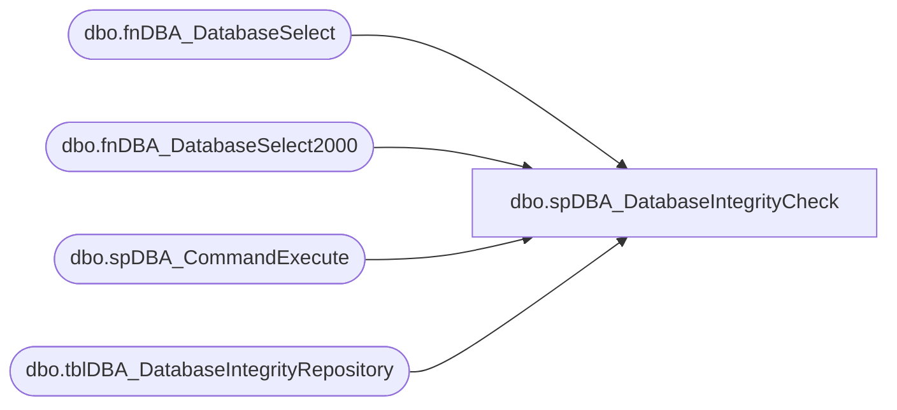

# dbo.spDBA_DatabaseIntegrityCheck

**Database:** DBAUtility  
**Server:** papamart  

## Architecture Diagram



## Table Dependencies

| Referenced Table |
|---|
| dbo.fnDBA_DatabaseSelect |
| dbo.fnDBA_DatabaseSelect2000 |
| dbo.spDBA_CommandExecute |
| dbo.tblDBA_DatabaseIntegrityRepository |

## Stored Procedure Code

```sql
CREATE PROCEDURE [dbo].[spDBA_DatabaseIntegrityCheck]
@Databases nvarchar(2000),
@PhysicalOnly nvarchar(2000) = 'N',
@NoIndex nvarchar(2000) = 'N',
@ResultsToTable nvarchar(2000) = 'N'

AS
 --=============================================================================================================
-- Name: spDBA_DatabaseIntegrityCheck
--
-- Description:	Performs database integrity check using DBCC checkdb.
--  Works with SQL Server 2000 and 2005
--  The procedure basically runs dbcc checkdb.  The procedure has the ability to record
--  results in a table.  Standard procedure should be to record the results of checkdb
--  to a table and provide notification when errors are found.
-- Output: error logging.
-- 
-- Available actions:
--	@Databases:
--		'ReturnVersion' = Does not do backup, just returns revision of backup script
--	E.g. SYSTEM_DATABASES
--	E.g. USER_DATABASES
--	E.g. Database1
--	E.g. Database1, Database2
--	E.g. USER_DATABASES, master
--	E.g. SYSTEM_DATABASES, -master
--	E.g. %Database%
--	E.g. %Database%, -Database1
--	@PhysicalOnly = Limit the checks to the physical structures of the database
--	@NoIndex = Nonclustered indexes are not checked
--	@ResultsToTable = record results in a table.
--  For SQL2000 only pass in 1 database name 

-- Dependencies: 
--
-- Revision History
--		Name:			Date:			Comments:
--		Gary Derikito	04/21/2009		Created based on http://blog.ola.hallengren.com/ and SQL Server article http://www.sqlmag.com/Articles/ArticleID/100178/pg/2/2.html
--		Gary Derikito	04/21/2009		Add capability to record results in table
--		Gary Derikito	05/20/2009		Modify to work with both SQL2000 and 2005
--		Gary Derikito	05/21/2009		Modify to use function fnDatabaseSelect2000
--		Mike Pelikan	04/16/2012		Modified temp and repository table to have BIGINT datatype for [PARTITION_ID], [ALLOC_UNIT_ID]
--		Mike Pelikan	04/19/2012		Modified repository to point to COREDB01_MAINT
--										Added Versioning
--		Mike Pelikan	04/30/2012		Added parameters to spDBA_CommandExecute
--		Mike Pelikan	05/15/2012		Added XACT_ABORT ON option
--		Mike Pelikan	09/17/2013		Modified for SQL 2012
--		Mike Pelikan	05/28/2014		Corrected logic to exclude offline tables.

DECLARE @Revision DATETIME
SET @Revision = '05/28/2014'
	
/*
EXECUTE spDBA_DatabaseIntegrityCheck @Databases = 'crm'
EXECUTE spDBA_DatabaseIntegrityCheck @Databases = 'crm', @PhysicalOnly = 'Y', @NoIndex = 'Y'
EXECUTE spDBA_DatabaseIntegrityCheck @Databases = 'USER_DATABASES, -workbrainTest', @ResultsToTable = 'Y'
EXECUTE spDBA_DatabaseIntegrityCheck @Databases = 'SYSTEM_DATABASES, USER_DATABASES, -workbrainTest', @ResultsToTable = 'Y'

EXECUTE spDBA_DatabaseIntegrityCheck @Databases = 'pubs', @ResultsToTable = 'Y'
EXECUTE spDBA_DatabaseIntegrityCheck @Databases = 'pubs', @ResultsToTable = 'N'


*/
-- =============================================================================================================

  ----------------------------------------------------------------------------------------------------
  --// Set options                                                                                //--
  ----------------------------------------------------------------------------------------------------

	SET NOCOUNT ON
	SET XACT_ABORT ON

  ----------------------------------------------------------------------------------------------------
  --// Declare variables                                                                          //--
  ----------------------------------------------------------------------------------------------------

--  DECLARE @StartMessage nvarchar(max)
  DECLARE @EndMessage nvarchar(2000)
  DECLARE @DatabaseMessage nvarchar(2000)
  DECLARE @ErrorMessage nvarchar(2000)
  DECLARE @CurrentID int
  DECLARE @CurrentDatabase nvarchar(2000)
  DECLARE @CurrentCommand01 nvarchar(2000)
  DECLARE @CurrentCommandOutput01 int
  DECLARE @tmpDatabases TABLE (ID int IDENTITY PRIMARY KEY,
                               DatabaseName nvarchar(2000),
                               Completed bit)

	DECLARE @Error int
	DECLARE @ReturnCode int


  DECLARE @ProductVersion	NVARCHAR(20) 

  SET @Error = 0
  SET @ProductVersion =  CAST(SERVERPROPERTY('productversion') AS VARCHAR)
  
----------------------------------------------------------------------------------------------------
--// Revision Return		                                                                    //--
----------------------------------------------------------------------------------------------------
IF @Databases = 'ReturnVersion' GOTO Logging

  ----------------------------------------------------------------------------------------------------
  --// Log initial information                                                                    //--
  ----------------------------------------------------------------------------------------------------

--  SET @StartMessage = 'DateTime: ' + CONVERT(nvarchar,GETDATE(),120) + CHAR(13) + CHAR(10)
--  SET @StartMessage = @StartMessage + 'Server: ' + CAST(SERVERPROPERTY('ServerName') AS nvarchar) + CHAR(13) + CHAR(10)
--  SET @StartMessage = @StartMessage + 'Version: ' + CAST(SERVERPROPERTY('ProductVersion') AS nvarchar) + CHAR(13) + CHAR(10)
--  SET @StartMessage = @StartMessage + 'Edition: ' + CAST(SERVERPROPERTY('Edition') AS nvarchar) + CHAR(13) + CHAR(10)
--  SET @StartMessage = @StartMessage + 'Procedure: ' + QUOTENAME(DB_NAME(DB_ID())) + '.' + QUOTENAME(OBJECT_SCHEMA_NAME(@@PROCID)) + '.' + QUOTENAME(OBJECT_NAME(@@PROCID)) + CHAR(13) + CHAR(10)
--  SET @StartMessage = @StartMessage + 'Parameters: @Databases = ' + ISNULL('''' + REPLACE(@Databases,'''','''''') + '''','NULL')
--  SET @StartMessage = @StartMessage + ', @PhysicalOnly = ' + ISNULL('''' + REPLACE(@PhysicalOnly,'''','''''') + '''','NULL')
--  SET @StartMessage = @StartMessage + ', @NoIndex = ' + ISNULL('''' + REPLACE(@NoIndex,'''','''''') + '''','NULL')
--  SET @StartMessage = @StartMessage + CHAR(13) + CHAR(10)
--  SET @StartMessage = REPLACE(@StartMessage,'%','%%')
--  RAISERROR(@StartMessage,10,1) WITH NOWAIT

  ----------------------------------------------------------------------------------------------------
  --// Select databases                                                                           //--
  ----------------------------------------------------------------------------------------------------

IF @Databases IS NULL OR @Databases = ''
BEGIN
	SET @ErrorMessage = 'The value for parameter @Databases is not supported.' + CHAR(13) + CHAR(10)
	RAISERROR(@ErrorMessage,16,1) WITH LOG
	SET @Error = @@ERROR
END


IF SUBSTRING(@ProductVersion, 1, 1) = '8' --2000
BEGIN
	INSERT INTO @tmpDatabases (DatabaseName, Completed)
	SELECT DatabaseName AS DatabaseName, 0 AS Completed
	FROM dbo.fnDBA_DatabaseSelect2000 (@Databases)
	ORDER BY DatabaseName ASC
	--		select @Databases, 0 --only pass in single database if using SQL 2000.  Comment out this line if using SQL 2005
END
ELSE --2005
BEGIN
	INSERT INTO @tmpDatabases (DatabaseName, Completed)
	SELECT DatabaseName AS DatabaseName, 0 AS Completed
	FROM dbo.fnDBA_DatabaseSelect (@Databases)
	ORDER BY DatabaseName ASC
END

IF @@ERROR <> 0 OR (@@ROWCOUNT = 0 AND @Databases <> 'USER_DATABASES')
BEGIN
	SET @ErrorMessage = 'Error selecting databases.' + CHAR(13) + CHAR(10)
	RAISERROR(@ErrorMessage,16,1) WITH LOG
	SET @Error = @@ERROR
END

----------------------------------------------------------------------------------------------------
--// Check input parameters                                                                     //--
----------------------------------------------------------------------------------------------------

IF @PhysicalOnly NOT IN ('Y','N') OR @PhysicalOnly IS NULL
BEGIN
	SET @ErrorMessage = 'The value for parameter @PhysicalOnly is not supported.' + CHAR(13) + CHAR(10)
	RAISERROR(@ErrorMessage,16,1) WITH LOG
	SET @Error = @@ERROR
END

IF @NoIndex NOT IN ('Y','N') OR @NoIndex IS NULL
	BEGIN
	SET @ErrorMessage = 'The value for parameter @NoIndex is not supported.' + CHAR(13) + CHAR(10)
	RAISERROR(@ErrorMessage,16,1) WITH LOG
	SET @Error = @@ERROR
END

IF @ResultsToTable NOT IN ('Y','N') OR @ResultsToTable IS NULL
BEGIN
	SET @ErrorMessage = 'The value for parameter @ResultsToTable is not supported.' + CHAR(13) + CHAR(10)
	RAISERROR(@ErrorMessage,16,1) WITH LOG
	SET @Error = @@ERROR
END

----------------------------------------------------------------------------------------------------
--// Check error variable                                                                       //--
----------------------------------------------------------------------------------------------------

IF @Error <> 0 GOTO Logging

----------------------------------------------------------------------------------------------------
--// Remove OFFLINE databases                                                                         //--
----------------------------------------------------------------------------------------------------
WHILE EXISTS (SELECT * FROM @tmpDatabases WHERE Completed = 0)
BEGIN
	SELECT TOP 1 @CurrentID = ID, @CurrentDatabase = DatabaseName
		FROM @tmpDatabases
		WHERE Completed = 0
		ORDER BY ID ASC
	IF DATABASEPROPERTYEX(@CurrentDatabase,'status') = 'ONLINE'
	BEGIN		
		UPDATE @tmpDatabases 
		SET Completed = 1
		WHERE DatabaseName = @CurrentDatabase
	END
	ELSE
	BEGIN
		DELETE FROM @tmpDatabases WHERE DatabaseName = @CurrentDatabase
	END
END

UPDATE @tmpDatabases 
SET Completed = 0

----------------------------------------------------------------------------------------------------
--// CREATE results tables                                                                           //--
----------------------------------------------------------------------------------------------------
IF object_id('tempdb..#CheckDBResult','u')  IS NOT NULL
DROP TABLE #CheckDBResult

CREATE TABLE #CheckDBResult(
	SERVER_NM [nvarchar](128) NULL,
	[ERR] [int] NULL,
	[ERR_LEVEL] [int] NULL,
	[DB_STATE] [int] NULL,
	[MESSAGE_TXT] [nvarchar](1024) NULL,
	[REPAIR_LEVEL] [int] NULL,
	[DB_STATUS] [int] NULL,
	[SERVER_DB_ID] [int] NULL,
	DbFragId int NULL,
	[DB_OBJECT_ID] [int] NULL,
	[INDEX_ID] [int] NULL,
	[PARTITION_ID] [bigint] NULL,
	[ALLOC_UNIT_ID] [bigint] NULL,
	RidDbId	int null, 
	RidPruId int null,
	[DB_FILE] [int] NULL,
	[PAGE] [int] NULL,
	[SLOT] [int] NULL,
	RefDbId	int null,
	RefPruId int null,
	[REF_FILE] [int] NULL,
	[REF_PAGE] [int] NULL,
	[REF_SLOT] [int] NULL,
	[ALLOCATION] [int] NULL,
	[INSERT_DT] [datetime] NOT NULL CONSTRAINT [DF_CheckDBResult_insert_date]  DEFAULT (getdate())
)

----------------------------------------------------------------------------------------------------
--// Execute commands                                                                           //--
----------------------------------------------------------------------------------------------------
WHILE EXISTS (SELECT * FROM @tmpDatabases WHERE Completed = 0)
BEGIN --loop through databases
	
	SELECT TOP 1 @CurrentID = ID, @CurrentDatabase = DatabaseName
	FROM @tmpDatabases
	WHERE Completed = 0
	ORDER BY ID ASC
	
	IF SUBSTRING(@ProductVersion, 1, 1) = '8' --2000
	BEGIN --SQL2000 code
		BEGIN
			SET @CurrentCommand01 = 'DBCC CHECKDB (' + QUOTENAME(@CurrentDatabase)
			IF @ResultsToTable = 'Y' 
				SET @CurrentCommand01 = @CurrentCommand01 + ') WITH TABLERESULTS ' 
			ELSE 
				SET @CurrentCommand01 = @CurrentCommand01 + ') WITH NO_INFOMSGS, ALL_ERRORMSGS' --no info prevents verbose messages
		
			IF @ResultsToTable = 'N'
			BEGIN
				EXECUTE @CurrentCommandOutput01 = [dbo].[spDBA_CommandExecute] @Command = @CurrentCommand01, @CommandType = 'DBA Maint', @Mode = 1, @LogToTable = 'N', @Execute = 'Y'
				SET @Error = @@ERROR
				IF @Error <> 0 
					SET @CurrentCommandOutput01 = @Error
			END
			ELSE
			BEGIN
				TRUNCATE TABLE #CheckDBResult

				INSERT INTO #CheckDBResult([ERR], [ERR_LEVEL], [DB_STATE], [MESSAGE_TXT], [REPAIR_LEVEL], [DB_STATUS],
					[SERVER_DB_ID],[DB_OBJECT_ID], [INDEX_ID], [DB_FILE],[PAGE],[SLOT],[REF_FILE],[REF_PAGE],[REF_SLOT],[ALLOCATION]				  )
					EXECUTE @CurrentCommandOutput01 = [dbo].[spDBA_CommandExecute] @Command = @CurrentCommand01, @CommandType = 'DBA Maint', @Mode = 1, @LogToTable = 'Y', @Execute = 'Y'
					
				SET @Error = @@ERROR
				IF @Error <> 0 SET @CurrentCommandOutput01 = @Error
			END
		END
	END  
	ELSE 
	BEGIN---2005+ code
		-- Set database message
		SET @DatabaseMessage = 'DateTime: ' + CONVERT(nvarchar,GETDATE(),120) + CHAR(13) + CHAR(10)
		SET @DatabaseMessage = @DatabaseMessage + 'Database: ' + QUOTENAME(@CurrentDatabase) + CHAR(13) + CHAR(10)
		SET @DatabaseMessage = @DatabaseMessage + 'Status: ' + CAST(DATABASEPROPERTYEX(@CurrentDatabase,'status') AS nvarchar) + CHAR(13) + CHAR(10)
		SET @DatabaseMessage = REPLACE(@DatabaseMessage,'%','%%')
		--    RAISERROR(@DatabaseMessage,10,1) WITH NOWAIT

		SET @CurrentCommand01 = 'DBCC CHECKDB (' + QUOTENAME(@CurrentDatabase)
		IF @NoIndex = 'Y' 
			SET @CurrentCommand01 = @CurrentCommand01 + ', NOINDEX'
		IF @ResultsToTable = 'Y' 
			SET @CurrentCommand01 = @CurrentCommand01 + ') WITH TABLERESULTS ' 
		ELSE 
			SET @CurrentCommand01 = @CurrentCommand01 + ') WITH NO_INFOMSGS, ALL_ERRORMSGS' --no info prevents verbose messages
		IF @PhysicalOnly = 'N' 
			SET @CurrentCommand01 = @CurrentCommand01 + ', DATA_PURITY'
		IF @PhysicalOnly = 'Y' 
			SET @CurrentCommand01 = @CurrentCommand01 + ', PHYSICAL_ONLY'

		IF @ResultsToTable = 'N'
		BEGIN
			EXECUTE @CurrentCommandOutput01 = [dbo].[spDBA_CommandExecute] @Command = @CurrentCommand01, @CommandType = 'DBA Maint', @Mode = 1, @LogToTable = 'N', @Execute = 'Y'
			SET @Error = @@ERROR
			IF @Error <> 0 
				SET @CurrentCommandOutput01 = @Error
		END
		ELSE
		BEGIN
			IF SUBSTRING(@ProductVersion,1,2) = '11' --2012
			BEGIN
				INSERT INTO #CheckDBResult([ERR], [ERR_LEVEL], [DB_STATE], [MESSAGE_TXT], [REPAIR_LEVEL], [DB_STATUS],
				[SERVER_DB_ID],DbFragId, [DB_OBJECT_ID], [INDEX_ID], [PARTITION_ID],[ALLOC_UNIT_ID], RidDbId,	RidPruId,
				[DB_FILE],[PAGE],[SLOT], RefDbId, RefPruId, [REF_FILE],[REF_PAGE],[REF_SLOT],[ALLOCATION]
				)

				EXECUTE @CurrentCommandOutput01 = [dbo].[spDBA_CommandExecute] @Command = @CurrentCommand01, @CommandType = 'DBA Maint', @Mode = 1, @LogToTable = 'Y', @Execute = 'Y'
				SET @Error = @@ERROR
				IF @Error <> 0 SET @CurrentCommandOutput01 = @Error
			END
			ELSE
			BEGIN
				INSERT INTO #CheckDBResult([ERR], [ERR_LEVEL], [DB_STATE], [MESSAGE_TXT], [REPAIR_LEVEL], [DB_STATUS],
				[SERVER_DB_ID],[DB_OBJECT_ID], [INDEX_ID], [PARTITION_ID],[ALLOC_UNIT_ID],
				[DB_FILE],[PAGE],[SLOT],[REF_FILE],[REF_PAGE],[REF_SLOT],[ALLOCATION]
				)

				EXECUTE @CurrentCommandOutput01 = [dbo].[spDBA_CommandExecute] @Command = @CurrentCommand01, @CommandType = 'DBA Maint', @Mode = 1, @LogToTable = 'Y', @Execute = 'Y'
				SET @Error = @@ERROR
				IF @Error <> 0 SET @CurrentCommandOutput01 = @Error
			END
		END
	END---2005 code end

	IF @ResultsToTable = 'Y'
	BEGIN
		--remove all detail except final results
		--This step could be eliminated to record all result data
		DELETE FROM #CheckDBResult
		WHERE MESSAGE_TXT NOT LIKE 'CHECKDB%'

		--update the servername
		UPDATE #CheckDBResult
		SET SERVER_NM = @@ServerName

		--finally insert clean data into permanent table
		INSERT INTO COREDB01_MAINT.DBAUtilityMaster.dbo.tblDBA_DatabaseIntegrityRepository(InstanceName, ErrorNumber, ErrorLevel, DBState, 
			Message_Text, RepairLevel, DBStatus, ServerDBID, DBObjectID, IndexID, PartitionID, AllocationUnitID, DBFile, Page, Slot,
			RefFile, RefPage, RefSlot, Allocation)
		SELECT  SERVER_NM, [ERR], [ERR_LEVEL], [DB_STATE], [MESSAGE_TXT], [REPAIR_LEVEL], [DB_STATUS], [SERVER_DB_ID], [DB_OBJECT_ID],
			[INDEX_ID], [PARTITION_ID], [ALLOC_UNIT_ID], [DB_FILE], [PAGE], [SLOT], [REF_FILE], [REF_PAGE], [REF_SLOT], [ALLOCATION]
		FROM #CheckDBResult

		SET @Error = @@ERROR
		IF @Error <> 0 SET @CurrentCommandOutput01 = @Error
	END

		-- Update that the database is completed
	UPDATE @tmpDatabases
	SET Completed = 1
	WHERE ID = @CurrentID

	-- Clear variables
	SET @CurrentID = NULL
	SET @CurrentDatabase = NULL

	SET @CurrentCommand01 = NULL

	SET @CurrentCommandOutput01 = NULL

END --loop through databases end

		  --RETURN 0


  ----------------------------------------------------------------------------------------------------
  --// Log completing information                                                                 //--
  ----------------------------------------------------------------------------------------------------
Logging:
IF @Databases = 'ReturnVersion'
BEGIN
	SELECT @Revision 
END
ELSE
BEGIN
	SET @EndMessage = 'DateTime: ' + CONVERT(nvarchar,GETDATE(),120)
	SET @EndMessage = REPLACE(@EndMessage,'%','%%')
	RAISERROR(@EndMessage,10,1) WITH NOWAIT

	IF @ReturnCode <> 0
	BEGIN
		--RETURN @ReturnCode
		SELECT @ReturnCode
	END
END
  ----------------------------------------------------------------------------------------------------
```

