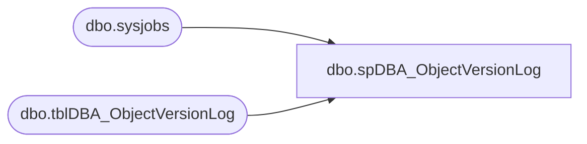

# dbo.spDBA_ObjectVersionLog

**Database:** DBAUtility  
**Server:** papamart  

## Architecture Diagram



## Table Dependencies

| Referenced Table |
|---|
| dbo.sysjobs |
| dbo.tblDBA_ObjectVersionLog |

## Stored Procedure Code

```sql
CREATE PROCEDURE [dbo].[spDBA_ObjectVersionLog]
	@Action VARCHAR(20) = 'Process'
AS
-- =============================================================================================================
-- Name: spDBA_ObjectVersionLog
--
-- Description:	Inserts all user created procedures in the DBAUtility database, with install date & version if 
--	possible
--
-- Output: none
-- 
-- Available actions:
-- @Action:
--	'ReturnVersion' = Do not do anything but return the version of the objects
--	'Process' = populate the object version log 

-- Dependencies: 
--  DBAUtility.dbo.tblDBA_ObjectVersionLog
--
-- Revision History:
--		Mike Pelikan	06/27/2012		Intitial deployment
--		Mike Pelikan	06/28/2012		Added DBA Jobs
--		Mike Pelikan	06/29/2012		Added temp syscomments table to overcome rows being to big.
--		Mike Pelikan	01/07/2014		Added  "AND category <> 2" to the WHERE clauses to remove system objects


DECLARE @Revision DATETIME
SET @Revision = '01/07/2014'
	
---- =============================================================================================================
--DECLARE @Action VARCHAR(20)
--SELECT @Action = 'Process'
---- =============================================================================================================

----------------------------------------------------------------------------------------------------
--// Set options                                                                                //--
----------------------------------------------------------------------------------------------------
SET NOCOUNT ON

----------------------------------------------------------------------------------------------------
--// Declare variables                                                                          //--
----------------------------------------------------------------------------------------------------
DECLARE @EndMessage varchar(2000)
DECLARE @ReturnCode int

----------------------------------------------------------------------------------------------------
--// Revision                                                                                  //--
----------------------------------------------------------------------------------------------------
IF @Action = 'ReturnVersion'
BEGIN
	SELECT @Revision
	GOTO EndHere
END

--use temp table to overcome rows being to large to sort (> 8000
DECLARE @syscomments TABLE (id int, colid int, text varchar(4000))

INSERT INTO @syscomments 
SELECT sc.id, sc.colid,  sc.text
FROM sysobjects so
LEFT JOIN syscomments sc ON so.id = sc.id AND 0 = OBJECTPROPERTY(sc.id, 'IsMSShipped') 
WHERE xtype NOT IN ('D','IT','PK','S','SQ') AND category <> 2


--TableVersions:
DECLARE @tblVersions TABLE (TableName Varchar(100), VersionDate DateTime)
INSERT INTO @tblVersions 
SELECT objname, CAST(value AS Datetime) FROM ::fn_listextendedproperty (NULL, 'schema', 'dbo', 'table', NULL , NULL, NULL) WHERE name = 'Version'
UNION 
SELECT objname, CAST(value AS Datetime) FROM ::fn_listextendedproperty (NULL, 'user', 'dbo', 'table', NULL , NULL, NULL) WHERE name = 'Version'

--Update existing
UPDATE DBAUtility.dbo.tblDBA_ObjectVersionLog
SET VersionDate = ISNULL(
	REPLACE(REPLACE(
	REPLACE(	CASE PATINDEX('%SET @Revision =%', sc.text) 
				WHEN 0 THEN NULL 
				ELSE 	REPLACE(REPLACE(SUBSTRING(sc.text, PATINDEX('%SET @Revision =%', sc.text), 30),'SET @Revision = ','') , CHAR(39),'') 
			END	, CHAR(13),''), CHAR(10), ''), CHAR(9),'')	,ver.VersionDate),
usesRevision = 1
FROM  DBAUtility.dbo.tblDBA_ObjectVersionLog pvl
INNER JOIN sysobjects so ON pvl.ObjectName = so.name 
LEFT JOIN @syscomments sc ON so.id=sc.id AND OBJECTPROPERTY(sc.id, 'IsMSShipped') = 0
LEFT JOIN @tblVersions ver ON pvl.ObjectName = ver.TableName COLLATE SQL_Latin1_General_CP1_CI_AS AND pvl.ObjectType = 'Table' 
WHERE xtype IN ( 'P', 'TF', 'U')  AND category <> 2
AND pvl.ObjectType <> 'Job'

AND CASE WHEN ver.VersionDate IS NULL THEN PATINDEX('%SET @Revision =%', sc.text) ELSE 1 END > 0 
AND ISDATE(ISNULL(REPLACE(REPLACE(
	REPLACE(CASE PATINDEX('%SET @Revision =%', sc.text) WHEN 0 THEN NULL ELSE
	REPLACE(REPLACE(SUBSTRING(sc.text, PATINDEX('%SET @Revision =%', sc.text), 30),'SET @Revision = ','') , CHAR(39),'') 
	END
	,CHAR(13),'')
	,CHAR(10), '')
	, CHAR(9),'')
,'1/1/1900') ) = 1
AND ISNULL(pvl.VersionDate, '1/1/1900') <> ISNULL(
	REPLACE(REPLACE(
	REPLACE(	CASE PATINDEX('%SET @Revision =%', sc.text) 
				WHEN 0 THEN NULL 
				ELSE 	REPLACE(REPLACE(SUBSTRING(sc.text, PATINDEX('%SET @Revision =%', sc.text), 30),'SET @Revision = ','') , CHAR(39),'') 
			END	, CHAR(13),''), CHAR(10), ''), CHAR(9),'')	,ver.VersionDate)


--Update existing jobs
UPDATE DBAUtility.dbo.tblDBA_ObjectVersionLog
SET VersionDate = ISNULL( 
		CAST( 
		REPLACE(REPLACE(
		REPLACE(CASE PATINDEX('%SET @Revision =%', [description]) WHEN 0 THEN NULL ELSE
		REPLACE(REPLACE(SUBSTRING([description], PATINDEX('%SET @Revision =%', [description]), 30),'SET @Revision = ','') , CHAR(39),'') 
		END
		,CHAR(13),'')
		,CHAR(10), '')
		, CHAR(9),'')
		AS DATETIME)
	, sj.date_modified),
usesRevision = CASE ISNULL(PATINDEX('%SET @Revision =%', [description]),0) WHEN 0 THEN 0 ELSE 1 END 
FROM  DBAUtility.dbo.tblDBA_ObjectVersionLog pvl
INNER JOIN [msdb].[dbo].[sysjobs] sj ON pvl.ObjectName = sj.name COLLATE SQL_Latin1_General_CP1_CI_AS  
WHERE pvl.ObjectType = 'Job'
AND ISNULL(VersionDate, '1/1/1900') <> ISNULL( 
		CAST( 
		REPLACE(REPLACE(
		REPLACE(CASE PATINDEX('%SET @Revision =%', [description]) WHEN 0 THEN NULL ELSE
		REPLACE(REPLACE(SUBSTRING([description], PATINDEX('%SET @Revision =%', [description]), 30),'SET @Revision = ','') , CHAR(39),'') 
		END
		,CHAR(13),'')
		,CHAR(10), '')
		, CHAR(9),'')
		AS DATETIME)
	, sj.date_modified)


--Insert New
INSERT INTO DBAUtility.dbo.tblDBA_ObjectVersionLog (InstanceName, ObjectName, ObjectType, InstallDate, VersionDate, usesRevision)
SELECT @@SERVERNAME InstanceName, so.name ObjectName, 
	CASE xtype 
	WHEN 'P' THEN 'Procedure'
	WHEN 'TF' THEN 'User Defined Function'
	WHEN 'U' THEN 'Table'
	ELSE 'Undefined'
	END ObjectType,
	crdate InstallDate,
	MAX( 
		ISNULL(
	REPLACE(REPLACE(
	REPLACE(	CASE PATINDEX('%SET @Revision =%', sc.text) 
				WHEN 0 THEN NULL 
				ELSE 	REPLACE(REPLACE(SUBSTRING(sc.text, PATINDEX('%SET @Revision =%', sc.text), 30),'SET @Revision = ','') , CHAR(39),'') 
			END	, CHAR(13),''), CHAR(10), ''), CHAR(9),'')	,ver.VersionDate)	
	) VersionDate, 
	MAX(
		CASE ISNULL(PATINDEX('%SET @Revision =%', sc.text),0) WHEN 0 THEN 0 ELSE 1 END 
	)usesRevision		
FROM sysobjects so
LEFT JOIN @syscomments sc ON so.id = sc.id AND 0 = OBJECTPROPERTY(sc.id, 'IsMSShipped') 
LEFT JOIN DBAUtility.dbo.tblDBA_ObjectVersionLog pvl ON so.name = pvl.ObjectName
LEFT JOIN @tblVersions ver ON so.name = ver.TableName COLLATE SQL_Latin1_General_CP1_CI_AS AND so.xtype = 'U' 
WHERE xtype NOT IN ('D','IT','PK','S','SQ') AND category <> 2
AND pvl.ProcVersionID IS NULL
AND ISDATE(ISNULL(REPLACE(REPLACE(
	REPLACE(CASE PATINDEX('%SET @Revision =%', sc.text) WHEN 0 THEN NULL ELSE
	REPLACE(REPLACE(SUBSTRING(sc.text, PATINDEX('%SET @Revision =%', sc.text), 30),'SET @Revision = ','') , CHAR(39),'') 
	END
	,CHAR(13),'')
	,CHAR(10), '')
	, CHAR(9),'')
,'1/1/1900') ) = 1
GROUP BY  so.name, CASE xtype 
WHEN 'P' THEN 'Procedure'
WHEN 'TF' THEN 'User Defined Function'
WHEN 'U' THEN 'Table'
ELSE 'Undefined'
END ,
crdate


-- Insert New Jobs
INSERT INTO DBAUtility.dbo.tblDBA_ObjectVersionLog (InstanceName, ObjectName, ObjectType, InstallDate, VersionDate, usesRevision)
SELECT @@SERVERNAME, [name], 'Job', 
      [date_created],
	ISNULL( 
		CAST( 
		REPLACE(REPLACE(
		REPLACE(CASE PATINDEX('%SET @Revision =%', [description]) WHEN 0 THEN NULL ELSE
		REPLACE(REPLACE(SUBSTRING([description], PATINDEX('%SET @Revision =%', [description]), 30),'SET @Revision = ','') , CHAR(39),'') 
		END
		,CHAR(13),'')
		,CHAR(10), '')
		, CHAR(9),'')
		AS DATETIME)
	, sj.date_modified) VersionDate,
	CASE ISNULL(PATINDEX('%SET @Revision =%', [description]),0) WHEN 0 THEN 0 ELSE 1 END 
FROM [msdb].[dbo].[sysjobs] sj
LEFT JOIN DBAUtility.dbo.tblDBA_ObjectVersionLog pvl ON sj.name = pvl.ObjectName COLLATE SQL_Latin1_General_CP1_CI_AS 
WHERE name like 'DBA%' AND [enabled] = 1 AND pvl.ProcVersionID IS NULL


--Delete old
DELETE FROM DBAUtility.dbo.tblDBA_ObjectVersionLog 
FROM  DBAUtility.dbo.tblDBA_ObjectVersionLog pvl
LEFT JOIN sysobjects so ON pvl.ObjectName = so.name AND category <> 2
WHERE so.id IS NULL AND pvl.ObjectType <> 'Job' 

--Delete old jobs/disabled jobs
DELETE FROM DBAUtility.dbo.tblDBA_ObjectVersionLog 
FROM  DBAUtility.dbo.tblDBA_ObjectVersionLog pvl
LEFT JOIN [msdb].[dbo].[sysjobs] sj ON sj.name = pvl.ObjectName COLLATE SQL_Latin1_General_CP1_CI_AS  AND sj.name like 'DBA%' AND sj.enabled = 1 
WHERE sj.job_id IS NULL AND pvl.ObjectType = 'Job'

EndHere:
IF @Action = 'ReturnVersion'
BEGIN
	SELECT @Revision 
END
ELSE
BEGIN
	SET @EndMessage = 'DateTime: ' + CONVERT(nvarchar,GETDATE(),120)
	SET @EndMessage = REPLACE(@EndMessage,'%','%%')
	RAISERROR(@EndMessage,10,1) WITH NOWAIT

	IF @ReturnCode <> 0
	BEGIN
		--RETURN @ReturnCode
		SELECT @ReturnCode
	END
END
```

