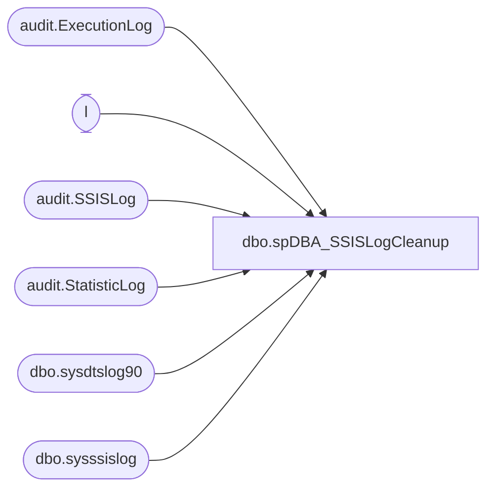

# dbo.spDBA_SSISLogCleanup

**Database:** DBAUtility  
**Server:** papamart  

## Architecture Diagram



## Table Dependencies

| Referenced Table |
|---|
| audit.ExecutionLog |
| l |
| audit.SSISLog |
| audit.StatisticLog |
| dbo.sysdtslog90 |
| dbo.sysssislog |

## Stored Procedure Code

```sql
CREATE PROC [dbo].[spDBA_SSISLogCleanup]
@dteToClean AS DATETIME = NULL
AS

-- =============================================================================================================
-- Name: spDBA_SSISLogCleanup
--
-- Description:	Removes older records from SSIS logging tables
-- 
-- 
-- Output: None
-- 
-- Available actions:
--	@dteToClean: NULL will default to 1 month ago

-- Dependencies: 
--	[SSISTemplates].[dbo].[sysssislog]
--	[SSISTemplates].[dbo].[sysdtslog90]
--	[SSISTemplates].[audit].[ExecutionLog]
--	[SSISTemplates].[audit].[SSISLog]
--	[SSISTemplates].[audit].[StatisticLog]
--
--
-- Revision History
--		Name:			Date:			Comments:
--		Mike Pelikan	06/04/2012		Original Release Date 
/*

*/
-- =============================================================================================================
SET NOCOUNT ON 

IF @dteToClean IS NULL 
	SELECT @dteToClean = DATEADD(mm, -1, GETDATE())


DELETE FROM [SSISTemplates].[dbo].[sysssislog]
  WHERE endtime < @dteToClean

DELETE 
  FROM [SSISTemplates].[dbo].[sysdtslog90]
  WHERE endtime < @dteToClean

DELETE
  FROM [SSISTemplates].[audit].[ExecutionLog]
  WHERE EndTime < @dteToClean
  
DELETE l
  FROM [SSISTemplates].[audit].[SSISLog] l 
LEFT JOIN [SSISTemplates].[audit].[ExecutionLog]  e ON l.LogID = e.LogID
WHERE e.LogID IS NULL
  
DELETE l
  FROM [SSISTemplates].[audit].[StatisticLog] l 
LEFT JOIN [SSISTemplates].[audit].[ExecutionLog]  e ON l.LogID = e.LogID
WHERE e.LogID IS NULL
```

