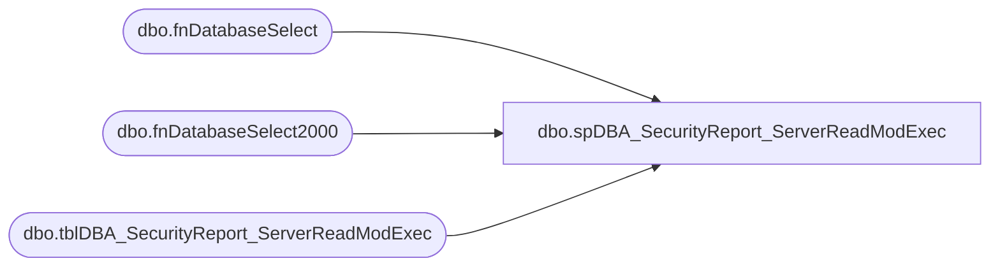

# dbo.spDBA_SecurityReport_ServerReadModExec

**Database:** DBAUtility  
**Server:** papamart  

## Architecture Diagram



## Table Dependencies

| Referenced Table |
|---|
| dbo.fnDatabaseSelect |
| dbo.fnDatabaseSelect2000 |
| dbo.tblDBA_SecurityReport_ServerReadModExec |

## Stored Procedure Code

```sql
CREATE PROCEDURE [dbo].[spDBA_SecurityReport_ServerReadModExec] 

@Databases nvarchar(2000) = 'SYSTEM_DATABASES, USER_DATABASES', @bolOutputToTable BIT = 0

AS
-- =============================================================================================================
-- Name: spDBA_SecurityReport
--
-- Description:	Reports objects and permissions that have been explicitly granted.
--  If a user has permissions on a object via sysadmin, the user will not be listed.
--
-- Output: error logging.
-- 
-- Available actions:
--	@Databases:
--	E.g. SYSTEM_DATABASES
--	E.g. USER_DATABASES
--	E.g. Database1
--	E.g. Database1, Database2
--	E.g. USER_DATABASES, master
--	E.g. SYSTEM_DATABASES, -master
--	E.g. %Database%
--	E.g. %Database%, -Database1
--
--
-- Dependencies: 
--
-- Revision History
--		Name:			Date:			Comments:
--		Gary Derikito	07/20/2009		Create initial version
--		Gary Derikito	07/23/2009		Added 3 part naming to remaining tables.
--		Mike Pelikan	02/23/2012		Added output to reporting table logic
/*
exec spDBA_SecurityReportV2 @Databases = DBAUtility
exec spDBA_SecurityReport_ServerReadModExec @Databases = 'SYSTEM_DATABASES, USER_DATABASES'

*/
-- =============================================================================================================

BEGIN

  ----------------------------------------------------------------------------------------------------
  --// Set options                                                                                //--
  ----------------------------------------------------------------------------------------------------

  SET NOCOUNT ON

  ----------------------------------------------------------------------------------------------------
  --// Declare variables                                                                          //--
  ----------------------------------------------------------------------------------------------------

--  DECLARE @StartMessage nvarchar(max)
  DECLARE @EndMessage nvarchar(2000)
  DECLARE @DatabaseMessage nvarchar(2000)
  DECLARE @ErrorMessage nvarchar(2000)
  DECLARE @CurrentID int
  DECLARE @CurrentDatabase nvarchar(2000)
  DECLARE @CurrentTable nvarchar(2000)
  DECLARE @CurrentSchema nvarchar(128)
  DECLARE @CurrentCommand01 nvarchar(2000)
  DECLARE @CurrentCommandOutput01 int
  DECLARE @CreateDate datetime
  DECLARE @CurrentDate CHAR(8)
  DECLARE @tmpDatabases TABLE (ID int IDENTITY PRIMARY KEY,
                               DatabaseName nvarchar(2000),
                               Completed bit)

  DECLARE @Error int
  DECLARE @RowCount int
  DECLARE @ProductVersion	NVARCHAR(20) 
  DECLARE @SQL nvarchar(1000)
 
  SET @Error = 0
  SET @ProductVersion =  CAST(SERVERPROPERTY('productversion') AS VARCHAR)
  SET @CurrentDate = CONVERT(CHAR(8), GETDATE(), 112)


  IF object_id('tempdb..#ObjectSecurity') IS NOT NULL
	DROP TABLE #ObjectSecurity

  CREATE TABLE #ObjectSecurity (pk int IDENTITY PRIMARY KEY,
								dbname nvarchar(128),
                               username nvarchar(128),
                               gid smallint,
								objectname nvarchar(128),
								type char(2),
								id int,
								s varchar(15),
								i varchar(15),
								u varchar(15),
								d varchar(15),
								e varchar(15))
  
  ----------------------------------------------------------------------------------------------------
  --// Log initial information                                                                    //--
  ----------------------------------------------------------------------------------------------------

--  SET @StartMessage = 'DateTime: ' + CONVERT(nvarchar,GETDATE(),120) + CHAR(13) + CHAR(10)
--  SET @StartMessage = @StartMessage + 'Server: ' + CAST(SERVERPROPERTY('ServerName') AS nvarchar) + CHAR(13) + CHAR(10)
--  SET @StartMessage = @StartMessage + 'Version: ' + CAST(SERVERPROPERTY('ProductVersion') AS nvarchar) + CHAR(13) + CHAR(10)
--  SET @StartMessage = @StartMessage + 'Edition: ' + CAST(SERVERPROPERTY('Edition') AS nvarchar) + CHAR(13) + CHAR(10)
--  SET @StartMessage = @StartMessage + 'Procedure: ' + QUOTENAME(DB_NAME(DB_ID())) + '.' + QUOTENAME(OBJECT_SCHEMA_NAME(@@PROCID)) + '.' + QUOTENAME(OBJECT_NAME(@@PROCID)) + CHAR(13) + CHAR(10)
--  SET @StartMessage = @StartMessage + 'Parameters: @Databases = ' + ISNULL('''' + REPLACE(@Databases,'''','''''') + '''','NULL')
--  SET @StartMessage = @StartMessage + ', @PhysicalOnly = ' + ISNULL('''' + REPLACE(@PhysicalOnly,'''','''''') + '''','NULL')
--  SET @StartMessage = @StartMessage + ', @NoIndex = ' + ISNULL('''' + REPLACE(@NoIndex,'''','''''') + '''','NULL')
--  SET @StartMessage = @StartMessage + CHAR(13) + CHAR(10)
--  SET @StartMessage = REPLACE(@StartMessage,'%','%%')
--  RAISERROR(@StartMessage,10,1) WITH NOWAIT

  ----------------------------------------------------------------------------------------------------
  --// Select databases                                                                           //--
  ----------------------------------------------------------------------------------------------------

  IF @Databases IS NULL OR @Databases = ''
  BEGIN
    SET @ErrorMessage = 'The value for parameter @Databases is not supported.' + CHAR(13) + CHAR(10)
    RAISERROR(@ErrorMessage,16,1) WITH LOG
    SET @Error = @@ERROR
  END


  IF SUBSTRING(@ProductVersion, 1, 1) = '8' --2000
	BEGIN
		INSERT INTO @tmpDatabases (DatabaseName, Completed)
		SELECT DatabaseName AS DatabaseName, 0 AS Completed
		FROM dbo.fnDatabaseSelect2000 (@Databases)
		ORDER BY DatabaseName ASC
		SET @RowCount = @@RowCount
	END
	ELSE --2005
	BEGIN
--		GOTO Crash---comment out because VS is checking for existence of object
		INSERT INTO @tmpDatabases (DatabaseName, Completed)
		SELECT DatabaseName AS DatabaseName, 0 AS Completed
		FROM dbo.fnDatabaseSelect (@Databases)
		ORDER BY DatabaseName ASC
		SET @RowCount = @@RowCount
	END

  IF @@ERROR <> 0 OR (@RowCount = 0 AND @Databases <> 'USER_DATABASES')
  BEGIN
    SET @ErrorMessage = 'Error selecting databases.' + CHAR(13) + CHAR(10)
    RAISERROR(@ErrorMessage,16,1) WITH LOG
    SET @Error = @@ERROR
  END

  ----------------------------------------------------------------------------------------------------
  --// Check input parameters                                                                     //--
  ----------------------------------------------------------------------------------------------------

  
  ----------------------------------------------------------------------------------------------------
  --// Check error variable                                                                       //--
  ----------------------------------------------------------------------------------------------------

  IF @Error <> 0 GOTO Crash

  ----------------------------------------------------------------------------------------------------
  --// Execute commands                                                                           //--
  ----------------------------------------------------------------------------------------------------

  WHILE EXISTS (SELECT * FROM @tmpDatabases WHERE Completed = 0)
  BEGIN --loop through databases

--select * from @tmpDatabases return

    SELECT TOP 1 @CurrentID = ID,
                 @CurrentDatabase = DatabaseName
    FROM @tmpDatabases
    WHERE Completed = 0
    ORDER BY ID ASC


    -- Set database message
    SET @DatabaseMessage = 'DateTime: ' + CONVERT(nvarchar,GETDATE(),120) + CHAR(13) + CHAR(10)
    SET @DatabaseMessage = @DatabaseMessage + 'Database: ' + QUOTENAME(@CurrentDatabase) + CHAR(13) + CHAR(10)
    SET @DatabaseMessage = @DatabaseMessage + 'Status: ' + CAST(DATABASEPROPERTYEX(@CurrentDatabase,'status') AS nvarchar) + CHAR(13) + CHAR(10)
    SET @DatabaseMessage = REPLACE(@DatabaseMessage,'%','%%')
--    RAISERROR(@DatabaseMessage,10,1) WITH NOWAIT

    IF DATABASEPROPERTYEX(@CurrentDatabase,'status') = 'ONLINE'
    BEGIN

		INSERT INTO #ObjectSecurity(dbname, username, gid, objectname, type, id, s, i, u, d, e)
		EXEC(

				'select ' + '''' + @CurrentDatabase + '''' + ',sysusers_0.name as username,
				sysusers_0.gid,
				sysobjects_0.name as objectname, type,
				sysobjects_0.id,
				CASE WHEN sysprotects_1.action is null
					 THEN CASE WHEN sysobjects_0.xtype = '''+ 'P' + ''' THEN ''' + 'N/A' + '''
							   ELSE ' + '''' + 'No' + ''''
						  + ' END'
					 + ' ELSE ' + '''' + 'Yes' + ''''
				+ ' END as ' + '''' + 'SELECT' + '''' + ',
				CASE WHEN sysprotects_2.action is null
					 THEN CASE WHEN sysobjects_0.xtype = ' + '''' + 'P' + '''' + ' THEN ' + '''' + 'N/A' + ''''
							   + ' ELSE ' + '''' + 'No' + ''''
						  + ' END 
					 ELSE ' + '''' + 'Yes' + ''''
				+ ' END as ' + '''' + 'INSERT' + '''' + ',
				CASE WHEN sysprotects_3.action is null
					 THEN CASE WHEN sysobjects_0.xtype = ' + '''' + 'P' + '''' + ' THEN ' + '''' + 'N/A' + ''''
							   + ' ELSE ' + '''' + 'No' + ''''
						  + ' END 
					 ELSE ' + '''' + 'Yes' + ''''
				+ ' END as ' + '''' + 'UPDATE' + '''' + ',
				CASE WHEN sysprotects_4.action is null
					 THEN CASE WHEN sysobjects_0.xtype = ' + '''' + 'P' + '''' + ' THEN ' + '''' + 'N/A' + ''''
							   + ' ELSE ' + '''' + 'No' + ''''
						  + ' END
					 ELSE ' + '''' + 'Yes' + ''''
				+ ' END as ' + '''' + 'DELETE' + '''' + ',
				CASE WHEN sysprotects_5.action is null
					 THEN CASE WHEN sysobjects_0.xtype = ' + '''' + 'U' + '''' + ' THEN ' + '''' + 'N/A' + ''''
							   + ' ELSE ' + '''' + 'No' + ''''
						  + ' END
					 ELSE ' + '''' + 'Yes' + ''''
				+ ' END as ' + '''' + 'EXECUTE' + ''''
		+ ' from [' + @CurrentDatabase + '].dbo.sysusers sysusers_0
				full join [' + @CurrentDatabase + '].dbo.sysobjects sysobjects_0 on ( sysobjects_0.xtype in ( '  + '''' + 'P' + '''' + ', ' + '''' + 'U' + '''' + ')
										  and sysobjects_0.name NOT LIKE ' + '''' + 'dt%' + ''''
										+ ')
				left join [' + @CurrentDatabase + '].dbo.sysprotects as sysprotects_1 on sysprotects_1.uid = sysusers_0.uid
														  and sysprotects_1.id = sysobjects_0.id
														  and sysprotects_1.action = 193
														  and sysprotects_1.protecttype in (
														  204, 205 )
				left join [' + @CurrentDatabase + '].dbo.sysprotects as sysprotects_2 on sysprotects_2.uid = sysusers_0.uid
														  and sysprotects_2.id = sysobjects_0.id
														  and sysprotects_2.action = 195
														  and sysprotects_2.protecttype in (
														  204, 205 )
				left join  [' + @CurrentDatabase + '].dbo.sysprotects as sysprotects_3 on sysprotects_3.uid = sysusers_0.uid
														  and sysprotects_3.id = sysobjects_0.id
														  and sysprotects_3.action = 197
														  and sysprotects_3.protecttype in (
														  204, 205 )
				left join  [' + @CurrentDatabase + '].dbo.sysprotects as sysprotects_4 on sysprotects_4.uid = sysusers_0.uid
														  and sysprotects_4.id = sysobjects_0.id
														  and sysprotects_4.action = 196
														  and sysprotects_4.protecttype in (
														  204, 205 )
				left join  [' + @CurrentDatabase + '].dbo.sysprotects as sysprotects_5 on sysprotects_5.uid = sysusers_0.uid
														  and sysprotects_5.id = sysobjects_0.id
														  and sysprotects_5.action = 224
														  and sysprotects_5.protecttype in (
														  204, 205 )
		where   ( sysprotects_1.action is not null
				  or sysprotects_2.action is not null
				  or sysprotects_3.action is not null
				  or sysprotects_4.action is not null
				  or sysprotects_5.action is not null
				)
		order by sysusers_0.name,
				sysobjects_0.name'
			)


	END


	-- Update that the database is completed
    UPDATE @tmpDatabases
    SET Completed = 1
    WHERE ID = @CurrentID

    -- Clear variables
    SET @CurrentID = NULL
    SET @CurrentDatabase = NULL

    SET @CurrentCommand01 = NULL

    SET @CurrentCommandOutput01 = NULL
 
	
  END--loop through databases end

--select * from #ObjectSecurity order by username return

--SELECT TOP 1 'Yes' FROM #ObjectSecurity c WHERE c.username = 'TargetServersRole' AND ((c.i = 'Yes' ) OR (c.u = 'Yes' ) OR (c.d = 'Yes' )) return

IF @bolOutputToTable = 0
	SELECT 
	a.username UserName
	,COALESCE((SELECT TOP 1 b.s FROM #ObjectSecurity b WHERE b.username = a.username AND b.s = 'Yes')
		,(SELECT TOP 1 'No' FROM #ObjectSecurity b WHERE b.username = a.username AND (b.s = 'No') OR (b.s = 'N/A')) )
	 AS 'Read'
	,COALESCE((SELECT TOP 1 'Yes' FROM #ObjectSecurity c WHERE c.username = a.username AND ((c.i = 'Yes' ) OR (c.u = 'Yes' ) OR (c.d = 'Yes' )))
		,(SELECT TOP 1 'No' FROM #ObjectSecurity c WHERE c.username = a.username AND ((c.i = 'No') OR (c.u = 'No' ) OR (c.d = 'No' ) OR (c.i = 'N/A') OR (c.u = 'N/A' ) OR (c.d = 'N/A' ))) )
	 AS 'Modify'
	,COALESCE((SELECT TOP 1 d.e FROM #ObjectSecurity d WHERE d.username = a.username AND d.e = 'Yes')
		,(SELECT TOP 1 'No' FROM #ObjectSecurity d WHERE d.username = a.username AND (d.e = 'No') OR (d.e = 'N/A')  ))
	 AS 'Exec'
	FROM #ObjectSecurity a
	GROUP BY a.username 
	ORDER BY a.username
ELSE
	INSERT INTO COREDB01_MAINT.DBAUtilityMaster.dbo.tblDBA_SecurityReport_ServerReadModExec (InstanceName, UserName, [Read], [Modify], [Exec])
	SELECT @@SERVERNAME, 
	a.username 
	,COALESCE((SELECT TOP 1 b.s FROM #ObjectSecurity b WHERE b.username = a.username AND b.s = 'Yes')
		,(SELECT TOP 1 'No' FROM #ObjectSecurity b WHERE b.username = a.username AND (b.s = 'No') OR (b.s = 'N/A')) )
	 AS 'Read'
	,COALESCE((SELECT TOP 1 'Yes' FROM #ObjectSecurity c WHERE c.username = a.username AND ((c.i = 'Yes' ) OR (c.u = 'Yes' ) OR (c.d = 'Yes' )))
		,(SELECT TOP 1 'No' FROM #ObjectSecurity c WHERE c.username = a.username AND ((c.i = 'No') OR (c.u = 'No' ) OR (c.d = 'No' ) OR (c.i = 'N/A') OR (c.u = 'N/A' ) OR (c.d = 'N/A' ))) )
	 AS 'Modify'
	,COALESCE((SELECT TOP 1 d.e FROM #ObjectSecurity d WHERE d.username = a.username AND d.e = 'Yes')
		,(SELECT TOP 1 'No' FROM #ObjectSecurity d WHERE d.username = a.username AND (d.e = 'No') OR (d.e = 'N/A')  ))
	 AS 'Exec'
	 from #ObjectSecurity a
	GROUP BY a.username 
	ORDER BY a.username

  RETURN 0


  ----------------------------------------------------------------------------------------------------
  --// Log completing information                                                                 //--
  ----------------------------------------------------------------------------------------------------

  Crash:
  SET @EndMessage = 'DateTime: ' + CONVERT(nvarchar,GETDATE(),120) + ' Error with ' + OBJECT_NAME(@@PROCID)
  SET @EndMessage = REPLACE(@EndMessage,'%','%%')
  RAISERROR(@EndMessage,10,1) WITH Log

  ----------------------------------------------------------------------------------------------------

END
```

