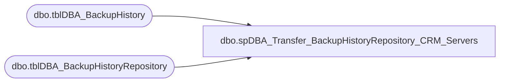

# dbo.spDBA_Transfer_BackupHistoryRepository_CRM_Servers

**Database:** DBAUtility  
**Server:** papamart  

## Architecture Diagram



## Table Dependencies

| Referenced Table |
|---|
| dbo.tblDBA_BackupHistory |
| dbo.tblDBA_BackupHistoryRepository |

## Stored Procedure Code

```sql
CREATE PROC [dbo].[spDBA_Transfer_BackupHistoryRepository_CRM_Servers]

@Action VARCHAR(100) = 'Process'
AS

-- =============================================================================================================
-- Name: spDBA_Transfer_BackupHistoryRepository_CRM_Servers
--
-- Description:	Inserts backup history into central repository table from CRM servers, that can't talk directly to COREDB01
-- Output: None

-- Available actions: None
--	
-- Dependencies: 
--	DBAUtility.dbo.tblDBA_BackupHistory
--	COREDB01_MAINT.DBAUtilityMaster.dbo.tblDBA_BackupHistoryRepository
--
-- Revision History
--		Name:			Date:			Comments:
--		Mike Pelikan	11/19/2014		Initial Release

DECLARE @Revision DATETIME
SET @Revision = '11/19/2014'
-----------------------------------------------------------------------------------------------------
-----------------------------------------------------------------------------------------------------

----------------------------------------------------------------------------------------------------
--// Set options                                                                                //--
----------------------------------------------------------------------------------------------------
SET NOCOUNT ON

----------------------------------------------------------------------------------------------------
--// Declare variables                                                                          //--
----------------------------------------------------------------------------------------------------
DECLARE @EndMessage varchar(2000)
DECLARE @ReturnCode int

----------------------------------------------------------------------------------------------------
--// Revision                                                                                  //--
----------------------------------------------------------------------------------------------------
IF @Action = 'ReturnVersion'
BEGIN
	SELECT @Revision
END
ELSE
BEGIN
	--Insert New

	INSERT INTO COREDB01_MAINT.DBAUtilityMaster.dbo.tblDBA_BackupHistoryRepository (InstanceName, DatabaseName, BackupName, BackupStarted, BackupFinished, BackupType, BackupFileLocation, BackupFileSize, StatusID)
	SELECT pvl.InstanceName, pvl.DatabaseName, pvl.BackupName, pvl.BackupStarted, pvl.BackupFinished, pvl.BackupType, pvl.BackupFileLocation, pvl.BackupFileSize, pvl.StatusID
	FROM crmdb02.DBAUtility.dbo.tblDBA_BackupHistory pvl 
	--LEFT JOIN COREDB01_MAINT.DBAUtility.dbo.tblDBA_BackupHistory pvr ON pvl.InstanceName = pvr.InstanceName COLLATE SQL_Latin1_General_CP1_CI_AS 
	--AND pvl.DatabaseName = pvr.DatabaseName COLLATE SQL_Latin1_General_CP1_CI_AS
	--AND pvr.BackupStarted = pvl.BackupStarted 
	WHERE --pvr.BackupHistoryID IS NULL AND 
	pvl.BackupStarted < DATEADD(dd, - 1, GETDATE()) 
	--Delete old
	DELETE FROM crmdb02.DBAUtility.dbo.tblDBA_BackupHistory
	WHERE BackupStarted < DATEADD(dd, - 1, GETDATE())
	

	INSERT INTO COREDB01_MAINT.DBAUtilityMaster.dbo.tblDBA_BackupHistoryRepository (InstanceName, DatabaseName, BackupName, BackupStarted, BackupFinished, BackupType, BackupFileLocation, BackupFileSize, StatusID)
	SELECT pvl.InstanceName, pvl.DatabaseName, pvl.BackupName, pvl.BackupStarted, pvl.BackupFinished, pvl.BackupType, pvl.BackupFileLocation, pvl.BackupFileSize, pvl.StatusID
	FROM CRMISE01.DBAUtility.dbo.tblDBA_BackupHistory pvl 
	--LEFT JOIN COREDB01_MAINT.DBAUtility.dbo.tblDBA_BackupHistory pvr ON pvl.InstanceName = pvr.InstanceName COLLATE SQL_Latin1_General_CP1_CI_AS 
	--AND pvl.DatabaseName = pvr.DatabaseName COLLATE SQL_Latin1_General_CP1_CI_AS
	--AND pvr.BackupStarted = pvl.BackupStarted 
	WHERE --pvr.BackupHistoryID IS NULL AND 
	pvl.BackupStarted < DATEADD(dd, - 1, GETDATE()) 

	DELETE FROM CRMISE01.DBAUtility.dbo.tblDBA_BackupHistory
	WHERE BackupStarted < DATEADD(dd, - 1, GETDATE())
	

END

EndHere:
IF @Action = 'ReturnVersion'
BEGIN
	SELECT @Revision 
END
ELSE
BEGIN
	SET @EndMessage = 'DateTime: ' + CONVERT(nvarchar,GETDATE(),120)
	SET @EndMessage = REPLACE(@EndMessage,'%','%%')
	RAISERROR(@EndMessage,10,1) WITH NOWAIT

	IF @ReturnCode <> 0
	BEGIN
		RETURN @ReturnCode
	--SELECT @ReturnCode
	END
END
```

