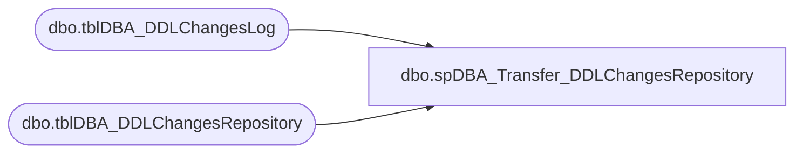

# dbo.spDBA_Transfer_DDLChangesRepository

**Database:** DBAUtility  
**Server:** papamart  

## Architecture Diagram



## Table Dependencies

| Referenced Table |
|---|
| dbo.tblDBA_DDLChangesLog |
| dbo.tblDBA_DDLChangesRepository |

## Stored Procedure Code

```sql
CREATE PROC [dbo].[spDBA_Transfer_DDLChangesRepository]
@Action VARCHAR(100) = 'Process'
AS

-- =============================================================================================================
-- Name: spDBA_Transfer_DDLChangesRepository
--
-- Description:	INSERTS DDL changes into central repository table, then truncates local version.
-- Output: None

-- Available actions: None
--	
-- Dependencies: 
--	DBAUtility.dbo.tblDBA_DDLChangesRepository
--	COREDB01_MAINT.DBAUtilityMaster.dbo.tblDBA_DDLChangesRepository
--
-- Revision History
--		Name:			Date:			Comments:
--		Mike Pelikan	06/12/2012		Added Robocopy logic
--		Mike Pelikan	06/13/2012		Changed Local log table name
--		Mike Pelikan	06/13/2012		Corrected name of local table in repository insert
--		Mike Pelikan	06/28/2012		Changed name of procedure

DECLARE @Revision DATETIME
SET @Revision = '06/28/2012'
-----------------------------------------------------------------------------------------------------
-----------------------------------------------------------------------------------------------------

SET NOCOUNT ON 

IF @Action = 'ReturnVersion'
BEGIN
SELECT @Revision
END
ELSE
BEGIN
	INSERT INTO COREDB01_MAINT.DBAUtilityMaster.dbo.tblDBA_DDLChangesRepository (ServerName, EventType, SchemaName, ObjectName, ObjectType, EventDate, SystemUser, CurrentUser, OriginalUser, DatabaseName, TSQLCode)
	SELECT ServerName, EventType, SchemaName, ObjectName, ObjectType, EventDate, SystemUser, CurrentUser, OriginalUser, DatabaseName, TSQLCode  
	FROM DBAUtility.dbo.tblDBA_DDLChangesLog

	TRUNCATE TABLE DBAUtility.dbo.tblDBA_DDLChangesLog
END
```

