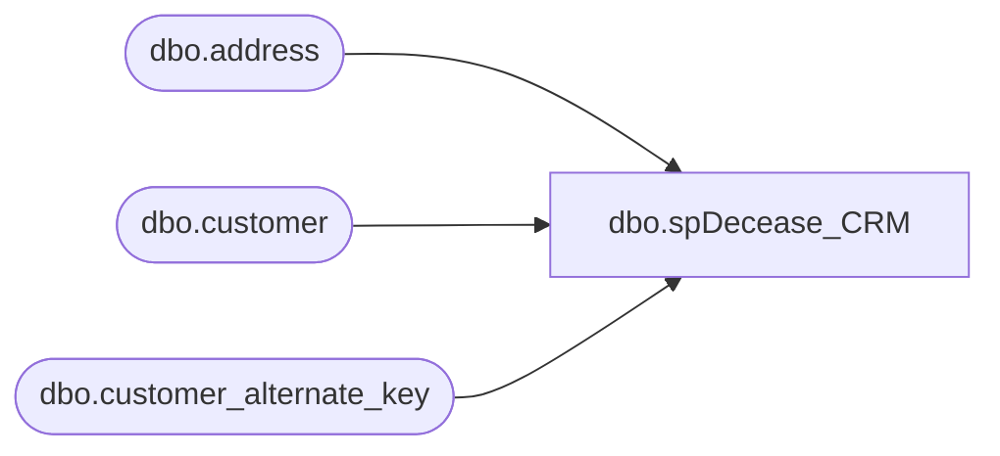

# dbo.spDecease_CRM

**Database:** DBAUtility  
**Server:** papamart  

## Architecture Diagram



## Table Dependencies

| Referenced Table |
|---|
| dbo.address |
| dbo.customer |
| dbo.customer_alternate_key |

## Stored Procedure Code

```sql
CREATE  PROCEDURE [dbo].[spDecease_CRM]
	@customer_num int 
-- =============================================================================================================
-- Name: spDecease_CRM
--
-- Description:	
--
-- Input:	N/A
--
-- Output: N/A
--
-- Dependencies: 
--
-- Revision History
--		Name:			Date:			Comments:
--		Gary Derikito	05/19/2008		Modify to point to new crm database.
-- =============================================================================================================


AS

declare @customer_id 		int
declare @customer_num_str 	varchar(20)
declare	@process_date 		smalldatetime

set @process_date = cast(getdate() as smalldatetime)
set @customer_num_str = cast(@customer_num as varchar(20))

-- find the customer id so that we can update 'em
if substring(@customer_num_str,1,1) = '5'
	select @customer_id = customer_id 
--	from mw.dbo.customer_alternate_key
	from crm.dbo.customer_alternate_key 
	where alternate_key=@customer_num_str
else
	set @customer_id = @customer_num

--update mw.dbo.customer
update crm.dbo.customer
set  email_address = 'Deceased'
	, last_update_date = @process_date
	, email_indicator = 0
	, opt_in_flag = 0
where customer_id = @customer_id

--update mw.dbo.address
update crm.dbo.address
set address_1 ='Deceased'
	, address_active_flag = 0
	, mail_indicator = 0
	, date_last_modified = @process_date
	, address_expiry_date = @process_date
where customer_id = @customer_id
```

