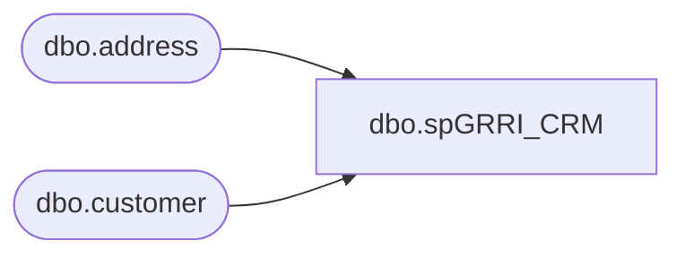

# dbo.spGRRI_CRM

**Database:** DBAUtility  
**Server:** papamart  

## Architecture Diagram



## Table Dependencies

| Referenced Table |
|---|
| dbo.address |
| dbo.customer |

## Stored Procedure Code

```sql
CREATE  PROCEDURE [dbo].[spGRRI_CRM]
-- =============================================================================================================
-- Name: spGRRI_CRM
--
-- Description:	
--
-- Input:	N/A
--
-- Output: N/A
--
-- Dependencies: 
--
-- Revision History
--		Name:			Date:			Comments:
--		Gary Derikito	05/19/2008		Modify to point to new crm database.
-- =============================================================================================================

	@customer_id int 

AS

DECLARE
	@process_date smalldatetime

SET @process_date = Cast(getdate() as smalldatetime)


-- --.......................................................
-- --.......OURSCLIENT LOGIC
-- --.......................................................

--.......mw.dbo.customer, address......
select 'CRDB01 (CRM) data removed'
select ''
--output documentation

select 
c.customer_id,
c.customer_no, 
c.first_name, 
c.last_name, 
c.email_address, 
c.last_update_date,
c.email_indicator,
c.opt_in_flag,
a.address_1,
a.address_active_flag,
a.mail_indicator,
a.date_last_modified,
a.address_expiry_date
from crm.dbo.customer c
	join crm.dbo.address a on c.customer_id=a.customer_id
where c.customer_id = @customer_id
--	c.last_name = 'Grzyb' and c.first_name ='Aysha'

----customer----
select '
update crm.dbo.customer
set first_name =''GRRI''
, last_name = ''GRRI''
, email_address = ''GRRI''
, last_update_date ='+ Cast(@process_date as varchar(25)) +'
, email_indicator = 0
, opt_in_flag = 0
where customer_id ='+ cast(@customer_id as varchar(20))

update crm.dbo.customer
set first_name ='GRRI'
, last_name = 'GRRI'
, email_address = 'GRRI'
, last_update_date = @process_date
, email_indicator = 0
, opt_in_flag = 0
where customer_id = @customer_id

----address----
select '
update crm.dbo.address
set address_1 =''GRRI''
, address_active_flag = 0
, mail_indicator = 0
, date_last_modified = '+Cast(@process_date as varchar(25))+'
, address_expiry_date = 0
where customer_id ='+ cast(@customer_id as varchar(20))

update crm.dbo.address
set address_1 ='GRRI'
, address_active_flag = 0
, mail_indicator = 0
, date_last_modified = @process_date
, address_expiry_date = @process_date
where customer_id = @customer_id
```

