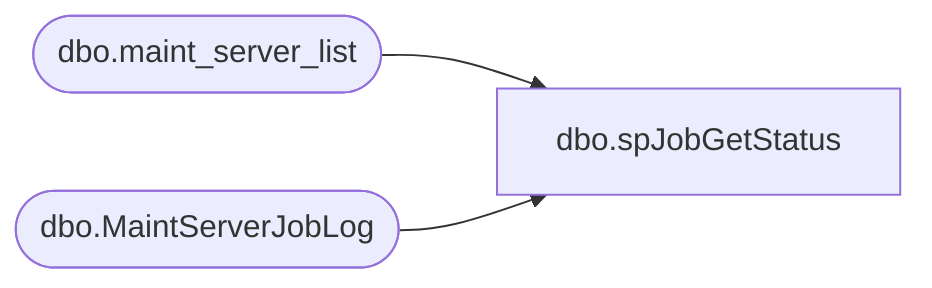

# dbo.spJobGetStatus

**Database:** DBAUtility  
**Server:** papamart  

## Architecture Diagram



## Table Dependencies

| Referenced Table |
|---|
| dbo.maint_server_list |
| dbo.MaintServerJobLog |

## Stored Procedure Code

```sql
CREATE  PROCEDURE spJobGetStatus
	@days_old int = -1
AS
SET NOCOUNT ON
DECLARE @sql varchar(8000)
DECLARE @srvname nvarchar(256)
DECLARE @srvname_name nvarchar(256)

TRUNCATE TABLE DBAUtility.dbo.MaintServerJobLog


DECLARE server_cursor CURSOR
FAST_FORWARD
FOR 
SELECT srvname
FROM DBAUtility.dbo.maint_server_list
WHERE srvname<>'POOHTOO' AND srvname<>'REDPANDA'

/*
BEARWEBDB
KODIAK
OURSBLANC
OURSBRUN
OURSCLIENT
OURSFREEDOM
OURSMARCHAND
OURSNOIR
OURSNOUVEL
OURSRAPPORT
PAPAMART
REDPANDA
SQLNETTIE
URSAMAJOR
WBN1
CHESAPEAKE
*/

OPEN server_cursor

FETCH NEXT FROM server_cursor INTO @srvname
WHILE (@@fetch_status =0)
BEGIN

     SET @srvname_name=@srvname
	
     If @srvname=@@SERVERNAME
     BEGIN
     SET @srvname=''
     END
     ELSE
     BEGIN
     SET @srvname=@srvname+'.'
     END
     

-- DECLARE @days_old int
-- DECLARE @sql varchar(8000)
-- DECLARE @srvname nvarchar(256)
-- DECLARE @srvname_name nvarchar(256)
-- 
-- SET @days_old = -1
-- SET @srvname='CHESAPEAKE'+'.'
-- SET @srvname_name= 'CHESAPEAKE'

     SET @sql='SELECT '+char(39)+@srvname_name+char(39)+', j.name,CASE run_status WHEN 0 THEN '+char(39) +'Failed'+char(39) + ' WHEN 1 THEN '+char(39) +'Succeeded'+char(39) 
     SET @sql=@sql+' WHEN 2 THEN '+char(39) +'Retry'+char(39) +' WHEN 3 THEN '+char(39) +'Canceled'+char(39) 
     SET @sql=@sql+' WHEN 4 THEN '+char(39) +'In progress'+char(39) 
     SET @sql=@sql+' END run_status, convert(varchar(20),convert(datetime,substring(convert(varchar(8),run_date),5,2) +'
     SET @sql=@sql+char(39) +'/'+char(39) + ' + right(convert(varchar(8),run_date),2) + '+char(39)+'/'+char(39)+' + left(convert(varchar(8),run_date),4) +'
     SET @sql=@sql+char(39)+char(32)+char(39)+' + convert(varchar(2),CASE WHEN len(convert(varchar(6),h.run_time))=6 THEN substring(convert(varchar(6),h.run_time),1,2)'
     SET @sql=@sql + ' ELSE '+char(39) +'0'+char(39) +' + substring(convert(varchar(6),h.run_time),1,1) END ) +' +char(39) +':'+char(39) 
     SET @sql=@sql+' + CASE WHEN len(convert(varchar(6),h.run_time))=6 THEN substring(convert(varchar(6),h.run_time),3,2) ELSE '
     SET @sql=@sql+' CASE WHEN len(substring(convert(varchar(6),h.run_time),2,2))=2 THEN substring(convert(varchar(6),h.run_time),2,2) ELSE ' 
     SET @sql=@sql+char(39) +'00'+char(39) +' END END +' +char(39) +':'+char(39) +' + CASE WHEN len(convert(varchar(6),h.run_time))=6 '
     SET @sql=@sql+' THEN substring(convert(varchar(6),h.run_time),5,2) ELSE CASE WHEN len(substring(convert(varchar(6),h.run_time),4,2))=2'
     SET @sql=@sql+' THEN substring(convert(varchar(6),h.run_time),4,2) ELSE '+char(39) +'00'+char(39) +' END END ),100) last_ran_date,'
     SET @sql=@sql+'left(replicate('+char(39) +'0'+char(39) +',6-len(convert(varchar(6),run_duration))) + convert(varchar(6),run_duration),2) + '
     SET @sql=@sql+char(39) +':'+char(39)+' + substring(replicate('+char(39) +'0'+char(39) +',6-len(convert(varchar(6),run_duration))) +' 
     SET @sql=@sql+' convert(varchar(6),run_duration),3,2) + '+char(39)+ ':'+char(39)+' + right(replicate('+char(39)+'0'+char(39)
     SET @sql=@sql+',6-len(convert(varchar(6),run_duration))) + convert(varchar(6),run_duration),2) run_duration '
     SET @sql=@sql+' from '+@srvname+'msdb.dbo.sysjobhistory h '
     SET @sql=@sql+' join '+@srvname+'msdb.dbo.sysjobs j '
     SET @sql=@sql+' on h.job_id=j.job_id '
     SET @sql=@sql+' inner join (select j.job_id, max(instance_id)instance_id '
     SET @sql=@sql+' from '+@srvname+'msdb.dbo.sysjobhistory h '
     SET @sql=@sql+' join '+@srvname+'msdb.dbo.sysjobs j '
     SET @sql=@sql+' on h.job_id=j.job_id where step_id=0 group by j.job_id) q '
     SET @sql=@sql+' on q.job_id=h.job_id and q.instance_id=h.instance_id '
     SET @sql=@sql+' where step_id=0 and datediff(d,getdate(),convert(datetime,substring(convert(varchar(8),run_date),5,2)+'+char(39)+'/'+char(39)
     SET @sql=@sql+' + right(convert(varchar(8),run_date),2) + '+char(39)+'/'+char(39)+' + left(convert(varchar(8),run_date),4)))>='+convert(varchar(4),@days_old)
     SET @sql=@sql+' order by run_date,run_time,j.name '

     INSERT INTO DBAUtility.dbo.MaintServerJobLog
     (srvname,name,run_status,last_ran_date,run_duration)
     Exec (@sql)

    	FETCH NEXT FROM server_cursor INTO @srvname
END

CLOSE server_cursor
DEALLOCATE server_cursor
```

