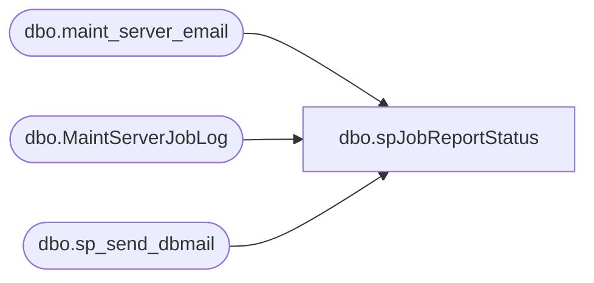

# dbo.spJobReportStatus

**Database:** DBAUtility  
**Server:** papamart  

## Architecture Diagram



## Table Dependencies

| Referenced Table |
|---|
| dbo.maint_server_email |
| dbo.MaintServerJobLog |
| dbo.sp_send_dbmail |

## Stored Procedure Code

```sql
-- exec spJobReportStatus
-- 
-- Executed as user: BAB\SQLservices. Cursorfetch: The number of variables declared in the 
-- INTO list must match that of selected columns. [SQLSTATE 42000] (Error 16924)  
-- Mail sent. [SQLSTATE 01000] (Message 17967)  Mail sent. [SQLSTATE 01000] (Message 17967).  
-- The step failed.

-- SET QUOTED_IDENTIFIER OFF 
-- GO
-- SET ANSI_NULLS ON 
-- GO
-- 
-- 
CREATE PROCEDURE [dbo].[spJobReportStatus]
AS
SET NOCOUNT ON

DECLARE @email varchar(100)
DECLARE @select varchar(8000)
DECLARE @filename  varchar(100)
DECLARE @charseperator varchar(1)
DECLARE @title varchar(50)
DECLARE @srvname varchar (50) 
DECLARE @job_name varchar (100) 
DECLARE @run_status varchar (11) 
DECLARE @last_ran_date varchar (20) 
DECLARE @run_duration varchar (8) 
DECLARE @message varchar(8000)


DECLARE email_cursor CURSOR
FAST_FORWARD
FOR 
SELECT DISTINCT email,title
FROM dbo.maint_server_email

SET @filename='SQLJobHistory'+replace(convert(varchar(12),getdate(),102),'.','')+'.txt'
SET @charseperator=char(9)
OPEN email_cursor

FETCH NEXT FROM email_cursor INTO @email,@title
WHILE (@@fetch_status =0)
BEGIN
     --Develop Message
     SET  @message=''

     DECLARE job_cursor CURSOR
     FAST_FORWARD
     FOR 
     SELECT l.srvname,name
     FROM DBAUtility.dbo.MaintServerJobLog l
     INNER JOIN DBAUtility.dbo.maint_server_email e 
     ON l.srvname=e.srvname 
     WHERE email = @email and title =@title and run_status<>'Succeeded'

     OPEN job_cursor

     FETCH NEXT FROM job_cursor INTO @srvname,@job_name
     WHILE (@@fetch_status =0)
     BEGIN
        SET  @message= @message+@srvname+char(9)+@job_name+char(13)

          FETCH NEXT FROM job_cursor INTO @srvname,@job_name 
     END
    CLOSE job_cursor
     DEALLOCATE job_cursor

     SET @message='Attached is the SQL Job History. Listed below are job(s) that failed:'+char(13)+@message

     SET @select =''
     SET @select='SELECT l.srvname,name,run_status ,last_ran_date ,run_duration FROM DBAUtility.dbo.MaintServerJobLog l'
     SET @select=@select+' INNER JOIN DBAUtility.dbo.maint_server_email e '
     SET @select=@select+' ON l.srvname=e.srvname '
     SET @select=@select+' WHERE email = '+char(39)+@email+char(39)+' and title ='+char(39)+@title+char(39)
     
    
      EXEC msdb.dbo.sp_send_dbmail @recipients = @email, 
      @message = @message, @subject = @title,
      @query =@select, @attach_query_result_as_file = 1, @query_result_width =250,    
      @query_result_separator = @charseperator,@query_attachment_filename =  @filename 

	FETCH NEXT FROM email_cursor INTO @email,@title
END

CLOSE email_cursor
DEALLOCATE email_cursor
```

