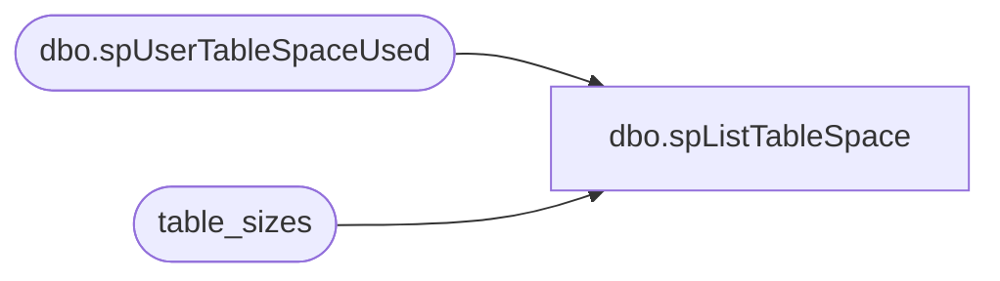

# dbo.spListTableSpace

**Database:** DBAUtility  
**Server:** papamart  

## Architecture Diagram



## Table Dependencies

| Referenced Table |
|---|
| dbo.spUserTableSpaceUsed |
| table_sizes |

## Stored Procedure Code

```sql
CREATE PROCEDURE spListTableSpace 
	(@tabletype varchar(25) = 'ALL')
AS

SET NOCOUNT ON

DECLARE @name sysname
DECLARE @cmd varchar(8000)
DECLARE @tablename nvarchar(128)
DECLARE @dbname nvarchar(128)
DECLARE @rows_output          int 
DECLARE	@KBreserved_output   dec(15,0) 
DECLARE	@KBdata_output       dec(15,0) 
DECLARE	@KBindex_size_output dec(15,0) 
DECLARE	@KBunused_output     dec(15,0) 
DECLARE @crdate_output       datetime 


TRUNCATE TABLE table_sizes

--TEMP TABLES
CREATE TABLE #temp_tables
(TABLE_CATALOG nvarchar(128), 
TABLE_SCHEMA nvarchar(128), 
TABLE_NAME sysname, 
TABLE_TYPE varchar(10) )

--CURSOR 1 GET TEMP TABLES FOR EACH DB ON SERVER
DECLARE db_cursor CURSOR
READ_ONLY
FOR 	SELECT  name 
	FROM master..sysdatabases 
	WHERE(NOT (name IN (N'master', N'model', N'msdb',N'tempdb',N'pubs',N'DBAUtility'))) 
	ORDER BY name


OPEN db_cursor

FETCH NEXT FROM db_cursor INTO @name
WHILE (@@fetch_status =0)
BEGIN
	
	IF UPPER(@tabletype)='TEMP' 
	BEGIN
	     SET @cmd='SELECT * FROM '+@name+'.INFORMATION_SCHEMA.TABLES'+
	              ' WHERE TABLE_NAME like ''%save%'' or '+ 
	              ' TABLE_NAME like ''%temp%'' or '+ 
	              ' TABLE_NAME like ''%tmp%'''
	END
	ELSE IF UPPER(@tabletype)='ALL' 
	BEGIN
	     SET @cmd='SELECT * FROM '+@name+'.INFORMATION_SCHEMA.TABLES'+
	              ' WHERE TABLE_TYPE=''BASE TABLE'''
	END
	
	INSERT INTO #temp_tables
	Exec (@cmd)
	FETCH NEXT FROM db_cursor INTO @name
END

CLOSE db_cursor
DEALLOCATE db_cursor


--CURSOR 2 GET THE SIZE OF EACH TEMP TABLE IN EACH DB's
DECLARE temptables_cursor CURSOR
READ_ONLY
FOR SELECT table_catalog, table_name 
FROM #temp_tables
ORDER BY 1,2


OPEN temptables_cursor

FETCH NEXT FROM temptables_cursor INTO @dbname,@tablename

WHILE (@@fetch_status =0)
BEGIN
	
	EXECUTE DBAUtility.dbo.spUserTableSpaceUsed
                @dbname,
		@tablename,
		@rows_output         OUTPUT,
		@KBreserved_output   OUTPUT,
		@KBdata_output       OUTPUT,
		@KBindex_size_output OUTPUT,
		@KBunused_output     OUTPUT,
		@crdate_output       OUTPUT

        INSERT INTO table_sizes
        ( dbname ,
          tablename,
          crdate,   
          rows,
          KBreserved,
          KBdata,
          KBindex_size,
          KBunused  )
	SELECT  @dbname,
                @tablename,
                @crdate_output,
                @rows_output  ,
	  @KBreserved_output   ,
	  @KBdata_output       ,
	  @KBindex_size_output,
	  @KBunused_output

	FETCH NEXT FROM temptables_cursor INTO @dbname,@tablename
END

CLOSE temptables_cursor
DEALLOCATE temptables_cursor


DROP TABLE #temp_tables


dbo,dt_generateansiname,/* 
**	Generate an ansi name that is unique in the dtproperties.value column 
*/ 
create procedure dbo.dt_generateansiname(@name varchar(255) output) 
as 
	declare @prologue varchar(20) 
	declare @indexstring varchar(20) 
	declare @index integer 
 
	set @prologue = 'MSDT-A-' 
	set @index = 1 
 
	while 1 = 1 
	begin 
		set @indexstring = cast(@index as varchar(20)) 
		set @name = @prologue + @indexstring 
		if not exists (select value from dtproperties where value = @name) 
			break 
		 
		set @index = @index + 1 
 
		if (@index = 10000) 
			goto TooMany 
	end 
 
Leave: 
 
	return 
 
TooMany: 
 
	set @name = 'DIAGRAM' 
	goto Leave 

dbo,dt_adduserobject,/*
**	Add an object to the dtproperties table
*/
create procedure dbo.dt_adduserobject
as
	set nocount on
	/*
	** Create the user object if it does not exist already
	*/
	begin transaction
		insert dbo.dtproperties (property) VALUES ('DtgSchemaOBJECT')
		update dbo.dtproperties set objectid=@@identity 
			where id=@@identity and property='DtgSchemaOBJECT'
	commit
	return @@identity

dbo,dt_setpropertybyid,/*
**	If the property already exists, reset the value; otherwise add property
**		id -- the id in sysobjects of the object
**		property -- the name of the property
**		value -- the text value of the property
**		lvalue -- the binary value of the property (image)
*/
create procedure dbo.dt_setpropertybyid
	@id int,
	@property varchar(64),
	@value varchar(255),
	@lvalue image
as
	set nocount on
	declare @uvalue nvarchar(255) 
	set @uvalue = convert(nvarchar(255), @value) 
	if exists (select * from dbo.dtproperties 
			where objectid=@id and property=@property)
	begin
		--
		-- bump the version count for this row as we update it
		--
		update dbo.dtproperties set value=@value, uvalue=@uvalue, lvalue=@lvalue, version=version+1
			where objectid=@id and property=@property
	end
	else
	begin
		--
		-- version count is auto-set to 0 on initial insert
		--
		insert dbo.dtproperties (property, objectid, value, uvalue, lvalue)
			values (@property, @id, @value, @uvalue, @lvalue)
	end
```

