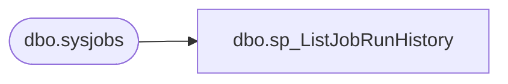

# dbo.sp_ListJobRunHistory

**Database:** DBAUtility  
**Server:** papamart  

## Architecture Diagram



## Table Dependencies

| Referenced Table |
|---|
| dbo.sysjobs |

## Stored Procedure Code

```sql
CREATE PROCEDURE dbo.sp_ListJobRunHistory
    @DBAdmin int = 0,
    @DBUltra bit = 0,
    @DBIntra varchar(8000) = NULL,
    @DBExtra varchar(8000) = NULL,
    @PCIntra varchar(100)  = NULL,
    @PCExtra varchar(100)  = NULL
AS

SET NOCOUNT ON

DECLARE @Return int
DECLARE @Retain int
DECLARE @Status int

SET @Status = 0

DECLARE @Task varchar(2000)

DECLARE @Work varchar(10)

DECLARE @MyID uniqueidentifier

CREATE TABLE #DBAH (job_id uniqueidentifier, instance_id int, message varchar(200), run_date int, run_time int, run_duration int)

SET @Work = CONVERT(varchar(10),CASE WHEN @DBAdmin = 0 THEN 100 ELSE @DBAdmin END)

DECLARE DBItems CURSOR FAST_FORWARD FOR
 SELECT O.job_id
   FROM msdb.dbo.sysjobs AS O
  WHERE 0 = 0
    AND (@DBIntra IS NULL OR CHARINDEX('|'+O.name+'|','|'+(@DBIntra)+'|') > 0)
    AND (@DBExtra IS NULL OR CHARINDEX('|'+O.name+'|','|'+(@DBExtra)+'|') = 0)
    AND (@PCIntra IS NULL OR               O.name     LIKE @PCIntra)
    AND (@PCExtra IS NULL OR               O.name NOT LIKE @PCExtra)

SET @Retain = @@ERROR IF @Status = 0 SET @Status = @Retain

OPEN DBItems

SET @Retain = @@ERROR IF @Status = 0 SET @Status = @Retain

FETCH NEXT FROM DBItems INTO @MyID

SET @Retain = @@ERROR IF @Status = 0 SET @Status = @Retain

WHILE @@FETCH_STATUS = 0 AND @Status = 0

    BEGIN

    SET @Task = '   INSERT #DBAH'

              + '   SELECT TOP ' + @Work + ' job_id, instance_id, SUBSTRING(message,1,CHARINDEX(' + CHAR(39) + '.' + CHAR(39) + ',message,1)), run_date, run_time, run_duration'

              + '     FROM msdb.dbo.sysjobhistory'

              + '    WHERE step_id = 0 AND CONVERT(varchar(100),job_id) = ' + CHAR(39) + CONVERT(varchar(100),@MyID) + CHAR(39)

              + ' ORDER BY instance_id DESC'

    EXECUTE (@Task)

    SET @Return = @@ERROR IF @Status = 0 SET @Status = @Return

    FETCH NEXT FROM DBItems INTO @MyID

    SET @Retain = @@ERROR IF @Status = 0 SET @Status = @Retain

    END

CLOSE DBItems DEALLOCATE DBItems

   SELECT O.name AS [Name]
        , ISNULL(SUBSTRING(CONVERT(varchar(8),T.run_date),1,4) + '-'
        +        SUBSTRING(CONVERT(varchar(8),T.run_date),5,2) + '-'
        +        SUBSTRING(CONVERT(varchar(8),T.run_date),7,2),'') AS [Date]
        , ISNULL(SUBSTRING(CONVERT(varchar(7),T.run_time+1000000),2,2) + ':'
        +        SUBSTRING(CONVERT(varchar(7),T.run_time+1000000),4,2) + ':'
        +        SUBSTRING(CONVERT(varchar(7),T.run_time+1000000),6,2),'') AS [Time]
        , ISNULL(SUBSTRING(CONVERT(varchar(7),T.run_duration+1000000),2,2) + ':'
        +        SUBSTRING(CONVERT(varchar(7),T.run_duration+1000000),4,2) + ':'
        +        SUBSTRING(CONVERT(varchar(7),T.run_duration+1000000),6,2),'') AS [Duration]
        , ISNULL(T.message,'') AS [Status]
     FROM msdb.dbo.sysjobs AS O
LEFT JOIN #DBAH AS T
       ON O.job_id = T.job_id
    WHERE (@DBUltra = 0 OR CHARINDEX('succeeded',T.message,1) = 0)
      AND (@DBIntra IS NULL OR CHARINDEX('|'+O.name+'|','|'+(@DBIntra)+'|') > 0)
      AND (@DBExtra IS NULL OR CHARINDEX('|'+O.name+'|','|'+(@DBExtra)+'|') = 0)
      AND (@PCIntra IS NULL OR               O.name     LIKE @PCIntra)
      AND (@PCExtra IS NULL OR               O.name NOT LIKE @PCExtra)
 ORDER BY O.name,
          T.instance_id DESC

DROP TABLE #DBAH

SET NOCOUNT OFF

RETURN (@Status)
```

