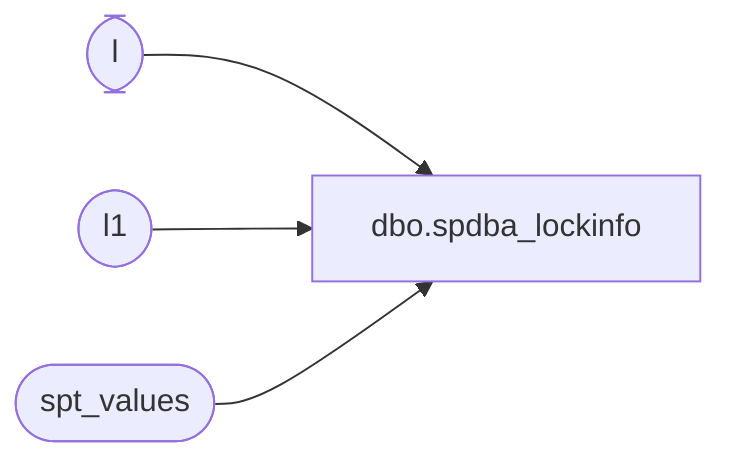

# dbo.spdba_lockinfo

**Database:** DBAUtility  
**Server:** papamart  

## Architecture Diagram



## Table Dependencies

| Referenced Table |
|---|
| l |
| l1 |
| spt_values |

## Stored Procedure Code

```sql
/*---------------------------------------------------------------------
  $Header: /abasql/aba_lockinfo_sql7.sp 3     02-05-04 18:41 Sommar $

  This SP lists locking information for all active processes, that is
  processes that have a lock or are not AWAITING COMMAND. Information
  about all locked objects are included, as well the last command sent
  from the client. Note that this command is tacked out afterwards with
  DBCC INPUTBUFFER, and may be out of sync with the rest of the data.

  The original source for the SP was taken from the undocumented
  system procedure sp_lockinfo.

  This version works only in SQL2000. There are separate versions for
  SQL6.5 and SQL7.

  $History: aba_lockinfo_sql7.sp $
 * 
 * *****************  Version 3  *****************
 * User: Sommar       Date: 02-05-04   Time: 18:41
 * Updated in $/abasql
 * Current time was saved in a format that later would cause conversion
 * error with some dateformat settings.
 *
 * *****************  Version 2  *****************
 * User: Sommar       Date: 02-03-24   Time: 0:40
 * Updated in $/abasql
 * The SQL7 version is now as similar to the SQL2000 it can be.
 *
 * *****************  Version 8  *****************
 * User: Sommar       Date: 02-03-22   Time: 16:02
 * Updated in $/abasql
 * Performance enhancements. No longer need for separate database, uses
 * temp tables. Lots of KEEP PLAN to avoid recompilations.
 * Unnecessary use of dynamic SQL removed. Support for SQL7 removed.
 *
 * *****************  Version 7  *****************
 * User: Sommar       Date: 01-11-26   Time: 15:38
 * Updated in $/abasql
 * Now that's news! There might be more than one ecid in sysprocesses per
 * spid. Let's handle that!
 *
 * *****************  Version 6  *****************
 * User: Sommar       Date: 01-07-16   Time: 22:27
 * Updated in $/abasql
 * Extensive rewrite. Default is now to group locks to reduce the amount
 * data when there are many locks. Also handling the case that a process
 * may not exist in sysprocesses. Handle also application locks.
 *
 * *****************  Version 5  *****************
 * User: Sommar       Date: 01-03-17   Time: 22:07
 * Updated in $/abasql
 * Added SET QUOTED_IDENTIFIER OFF for the benefit of people outside
 * Abaris who might have this on.
 *
 * *****************  Version 4  *****************
 * User: Sommar       Date: 00-11-07   Time: 10:59
 * Updated in $/projects/dbverktyg/abasql
 * Adaptions for SQL2000. Define processes that only hold a lock on a
 * databaes as passive. Translate object names per database, not per
 * object. Handle that last_since may overflow.
 *
 * *****************  Version 2  *****************
 * User: Sommar       Date: 00-02-09   Time: 13:19
 * Updated in $/projects/dbverktyg/abasql
 * Stupid bug: last_since was 10 times too big.
 *
 * *****************  Version 1  *****************
 * User: Sommar       Date: 00-01-06   Time: 17:46
 * Created in $/projects/dbverktyg/abasql
 *
 * *****************  Version 2  *****************
 * User: Sommar       Date: 99-12-21   Time: 19:39
 * Updated in $/projects/dbverktyg/abasql
 * Hide system processes.
 *
 * *****************  Version 1  *****************
 * User: Sommar       Date: 99-12-21   Time: 19:33
 * Created in $/projects/dbverktyg/abasql
  ---------------------------------------------------------------------*/
CREATE PROCEDURE spdba_lockinfo @processes tinyint = 0,
                              @details   bit     = 0 AS

DECLARE @minspid     int,

        @lkdbid      smallint,
        @lkdbnm      sysname,
        @lkobjid     int,
        @stmt        varchar(8000),
        @spid        smallint,
        @spidstr     varchar(10),
        @str         varchar(255),
        @ix          tinyint,
        @blklvl      tinyint,

        @spidlen     varchar(5),
        @ecidlen     varchar(5),
        @loginlen    varchar(5),
        @cntlen      varchar(5),
        @statuslen   varchar(5),
        @dbnamelen   varchar(5),
        @hostlen     varchar(5),
        @cmdlen      varchar(5),
        @appllen     varchar(5),
        @waitlen     varchar(5),
        @waitreslen  varchar(5),
        @locktlen    varchar(5),
        @refcntlen   varchar(5),
        @restlen     varchar(5),
        @lkstatlen   varchar(5),
        @lkobjlen    varchar(5),
        @cpulen      varchar(5),
        @physiolen   varchar(5),
        @memlen      varchar(5),
        @delaylen    varchar(5),
        @cntstr      varchar(255),
        @refcntstr   varchar(255),
        @waittypestr varchar(255)


SET TRANSACTION ISOLATION LEVEL READ UNCOMMITTED
SET NOCOUNT ON

/* ===========================================================*/
/* build temp table with processes and their associated locks */
/* ===========================================================*/


CREATE TABLE #inputbuffer (eventtype nvarchar(30)  NULL,
                           params    int           NULL,
                           eventinfo nvarchar(255) NULL)

CREATE TABLE #lockinfo (
   id          int IDENTITY(1, 1) NOT NULL,
   last        bit                NOT NULL DEFAULT 0,
   cnt         int                NOT NULL,
   active      bit                NOT NULL,
   spid        smallint           NOT NULL,
   ecid        smallint           NOT NULL,
   login       sysname            NULL,
   status      nvarchar(30)       NULL,
   dbname      sysname            NULL,
   host        nvarchar(128)      NULL,
   command     nvarchar(16)       NULL,
   appl        nvarchar(128)      NULL,
   opntrn      smallint           NULL,
   blking      smallint           NOT NULL,
   blkby       smallint           NULL,
   blklvl      smallint           NOT NULL,
   waittime    int                NULL,
   req_mode    tinyint            NULL,
   rsc_type    tinyint            NULL,
   req_status  tinyint            NULL,
   req_ownertype smallint         NULL,
   refcnt      smallint           NULL,
   locktype    nvarchar(30)       NOT NULL,
   waittype    binary(2)          NULL,
   lkdbid      smallint           NULL,
   lkobjid     int                NULL,
   lkindid     int                NULL,
   lkobj       nvarchar(170)      NOT NULL,
   restype     nvarchar(20)       NOT NULL,
   lkstatus    nvarchar(20)       NOT NULL,
   lkowntype   nvarchar(5)        NOT NULL,
   cpu         int                NULL,
   physio      int                NULL,
   memusage    int                NULL,
   now         char(23)           NOT NULL,
   login_time  char(16)           NULL,
   last_batch  char(16)           NULL,
   last_since  numeric(10,3)      NULL,
   delay       int                NOT NULL,
   inputbuffer nchar(255)         NOT NULL)

-- A copy of syslockinfo, with unused columns removed.
CREATE TABLE #syslockinfo (
    rsc_text           nchar (32)       NOT NULL,
--    rsc_bin            binary (16)      NOT NULL,
--    rsc_valblk         binary (16)      NOT NULL,
    rsc_dbid           smallint         NOT NULL,
    rsc_indid          smallint         NOT NULL,
    rsc_objid          int              NOT NULL,
    rsc_type           tinyint          NOT NULL,
--    rsc_flag           tinyint          NOT NULL,
    req_mode           tinyint          NOT NULL,
    req_status         tinyint          NOT NULL,
    req_refcnt         smallint         NOT NULL,
--    req_cryrefcnt      smallint         NOT NULL,
--    req_lifetime       int              NOT NULL,
    req_spid           int              NOT NULL,
    req_ecid           int              NOT NULL,
    req_ownertype      smallint         NOT NULL
--    req_transactionID  bigint           NULL,
--    req_transactionUOW uniqueidentifier NULL
)

CREATE TABLE #sysprocesses (
    spid         smallint    NOT NULL,
--    kpid         smallint    NOT NULL,
    blocked      smallint    NOT NULL,
    waittype     binary(2)   NOT NULL,
    waittime     int         NOT NULL,
--    lastwaittype nchar(32)   NOT NULL,
--    waitresource nchar(256)  NOT NULL,
    dbid         smallint    NOT NULL,
    uid          smallint    NOT NULL,
    cpu          int         NOT NULL,
    physical_io  int         NOT NULL,
    memusage     int         NOT NULL,
    login_time   datetime    NOT NULL,
    last_batch   datetime    NOT NULL,
    ecid         smallint    NOT NULL,
    open_tran    smallint    NOT NULL,
    status       nchar(30)   NOT NULL,
    sid          binary(86)  NOT NULL,
    hostname     nchar(128)  NOT NULL,
    program_name nchar(128)  NOT NULL,
--    hostprocess  nchar(8)    NOT NULL,
    cmd          nchar(16)   NOT NULL,
    nt_domain    nchar(128)  NOT NULL,
    nt_username  nchar(128)  NOT NULL,
--    net_address  nchar(12)   NOT NULL,
--    net_library  nchar(12)   NOT NULL,
    loginame     nchar(128)  NOT NULL
--    context_info binary(128) NOT NULL
)

SET @minspid = 6

INSERT #sysprocesses
         (spid, blocked, waittype, waittime, dbid, uid, cpu, physical_io,
          memusage, login_time, last_batch, ecid, open_tran, status, sid,
          hostname, program_name, cmd, nt_domain, nt_username, loginame)
   SELECT spid, blocked, waittype, waittime, dbid, uid, cpu, physical_io,
          memusage, login_time, last_batch, ecid, open_tran, status, sid,
          hostname, program_name, cmd, nt_domain, nt_username, loginame
   FROM   master..sysprocesses

INSERT #syslockinfo
         (rsc_text, rsc_dbid, rsc_indid, rsc_objid, rsc_type,
          req_mode, req_status, req_refcnt, req_spid, req_ecid,
          req_ownertype)
   SELECT rsc_text, rsc_dbid, rsc_indid, rsc_objid, rsc_type,
          req_mode, req_status, req_refcnt, req_spid, req_ecid,
          req_ownertype
   FROM   master..syslockinfo

IF @details = 0
BEGIN
   INSERT #lockinfo (active, cnt, login,
                    spid, ecid, status, dbname, host,
                    command, appl, opntrn, blking, blkby, blklvl, waittime,
                    lkdbid, lkobjid, lkindid, req_mode, rsc_type,
                    req_status, req_ownertype, refcnt,
                    lkobj,
                    locktype, restype, lkstatus, lkowntype,
                    cpu, physio, memusage, waittype,
                    now,
                    login_time,
                    last_batch,
                    last_since, delay, inputbuffer)
      SELECT 1, coalesce(l.cnt, 0), suser_sname(p.sid),
             coalesce(p.spid, l.req_spid),
             coalesce(p.ecid, l.req_ecid),
             p.status, db_name(p.dbid), p.hostname,
             p.cmd, p.program_name, p.open_tran, 0, p.blocked, 0, p.waittime,
             l.rsc_dbid, l.rsc_objid, l.rsc_indid, l.req_mode, l.rsc_type,
             l.req_status, l.req_ownertype, 0,
             coalesce(db_name(l.rsc_dbid) + '.' + l.rsc_text,
                      db_name(l.rsc_dbid), ' '),
             ' ', ' ', ' ', ' ',
             p.cpu, p.physical_io, p.memusage, p.waittype,
             convert(char(9), getdate(), 112) + convert(char(12), getdate(), 114),
             convert(char(7), p.login_time, 12) + convert(char(9), p.login_time, 8),
             convert(char(7), p.last_batch, 12) + convert(char(9), p.last_batch, 8),
             CASE WHEN datediff(DAY, p.last_batch, getdate()) > 20
                  THEN NULL
                  ELSE datediff(MS, p.last_batch, getdate()) / 1000.000
             END, 0, ' '
      FROM   #sysprocesses p
      FULL   JOIN (SELECT req_spid, req_ecid, rsc_dbid, rsc_objid, rsc_indid, req_mode,
                          rsc_type, req_status, req_ownertype,
                          CASE rsc_type WHEN 10 THEN rsc_text END AS rsc_text,
                          cnt = COUNT(*)
                   FROM   #syslockinfo
                   GROUP  BY req_spid, req_ecid, rsc_dbid, rsc_objid,
                          rsc_indid, req_mode, rsc_type, req_status,
                          req_ownertype,
                          CASE rsc_type WHEN 10 THEN rsc_text END
                   ) AS l ON p.spid = l.req_spid
                         AND p.ecid = l.req_ecid
      WHERE  (upper(p.cmd) <> 'AWAITING COMMAND' OR
              l.req_spid IS NOT NULL OR
              p.blocked > 0 OR
              @processes > 0)
        AND  (p.spid IS NULL OR p.spid <> @@spid OR @processes > 0)
   OPTION (KEEP PLAN)
END
ELSE
BEGIN
   INSERT #lockinfo (active, login, spid,
                    ecid, cnt, status,
                    dbname, host, command, appl, opntrn,
                    blking, blkby, blklvl, waittime, lkdbid, lkobjid, lkindid,
                    req_mode, rsc_type, req_status, req_ownertype, refcnt,
                    lkobj,
                    locktype, restype, lkstatus, lkowntype,
                    cpu, physio, memusage, waittype,
                    now,
                    login_time,
                    last_batch,
                    last_since, delay, inputbuffer)
      SELECT 1, suser_sname(p.sid), coalesce(p.spid, l.req_spid),
             coalesce(p.ecid, l.req_ecid), 1, p.status,
             db_name(p.dbid), p.hostname, p.cmd, p.program_name, p.open_tran,
             0, p.blocked, 0, p.waittime, l.rsc_dbid, l.rsc_objid, l.rsc_indid,
             l.req_mode, l.rsc_type, l.req_status, l.req_ownertype, l.req_refcnt,
             CASE l.rsc_type
                  WHEN 10 THEN db_name(l.rsc_dbid) + '.' + l.rsc_text
                  ELSE coalesce(db_name(l.rsc_dbid), ' ')
             END,
             ' ', ' ', ' ', ' ',
             p.cpu, p.physical_io, p.memusage, p.waittype,
             convert(char(9), getdate(), 112) + convert(char(12), getdate(), 114),
             convert(char(7), p.login_time, 12) + convert(char(9), p.login_time, 8),
             convert(char(7), p.last_batch, 12) + convert(char(9), p.last_batch, 8),
             CASE WHEN datediff(DAY, p.last_batch, getdate()) > 20
                  THEN NULL
                  ELSE datediff(MS, p.last_batch, getdate()) / 1000.000
             END, 0, ' '
      FROM   #sysprocesses p
      FULL   JOIN #syslockinfo l ON p.spid = l.req_spid
                                AND p.ecid = l.req_ecid
      WHERE  (upper(p.cmd) <> 'AWAITING COMMAND' OR
              l.req_spid IS NOT NULL OR
              p.blocked > 0 OR
              @processes > 0)
        AND  (p.spid IS NULL OR p.spid <> @@spid OR @processes > 0)
   OPTION (KEEP PLAN)
END

/*===========================*/
/* Mark inactive processes   */
/*===========================*/
IF @processes < 2
BEGIN
   UPDATE #lockinfo
   SET    active = 0
   WHERE  command = 'AWAITING COMMAND' AND req_mode IS NULL AND blkby = 0
          -- Normal inactive process
      OR  spid = @@spid
          -- Don't display ourselves.
      OR  rsc_type = 2 AND req_status = 1
          -- A database lock that even an inactive process may hold
      OR  spid < @minspid AND blkby = 0 AND req_mode IS NULL
          -- Skip system processes that are not blocked or locking.
   OPTION (KEEP PLAN)
END

/*===========================*/
/* Delete inactive processes */
/*===========================*/
IF @processes = 0
BEGIN
   DELETE #lockinfo
   FROM   #lockinfo l
   WHERE  NOT EXISTS (SELECT *
                      FROM   (SELECT DISTINCT spid
                              FROM   #lockinfo
                              WHERE  active = 1) AS l2
                      WHERE  l.spid = l2.spid)
   OPTION (KEEP PLAN)
END

/* ======================= */
/* Get input buffers       */
/* ======================= */
IF @processes < 2
BEGIN
   DECLARE C2 CURSOR LOCAL FOR
      SELECT DISTINCT str(spid), spid
      FROM   #lockinfo
      WHERE  active = 1
        AND  login IS NOT NULL
     OPTION (KEEP PLAN)

END
ELSE
BEGIN
   DECLARE C2 CURSOR LOCAL FOR
      SELECT DISTINCT str(spid), spid
      FROM   #lockinfo
      WHERE  login IS NOT NULL
      OPTION (KEEP PLAN)
END
OPEN C2

WHILE 1 = 1
BEGIN
   FETCH C2 INTO @spidstr, @spid
   IF @@fetch_status <> 0
      BREAK

   DELETE #inputbuffer
   INSERT #inputbuffer EXEC ('DBCC INPUTBUFFER (' + @spidstr + ') WITH NO_INFOMSGS')

   SELECT @str = ' '
   SELECT @str = rtrim(eventinfo) FROM #inputbuffer

   -- Replace line breaks with spaces.
   SET @str = replace(@str, char(10) + char(13), ' ')
   SET @str = replace(@str, char(10), ' ')
   SET @str = replace(@str, char(13), ' ')

   UPDATE #lockinfo
   SET    inputbuffer = isnull(@str, ' '),
          delay       = datediff(ms, now, getdate())
   WHERE  spid = @spid
   OPTION (KEEP PLAN)
END

DEALLOCATE C2

/* ======================== */
/* Get data from spt_values */
/* ======================== */
UPDATE l
SET    locktype  = coalesce(v1.name, ' '),
       restype   = coalesce(v2.name, ' '),
       lkstatus  = coalesce(v3.name, ' '),
       lkowntype = coalesce(v4.name, ' ')
FROM   #lockinfo l
LEFT   JOIN master..spt_values v1 ON v1.number = l.req_mode + 1
                                 AND v1.type   = 'L'
LEFT   JOIN master..spt_values v2 ON v2.number = l.rsc_type
                                 AND v2.type   = 'LR'
LEFT   JOIN master..spt_values v3 ON v3.number = l.req_status
                                 AND v3.type   = 'LS'
LEFT   JOIN master..spt_values v4 ON v4.number = l.req_ownertype
                                 AND v4.type   = 'LO'
WHERE  l.req_mode IS NOT NULL
OPTION (KEEP PLAN)

/*-------------------------------*/
/* Mark last row                */
/*-------------------------------*/

UPDATE #lockinfo
SET    last = 1
FROM   #lockinfo l1
WHERE  id = (SELECT MAX(id) FROM #lockinfo l2 WHERE l2.spid = l1.spid)
OPTION (KEEP PLAN)

/* ======================= */
/* flag blocking processes */
/* ======================= */

UPDATE #lockinfo
SET    blking = 1
WHERE  spid in (SELECT blkby FROM #lockinfo WHERE blkby > 0)
OPTION (KEEP PLAN)

UPDATE #lockinfo
SET    blklvl = 1
WHERE  blking = 1
  AND  blkby  = 0
OPTION (KEEP PLAN)

SELECT @blklvl = 1

WHILE EXISTS (SELECT * FROM #lockinfo WHERE blkby > 0 AND blklvl = 0) AND
      @blklvl < 20
BEGIN
   UPDATE l1
   SET    blklvl = @blklvl + 1
   FROM   #lockinfo l1, #lockinfo l2
   WHERE  l1.blkby = l2.spid
     AND  l1.blkby > 0
     AND  l1.blklvl = 0
     AND  l2.blklvl = @blklvl
   OPTION (KEEP PLAN)

   SELECT @blklvl = @blklvl + 1
END

/* =============================================*/
/* get list of locked object IDs */
/* =============================================*/

DECLARE c1 CURSOR LOCAL FOR
   SELECT DISTINCT db_name(l.lkdbid), l.lkdbid
   FROM   #lockinfo l
   WHERE  l.lkobjid > 0
FOR READ ONLY
   OPTION (KEEP PLAN)

OPEN c1

WHILE 1 = 1
BEGIN
   FETCH c1 INTO @lkdbnm, @lkdbid
   IF @@fetch_status <> 0
      BREAK

   -- Set database.owner.name(.index) of locked objects in lockinfo
   SELECT @stmt =
       ' UPDATE l ' +
       ' SET    lkobj = "' + @lkdbnm + '." + u.name + "." + o.name +
                CASE l.lkindid WHEN 0 THEN "" ELSE "." + i.name END ' +
       ' FROM   #lockinfo l
         JOIN   ' +  @lkdbnm + '..sysobjects o ON l.lkobjid = o.id
         JOIN   ' +  @lkdbnm + '..sysusers u   ON u.uid     = o.uid
         LEFT   JOIN ' + @lkdbnm + '..sysindexes i ON l.lkindid = i.indid
                                                  AND i.id      = o.id
         WHERE  l.lkdbid = ' + str(@lkdbid) + '
           AND  l.lkobjid > 0 '
   EXEC ('SET QUOTED_IDENTIFIER OFF ' + @stmt)
END
DEALLOCATE c1


----------------------------------------------
-- Get lengths
---------------------------------------------
SELECT @spidlen    = convert(varchar(5), isnull(max(len(ltrim(str(spid)))), 1)),
       @ecidlen    = convert(varchar(5), isnull(max(len(ltrim(str(ecid)))), 1)),
       @loginlen   = convert(varchar(5), isnull(nullif(max(len(login)), 0), 1)),
       @cntlen     = convert(varchar(5), isnull(nullif(max(len(ltrim(str(cnt)))), 0), 1)),
       @statuslen  = convert(varchar(5), isnull(nullif(max(len(status)), 0), 1)),
       @dbnamelen  = convert(varchar(5), isnull(nullif(max(len(dbname)), 0), 1)),
       @hostlen    = convert(varchar(5), isnull(nullif(max(len(host)), 0), 1)),
       @cmdlen     = convert(varchar(5), isnull(nullif(max(len(command)), 0), 1)),
       @appllen    = convert(varchar(5), isnull(nullif(max(len(appl)), 0), 1)),
       @waitlen    = convert(varchar(5), isnull(nullif(max(len(ltrim(str(waittime)))), 0), 1)),
       @locktlen   = convert(varchar(5), isnull(nullif(max(len(locktype)), 0), 1)),
       @lkobjlen   = convert(varchar(5), isnull(nullif(max(len(lkobj)), 0), 1)),
       @restlen    = convert(varchar(5), isnull(nullif(max(len(restype)), 0), 1)),
       @lkstatlen  = convert(varchar(5), isnull(nullif(max(len(lkstatus)), 0), 1)),
       @refcntlen  = convert(varchar(5), isnull(nullif(max(len(ltrim(str(refcnt)))), 0), 1)),
       @cpulen     = convert(varchar(5), isnull(nullif(max(len(ltrim(str(cpu)))), 0), 1)),
       @physiolen  = convert(varchar(5), isnull(nullif(max(len(ltrim(str(physio)))), 0), 1)),
       @memlen     = convert(varchar(5), isnull(nullif(max(len(ltrim(str(memusage)))), 0), 1)),
       @delaylen   = convert(varchar(5), isnull(nullif(max(len(ltrim(str(delay)))), 0), 1))
FROM   #lockinfo
OPTION (KEEP PLAN)

-- Set cntstr, this column is only to be shown when @details is 0.
SET @cntstr = CASE @details
                 WHEN 1 THEN ''
                 ELSE 'cnt = convert(varchar(' + @cntlen + '), cnt), '
              END

/* ====== return the lockinfo table ===== */
EXEC('SET QUOTED_IDENTIFIER OFF
   SELECT spid      = str(spid, ' + @spidlen + '),
          ecid      = str(ecid, ' + @ecidlen + '),
          ' + @cntstr + '
          login     = coalesce(convert(varchar( ' + @loginlen + '), login), ""),
          prcstatus = coalesce(convert(varchar( ' + @statuslen + '), status), ""),
          command   = coalesce(convert(varchar( ' + @cmdlen + '), command), ""),
          dbname    = coalesce(convert(varchar( ' + @dbnamelen + '), dbname), ""),
          host      = coalesce(convert(varchar( ' + @hostlen + '), host), ""),
          appl      = coalesce(convert(varchar( ' + @appllen + '), appl), ""),
          opntrn    = coalesce(convert(varchar(5), opntrn), ""),
          lvl       = CASE coalesce(blklvl, 0)
                           WHEN 0 THEN " "
                           WHEN 1 THEN "!!"
                           ELSE convert(varchar(3), blklvl - 1)
                      END,
          blkby     = CASE coalesce(blkby, 0)
                         WHEN 0 THEN " "
                         ELSE convert(varchar(5), blkby)
                      END,
          locktype  = coalesce(convert(varchar( ' + @locktlen + '), locktype), ""),
          ownertype = coalesce(lkowntype, ""),
          object    = coalesce(convert(varchar( ' + @lkobjlen + '), lkobj), ""),
          rsctype   = coalesce(convert(varchar( ' + @restlen + '), restype), ""),
          lstatus   = coalesce(convert(varchar( ' + @lkstatlen + '), lkstatus), ""),
          ' + @refcntstr + '
          waittime  = CASE coalesce(waittime, 0)
                          WHEN 0 THEN " "
                          ELSE convert(varchar( ' + @waitlen + '), waittime)
                      END,
          waittype,
          cpu       = coalesce(convert(varchar( ' + @cpulen + '), cpu), ""),
          io        = coalesce(convert(varchar( ' + @physiolen + '), physio), ""),
          memusg    = coalesce(convert(varchar( ' + @memlen + '), memusage), ""),
          now       = substring(now, 10, 12),
          login_time = coalesce(login_time, ""),
          last_batch = coalesce(last_batch, ""),
          last_since = CASE WHEN last_since IS NOT NULL
                            THEN str(last_since, 11, 3)
                            ELSE " "
                       END,
          delay     = coalesce(convert(varchar( ' + @delaylen + '), delay), ""),
          inputbuffer,
          CASE last WHEN 1 THEN char(13) + char(10) ELSE " " END
   FROM   #lockinfo
   ORDER  BY spid, ecid, last ASC')
```

