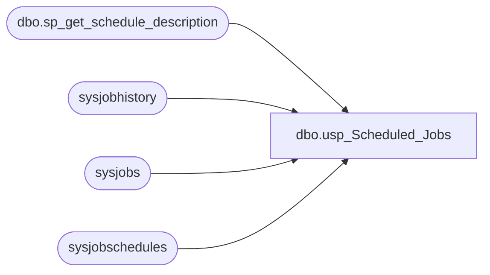

# dbo.usp_Scheduled_Jobs

**Database:** DBAUtility  
**Server:** papamart  

## Architecture Diagram



## Table Dependencies

| Referenced Table |
|---|
| dbo.sp_get_schedule_description |
| sysjobhistory |
| sysjobs |
| sysjobschedules |

## Stored Procedure Code

```sql
CREATE PROCEDURE dbo.usp_Scheduled_Jobs
/***************************************************************************************
** Procedure: usp_Scheduled_Jobs                                                      **
**                                                                                    **
** Purpose  : Return list of scheduled tasks with average and maximum run time.       **
**                                                                                    **
** Company  : Verizon                                                                 **
** Author   : Jose L. Amado-Blanco & Jason Carter                                     **
***************************************************************************************/ 
AS
SET NOCOUNT ON

-- Create temporary table
CREATE TABLE #dba_Scheduled_Jobs (
     job_name          varchar(255)     NOT NULL,
     job_enabled       varchar(3)       NOT NULL,
     scheduled_enabled varchar(3)       NOT NULL,
     occurs            varchar(255)     NULL,
     start_time        varchar(15)      NOT NULL,
     AVG_runtime       int              NOT NULL,
     MAX_runtime       int              NOT NULL,
     job_id            uniqueidentifier NOT NULL,
     schedule_id       int NOT NULL  )

INSERT INTO #dba_Scheduled_Jobs ( 
       job_name, job_enabled, scheduled_enabled, start_time, AVG_runtime, MAX_runtime, job_id, schedule_id )
     SELECT j.name,       -- Job Name
            CASE          -- Job Enabled = 1; Job Disabled = 0
                 WHEN j.enabled = 1 THEN 'Yes'
                 ELSE 'No'
            END,
            CASE          -- Schedule Enabled = 1; Schedule Disabled = 0
                 WHEN js.enabled = 1 THEN 'Yes'
                 ELSE 'No'
            END,
            CASE          -- Start Time (in military format). Convert it to AM/PM format with colon
                 WHEN RIGHT('000000' + RTRIM(js.active_start_time),6) > '125959' THEN
                 -- After 1pm (Example: 131500, means 1:15 pm). Subtract 120000 to convert it to PM format.
                      LEFT( RIGHT('000000' + RTRIM(js.active_start_time - 120000), 6), 2 ) + ':' +
                      SUBSTRING( RIGHT('000000' + RTRIM(js.active_start_time - 120000), 6),3,2) + ':' +
                      RIGHT( RIGHT('000000' + RTRIM(js.active_start_time - 120000), 6),2) + ' PM'
                 WHEN RIGHT('000000' + RTRIM(js.active_start_time),6) >= '120000' AND
                      RIGHT('000000' + RTRIM(js.active_start_time),6) <= '125959' THEN
                 -- Between 12pm and 1pm (Example: 121500, means 12:15 pm). Convert it to PM format.
                      LEFT( RIGHT('000000' + RTRIM(js.active_start_time),6), 2 ) +  ':' + 
                      SUBSTRING( RIGHT('000000' + RTRIM(js.active_start_time), 6),3,2) + ':' +
                      RIGHT( RIGHT('000000' + RTRIM(js.active_start_time), 6),2) + ' PM'
                 WHEN RIGHT('000000' + RTRIM(js.active_start_time),6) < '010000' THEN 
                 -- Between 12am and 1am. Convert it to AM format.
                      '12:' +
                      SUBSTRING( RIGHT('000000' + RTRIM(js.active_start_time), 6),3,2) + ':' +
                      RIGHT( RIGHT('000000' + RTRIM(js.active_start_time), 6),2) + ' AM'
                 ELSE
                 -- Between 1am and 12pm. Convert it to AM format.
                      LEFT( RIGHT('000000' + RTRIM(js.active_start_time),6), 2 ) +  ':' + 
                      SUBSTRING( RIGHT('000000' + RTRIM(js.active_start_time), 6),3,2) + ':' +
                      RIGHT( RIGHT('000000' + RTRIM(js.active_start_time), 6),2) + ' AM'
            END,
            AVG( CASE     -- Average Run Time (Convert everything to seconds = HH*3600 + MM*60 + SS)
                      WHEN LEN( CAST(jh.run_duration AS varchar) ) > 5 THEN                    -- Format: HHMMSS
                           CAST(LEFT(CAST(jh.run_duration as varchar), 2) AS int) * 3600       + -- get hours
                           CAST(SUBSTRING(CAST(jh.run_duration as varchar), 3, 2) AS int) * 60 + -- get minutes
                           CAST(RIGHT(CAST(jh.run_duration as varchar), 2) AS int)               -- get seconds
                      WHEN LEN( CAST(jh.run_duration AS varchar) ) = 5 THEN                    -- Format: HMMSS
                           CAST(LEFT(CAST(jh.run_duration as varchar), 1) AS int) * 3600       + -- get hours
                           CAST(SUBSTRING(CAST(jh.run_duration as varchar), 2, 2) AS int) * 60 + -- get minutes
                           CAST(RIGHT(CAST(jh.run_duration as varchar), 2) AS int)               -- get seconds
                      WHEN LEN( CAST(jh.run_duration AS varchar) ) = 4 THEN                    -- Format: MMSS
                           CAST(LEFT(CAST(jh.run_duration as varchar), 2) AS int) * 60 +         -- get minutes
                           CAST(RIGHT(CAST(jh.run_duration as varchar), 2) AS int)               -- get seconds
                      WHEN LEN( CAST(jh.run_duration AS varchar) ) = 3 THEN                    -- Format: MSS
                           CAST(LEFT(CAST(jh.run_duration as varchar), 1) AS int) * 60 +         -- get minutes
                           CAST(jh.run_duration as varchar)                                      -- get seconds
                      ELSE                                                                     -- Format: SS or S
                           jh.run_duration                                                       -- get seconds
                 END ),
            MAX(jh.run_duration), -- Max Run Time
            j.job_id,      -- Job ID
            js.schedule_id -- Schedule ID
FROM msdb..sysjobs AS j 
           INNER JOIN msdb..sysjobschedules AS js ON j.job_id = js.job_id
           INNER JOIN msdb..sysjobhistory   AS jh On j.job_id = jh.job_id AND jh.step_id = 0
GROUP BY j.name, j.enabled, js.enabled, j.job_id, js.active_start_time, js.schedule_id
ORDER BY j.name, j.enabled, js.enabled, j.job_id, js.active_start_time, js.schedule_id


DECLARE 
     @job_id                 uniqueidentifier,
     @freq_type              int,
     @freq_interval          int,
     @freq_subday_type       int,
     @freq_subday_interval   int,
     @freq_relative_interval int,
     @freq_recurrence_factor int,
     @active_start_date      int,
     @active_end_date        int,
     @active_start_time      int,
     @active_end_time        int,
     @occurs                 varchar(255),
     @schedule_id            int

DECLARE cur_s CURSOR FOR 
     SELECT DISTINCT j2.job_id, sj.freq_type, sj.freq_interval, sj.freq_subday_type, sj.freq_subday_interval,
            sj.freq_relative_interval, sj.freq_recurrence_factor, sj.active_start_date, sj.active_end_date,
            sj.active_start_time, sj.active_end_time, j2.schedule_id
     FROM #dba_Scheduled_Jobs j2 INNER JOIN msdb..sysjobschedules sj 
            ON  j2.job_id = sj.job_id 
            AND j2.schedule_id = sj.schedule_id
     FOR READ ONLY

OPEN cur_s
FETCH cur_s INTO @job_id,
     @freq_type,
     @freq_interval,
     @freq_subday_type,
     @freq_subday_interval,
     @freq_relative_interval,
     @freq_recurrence_factor,
     @active_start_date,
     @active_end_date,
     @active_start_time,
     @active_end_time,
     @schedule_id

WHILE @@fetch_status = 0
BEGIN
     -- Obtain the 'english description' of the schedule
     EXEC msdb.dbo.sp_get_schedule_description
	  @freq_type,
	  @freq_interval,
	  @freq_subday_type,
	  @freq_subday_interval,
	  @freq_relative_interval,
	  @freq_recurrence_factor,
	  @active_start_date,
	  @active_end_date,
	  @active_start_time,
	  @active_end_time,
          @occurs  OUTPUT


     UPDATE #dba_Scheduled_Jobs
     SET occurs = CASE
                     WHEN CHARINDEX( 'Once on ', @occurs ) > 0 THEN
                         'Once on ' + LEFT(CONVERT(varchar, CAST(SUBSTRING( @occurs, 9, 8) AS datetime), 100), 11)
                     WHEN CHARINDEX( ' at ', @occurs ) > 0 THEN
                         LEFT( @occurs, CHARINDEX( ' at ', @occurs ) )
                     ELSE @occurs
                  END
     WHERE job_id = @job_id and schedule_id = @schedule_id


     FETCH cur_s INTO @job_id,
	     @freq_type,
	     @freq_interval,
	     @freq_subday_type,
	     @freq_subday_interval,
	     @freq_relative_interval,
	     @freq_recurrence_factor,
	     @active_start_date,
	     @active_end_date,
	     @active_start_time,
	     @active_end_time,
             @schedule_id
END
CLOSE cur_s
DEALLOCATE cur_s

SELECT LEFT(job_name, 50) AS 'Job Name'
,      job_enabled   AS 'Job Enabled'
,      scheduled_enabled AS 'Schedule Enabled'
,      LEFT(occurs, 85) AS 'Occurs'
,      start_time  AS 'At'
,      'AVG Run Duration' = CAST( AVG_runtime / 3600 AS varchar) + ':' +
                            RIGHT('00' + CAST( (AVG_runtime % 3600) / 60 AS varchar), 2) + ':' + 
                            RIGHT('00' + CAST( ((AVG_runtime % 3600) % 60) AS varchar), 2)
,      'MAX Run Duration' = LEFT( RIGHT('000000' + CAST(MAX_runtime AS varchar), 6), 2 ) + ':' +
                            SUBSTRING( RIGHT('000000' + CAST(MAX_runtime AS varchar), 6), 3, 2 ) + ':' +
                            RIGHT( RIGHT('000000' + CAST(MAX_runtime AS varchar), 6), 2 )
FROM #dba_Scheduled_Jobs 

DROP TABLE #dba_Scheduled_Jobs
RETURN
```

