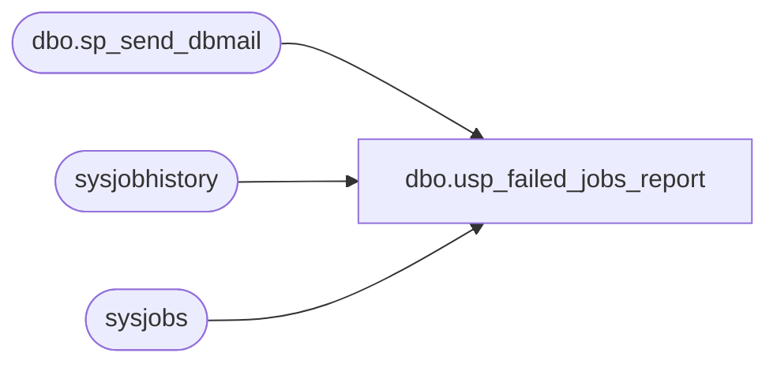

# dbo.usp_failed_jobs_report

**Database:** DBAUtility  
**Server:** papamart  

## Architecture Diagram



## Table Dependencies

| Referenced Table |
|---|
| dbo.sp_send_dbmail |
| sysjobhistory |
| sysjobs |

## Stored Procedure Code

```sql
CREATE procedure [dbo].[usp_failed_jobs_report] as

-- Written by: Greg Larsen

-- Company: Department of Health, Washington State

-- Date: January 3, 2002

-- Description:  This SQL Code reports job/step failures based on a data and time range.  The

--               report built is emailed to the DBA distribution list.

--

-- Modified 04/12/2002 - Greg Larsen - Modified to support Long running jobs that cross reporting 

--                                     periods

declare @RPT_BEGIN_DATE datetime

declare @NUMBER_OF_DAYS int

-- Set the number of days to go back to calculate the report begin date

set @NUMBER_OF_DAYS = -1

-- If the current date is Monday, then have the report start on Friday.

if datepart(dw,getdate()) = 2

  set @NUMBER_OF_DAYS = -3

-- Get the report begin date and time

set @RPT_BEGIN_DATE = dateadd(day,@NUMBER_OF_DAYS,getdate()) 

-- Get todays date in YYMMDD format

-- Create temporary table to hold report

create table ##temp_text (

email_text char(100))

-- Generate report heading and column headers

insert into ##temp_text values('The following jobs/steps failed since ' + 

                               cast(@RPT_BEGIN_DATE as char(20)) )

insert into ##temp_text values ('job                                         step_name                         failed datetime    ')

insert into ##temp_text values ('------------------------------------------- --------------------------------- -------------------')

-- Generate report detail for failed jobs/steps

insert into ##temp_text (email_text)

 select substring(j.name,1,43)+ 

        substring('                                           ',

        len(j.name),43) + substring(jh.step_name,1,33) + 

        substring('                                 ',

        len(jh.step_name),33) + 

        -- Calculate fail datetime

        -- Add Run Duration Seconds

        cast(dateadd(ss,

        cast(substring(cast(run_duration + 1000000 as char(7)),6,2) as int),

        -- Add Run Duration Minutes 

        dateadd(mi,

        cast(substring(cast(run_duration + 1000000 as char(7)),4,2) as int),

        -- Add Run Duration Hours

        dateadd(hh,

        cast(substring(cast(run_duration + 1000000 as char(7)),2,2) as int),

        -- Add Start Time Seconds

        dateadd(ss,

        cast(substring(cast(run_time + 1000000 as char(7)),6,2) as int),

        -- Add Start Time Minutes 

        dateadd(mi,

        cast(substring(cast(run_time + 1000000 as char(7)),4,2) as int),

        -- Add Start Time Hours

        dateadd(hh,

        cast(substring(cast(run_time + 1000000 as char(7)),2,2) as int),

        convert(datetime,cast (run_date as char(8))))

           ))))) as char(19))

   from msdb..sysjobhistory jh join msdb..sysjobs j on jh.job_id=j.job_id

   where   (getdate() >

               -- Calculate fail datetime

               -- Add Run Duration Seconds

               dateadd(ss,

               cast(substring(cast(run_duration + 1000000 as char(7)),6,2) as int),

               -- Add Run Duration Minutes 

               dateadd(mi,

               cast(substring(cast(run_duration + 1000000 as char(7)),4,2) as int),

               -- Add Run Duration Hours

               dateadd(hh,

               cast(substring(cast(run_duration + 1000000 as char(7)),2,2) as int),

               -- Add Start Time Seconds

               dateadd(ss,

               cast(substring(cast(run_time + 1000000 as char(7)),6,2) as int),

               -- Add Start Time Minutes 

               dateadd(mi,

               cast(substring(cast(run_time + 1000000 as char(7)),4,2) as int),

               -- Add Start Time Hours

               dateadd(hh,

               cast(substring(cast(run_time + 1000000 as char(7)),2,2) as int),

               convert(datetime,cast (run_date as char(8))))

               )))))) 

and  (@RPT_BEGIN_DATE < -- Calculate fail datetime

               -- Add Run Duration Seconds

               dateadd(ss,

               cast(substring(cast(run_duration + 1000000 as char(7)),6,2) as int),

               -- Add Run Duration Minutes 

               dateadd(mi,

               cast(substring(cast(run_duration + 1000000 as char(7)),4,2) as int),

               -- Add Run Duration Hours

               dateadd(hh,

               cast(substring(cast(run_duration + 1000000 as char(7)),2,2) as int),

               -- Add Start Time Seconds

               dateadd(ss,

               cast(substring(cast(run_time + 1000000 as char(7)),6,2) as int),

               -- Add Start Time Minutes 

               dateadd(mi,

               cast(substring(cast(run_time + 1000000 as char(7)),4,2) as int),

               -- Add Start Time Hours

               dateadd(hh,

               cast(substring(cast(run_time + 1000000 as char(7)),2,2) as int),

               convert(datetime,cast (run_date as char(8))))

               )))))) 

      

      and jh.run_status = 0

-- Email report to DBA distribution list

exec msdb.dbo.sp_send_dbmail @recipients='juliel@buildabear.com'                   ,          --------buildabear.com',
              @subject='Check for Failed Jobs - Contains jobs/steps that have failed.', 
              @query='select * from ##temp_text' , @query_result_header =0, @query_result_width=150

-- Drop temporary table

drop table ##temp_text
```

