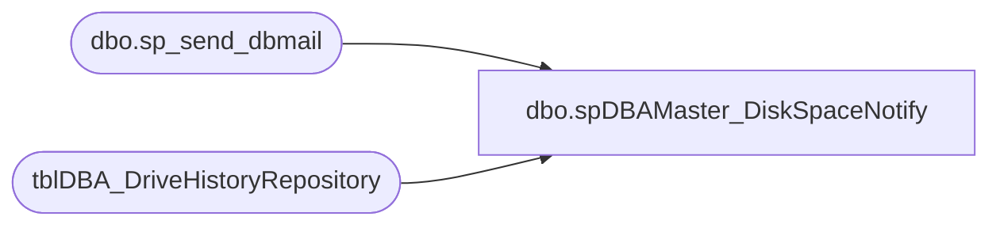

# dbo.spDBAMaster_DiskSpaceNotify

**Database:** DBAUtilityMaster  
**Server:** papamart  

## Architecture Diagram



## Table Dependencies

| Referenced Table |
|---|
| dbo.sp_send_dbmail |
| tblDBA_DriveHistoryRepository |

## Stored Procedure Code

```sql
CREATE PROCEDURE [dbo].[spDBAMaster_DiskSpaceNotify] 
AS

SET NOCOUNT ON

-- clean out the drive logs
DELETE FROM tblDBA_DriveHistoryRepository WHERE ExecutionTime < DATEADD(dd, -14, GETDATE())
DELETE FROM tblDBA_DriveHistoryRepository WHERE InstanceName IN ('OURSNOIR','OURSMARCHAND','OURSPOLAIRE','OURSBLANC')

IF (Object_ID('tempdb..##missingstats') IS NOT NULL) DROP TABLE ##missingstats
SELECT CAST(InstanceName AS VARCHAR(40)) InstanceName, max(ExecutionTime) ExecutionTime
INTO ##missingstats
FROM tblDBA_DriveHistoryRepository
GROUP BY InstanceName
HAVING MAX(ExecutionTime) < DATEADD(hh, -2, GETDATE())

IF (Object_ID('tempdb..##lowdrives') IS NOT NULL) DROP TABLE ##lowdrives

SELECT CAST(d.InstanceName AS VARCHAR(40)) InstanceName , d.Drive, d.TotalSize TotalSize_mb, d.FreeSpace FreeSpace_mb, 
CAST(d.PercentFree as varchar(11)) + '%' PercentFree, d.ExecutionTime
INTO ##lowdrives
FROM (
		SELECT InstanceName, MAX(ExecutionTime) ExecutionTime
		FROM tblDBA_DriveHistoryRepository
		GROUP BY InstanceName
	) ds
	JOIN tblDBA_DriveHistoryRepository d
	ON d.InstanceName = ds.InstanceName
	AND d.ExecutionTime = ds.ExecutionTime
WHERE 
	(
	(d.PercentFree < 10
	AND d.FreeSpace < 100)
	)
 	AND d.InstanceName NOT IN ('redpanda')
ORDER BY d.InstanceName, d.Drive

DELETE FROM ##lowdrives
WHERE (InstanceName = 'ourspolaire' AND Drive = 'f' AND FreeSpace_mb > 100)

IF (SELECT COUNT(*) FROM ##missingstats) > 0 OR (SELECT COUNT(*) FROM ##lowdrives) > 0
BEGIN 
	DECLARE 
		@displayname		varchar(100),
		@Recipients 		varchar(500),
		@Message 		varchar(8000),
		@Subject 		varchar(250),
		@Copy_Recipients 	varchar(250),
		@query 		varchar(1000)

	SET @query = 'SET NOCOUNT ON
			GO
			 '	
	SET @Subject = 'Warning: Low DB Disk Space'
--	SET @recipients = 'databears@buildabear.com'
	SET @recipients = 'mikep@buildabear.com'

	IF (select count(*) FROM ##missingstats) > 0
	BEGIN
		SET @query = @query + 
			'select ''These servers have not reported in a while''
			select * from ##missingstats'
	END

	IF (SELECT COUNT(*) FROM ##lowdrives) > 0
	BEGIN
		SET @query = @query + ' ' + 
			'
			select ''These drives are low in space''
			select * from ##lowdrives'
	END

	SET @query = @query + ' ' + 
		'
		select ''this was run from COREDB01.DBAUtilityMaster.dbo.spDBA_DiskSpaceNotify''
		'
	EXEC msdb.dbo.sp_send_dbmail
		@recipients = @recipients,
		@subject=@Subject, 
		@query_result_width  = 250,
		@query= @query
end
```

