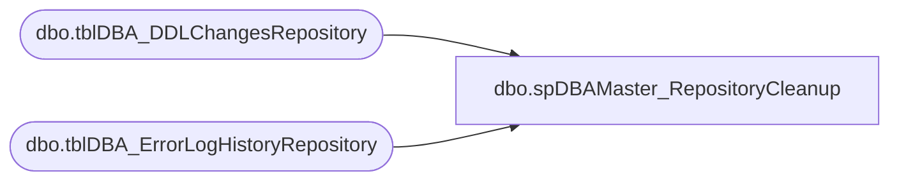

# dbo.spDBAMaster_RepositoryCleanup

**Database:** DBAUtilityMaster  
**Server:** papamart  

## Architecture Diagram



## Table Dependencies

| Referenced Table |
|---|
| dbo.tblDBA_DDLChangesRepository |
| dbo.tblDBA_ErrorLogHistoryRepository |

## Stored Procedure Code

```sql
CREATE PROC [dbo].[spDBAMaster_RepositoryCleanup]
@Action VARCHAR(20) = 'Process'
AS
-- =============================================================================================================
-- Name: spDBAMaster_RepositoryCleanup
--
-- Description:	Deletes older repository records
--
-- Output: none
-- 
-- Available actions:
-- @Action:
--	'ReturnVersion' = Do not do anything but return the version of the objects
--	'Process' = populate the object version log 

-- Dependencies: 
--  None
--
-- Revision History:
--		Mike Pelikan	11/21/2013		Created
--		Mike Pelikan	12/3/2013		Added looping so the log wouldn't fill up.
-- =============================================================================================================
DECLARE @Revision DATETIME
SET @Revision = '12/3/2013'

----------------------------------------------------------------------------------------------------
--// Set options                                                                                //--
----------------------------------------------------------------------------------------------------
SET NOCOUNT ON

----------------------------------------------------------------------------------------------------
--// Revision                                                                                  //--
----------------------------------------------------------------------------------------------------
IF @Action = 'ReturnVersion'
BEGIN
	GOTO EndHere
END

----------------------------------------------------------------------------------------------------
--// Clean Repository                                                                           //--
----------------------------------------------------------------------------------------------------

WHILE (	SELECT COUNT(*) FROM ( SELECT TOP 1 * FROM [DBAUtilityMaster].[dbo].[tblDBA_ErrorLogHistoryRepository] WHERE LogDate < DATEADD(mm, -6, GETDATE()) )q ) > 0
BEGIN
	DELETE FROM [DBAUtilityMaster].[dbo].[tblDBA_ErrorLogHistoryRepository] 
	WHERE ID IN (
		SELECT TOP 5000 ID FROM [DBAUtilityMaster].[dbo].[tblDBA_ErrorLogHistoryRepository] WHERE LogDate < DATEADD(mm, -6, GETDATE()) 
	) 
END

WHILE (	SELECT COUNT(*) FROM ( SELECT TOP 1 * FROM [DBAUtilityMaster].[dbo].[tblDBA_DDLChangesRepository] WHERE EventDate < DATEADD(mm, -6, GETDATE()) )q ) > 0
BEGIN
DELETE FROM [DBAUtilityMaster].[dbo].[tblDBA_DDLChangesRepository] 
	WHERE DDLChangeID IN (
		SELECT TOP 5000 DDLChangeID FROM [DBAUtilityMaster].[dbo].[tblDBA_DDLChangesRepository] WHERE EventDate < DATEADD(mm, -6, GETDATE()) 
	) 
END


EndHere:
IF @Action = 'ReturnVersion'
BEGIN
	SELECT @Revision 
END
```

