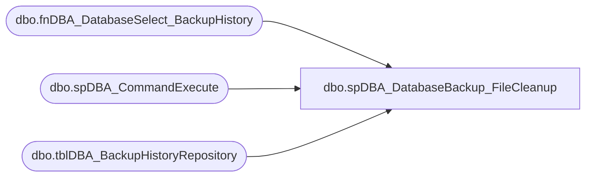

# dbo.spDBA_DatabaseBackup_FileCleanup

**Database:** DBAUtilityMaster  
**Server:** papamart  

## Architecture Diagram



## Table Dependencies

| Referenced Table |
|---|
| dbo.fnDBA_DatabaseSelect_BackupHistory |
| dbo.spDBA_CommandExecute |
| dbo.tblDBA_BackupHistoryRepository |

## Stored Procedure Code

```sql
CREATE PROC [dbo].[spDBA_DatabaseBackup_FileCleanup] 
	 @intDaysToKeep INT = -14, @Databases VARCHAR(100) = 'SYSTEM_DATABASES, USER_DATABASES', @InstanceName VARCHAR(100) = ''
AS

-- =============================================================================================================
-- Name: spDBA_DatabaseBackup_FileCleanup
--
-- Description:	Procedure to cleanup backup files as per 
--
-- Output: error logging.
-- 
-- Available actions:
--	@InstanceName: Server, Null means ALL
--	@intDaysToKeep: defaults to Retention Policy
--	@Databases:
--	E.g. SYSTEM_DATABASES
--	E.g. USER_DATABASES
--	E.g. Database1
--	E.g. Database1, Database2
--	E.g. USER_DATABASES, master
--	E.g. SYSTEM_DATABASES, -master
--	E.g. %Database%
--	E.g. %Database%, -Database1
--
-- Dependencies: 
--
-- Revision History
--		Name:			Date:			Comments:
--		Mike Pelikan	02/23/2012		Created

/*
exec spDBA_DatabaseBackup_FileCleanup @InstanceName = 'CoreDB01', @intDaysToKeep = -2
--DECLARE @intDaysToKeep INT 
--DECLARE @DatabaseName VARCHAR(100)
*/
-- =============================================================================================================

DECLARE @tmpDatabases TABLE (ID int IDENTITY PRIMARY KEY,
                           InstanceName varchar(2000), DatabaseName varchar(2000),
                           Completed bit)

SET NOCOUNT ON

---
DECLARE @CurrentCommand01 VARCHAR(MAX)
DECLARE @CurrentCommandOutput01 int
DECLARE @CurrentCommandType01 VARCHAR(MAX)

DECLARE @DatabaseName VARCHAR(100)
DECLARE @LogToTable CHAR(1)
DECLARE @Execute CHAR(1)
DECLARE @Error int
DECLARE @ReturnCode int

SET @Error = 0
SET @ReturnCode = 0		
SET @CurrentCommandType01 = 'Backup File Cleanup'
SET @LogToTable = 'Y'
SET @Execute = 'Y'

--Get databases to work with
INSERT INTO @tmpDatabases (InstanceName, DatabaseName, Completed)
SELECT InstanceName, DatabaseName AS DatabaseName, 0 AS Completed
FROM dbo.fnDBA_DatabaseSelect_BackupHistory (@Databases, @InstanceName)
ORDER BY DatabaseName ASC


--table of excluded files
DECLARE @tblExclusions TABLE (BackupName VARCHAR(1000))

--Get First backup of each year
INSERT INTO @tblExclusions (BackupName)
SELECT BackupName 
FROM DBAUtilityMaster.dbo.tblDBA_BackupHistoryRepository bhr
WHERE BackupHistoryID IN (
	SELECT MIN(BackupHistoryID)
	FROM DBAUtilityMaster.dbo.tblDBA_BackupHistoryRepository dhr
	INNER JOIN @tmpDatabases t ON dhr.InstanceName = t.InstanceName AND dhr.DatabaseName = t.DatabaseName
	--WHERE dhr.InstanceName = @InstanceName and dhr.DatabaseName IN ( SELECT DatabaseName FROM @tmpDatabases WHERE InstanceName = @InstanceName )
	GROUP BY YEAR(BackupStarted), dhr.InstanceName, dhr.DatabaseName
)
UNION ALL
--Get first backup of each quarter (within 1 year)
SELECT BackupName
FROM DBAUtilityMaster.dbo.tblDBA_BackupHistoryRepository bhr
WHERE BackupHistoryID IN (
	SELECT MIN(BackupHistoryID)
	FROM --COREDB01.
	DBAUtilityMaster.dbo.tblDBA_BackupHistoryRepository dhr 
	INNER JOIN @tmpDatabases t ON dhr.InstanceName = t.InstanceName
	GROUP BY YEAR(BackupStarted), dhr.InstanceName, dhr.DatabaseName, CASE MONTH (BackupStarted) 
	WHEN 1 THEN 1 WHEN 2 THEN 1 WHEN 3 THEN 1
	WHEN 4 THEN 2 WHEN 5 THEN 2 WHEN 6 THEN 2
	WHEN 7 THEN 3 WHEN 8 THEN 3 WHEN 9 THEN 3
	ELSE 4 END
)
AND BackupStarted > DATEADD(YY,-1,GETDATE())
AND BackupName IS NOT NULL

WHILE (
	SELECT COUNT(*)
	FROM [DBAUtilityMaster].[dbo].[tblDBA_BackupHistoryRepository] dhr
	INNER JOIN @tmpDatabases D ON dhr.InstanceName = D.InstanceName
	WHERE dhr.BackupStarted < DATEADD(DD, @intDaysToKeep, GETDATE())
	AND dhr.BackupName NOT IN (SELECT BackupName FROM @tblExclusions)
    ) > 0
BEGIN
	    
	SELECT TOP 1 @CurrentCommand01 = 'EXEC xp_cmdshell ''' + 'DEL ' + [BackupFileLocation] + '''', @DatabaseName = DatabaseName
	FROM [DBAUtilityMaster].[dbo].[tblDBA_BackupHistoryRepository] 
	WHERE BackupStarted < DATEADD(DD, @intDaysToKeep, GETDATE())
	ORDER BY [BackupFileLocation]
	
	DELETE FROM [DBAUtilityMaster].[dbo].[tblDBA_BackupHistoryRepository] 
	WHERE [BackupFileLocation] = (SELECT TOP 1 [BackupFileLocation] FROM [DBAUtilityMaster].[dbo].[tblDBA_BackupHistoryRepository] 
	WHERE BackupStarted < DATEADD(DD, @intDaysToKeep, GETDATE())
	ORDER BY [BackupFileLocation])
			
	EXECUTE @CurrentCommandOutput01 = [dbo].[spDBA_CommandExecute] @Command = @CurrentCommand01, @CommandType = @CurrentCommandType01, 
	@Mode = 1, @DatabaseName = @DatabaseName, @LogToTable = @LogToTable, @Execute = @Execute
	SET @Error = @@ERROR
	IF @Error <> 0 SET @CurrentCommandOutput01 = @Error
	IF @CurrentCommandOutput01 <> 0 SET @ReturnCode = @CurrentCommandOutput01

END	

IF @ReturnCode <> 0
BEGIN
	RETURN @ReturnCode
	--SELECT @ReturnCode
END
```

