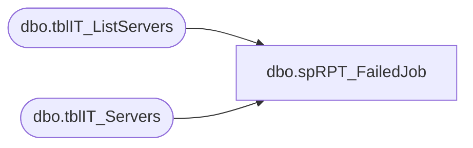

# dbo.spRPT_FailedJob

**Database:** DBAUtilityMaster  
**Server:** papamart  

## Architecture Diagram



## Table Dependencies

| Referenced Table |
|---|
| dbo.tblIT_ListServers |
| dbo.tblIT_Servers |

## Stored Procedure Code

```sql
CREATE PROC [dbo].[spRPT_FailedJob]

AS
SET NOCOUNT ON

IF OBJECT_ID('tempdb..##FailedJobs') IS NOT NULL DROP TABLE ##FailedJobs
IF OBJECT_ID('tempdb..#ServerList') IS NOT NULL DROP TABLE #ServerList

CREATE TABLE ##FailedJobs (
	ServerName VARCHAR(200) NOT NULL,
	[instance_id] [int] NULL,
	[job_id] [uniqueidentifier] NOT NULL,
	[JOB_NAME] [sysname] NOT NULL,
	[STEP_NAME] [sysname] NOT NULL,
	[run_status] [varchar](11) NULL,
	[sql_message_id] [int] NOT NULL,
	[sql_severity] [int] NOT NULL,
	[message] [nvarchar](4000) NULL,
	[exec_date] [varchar](19) NULL,
	[run_duration] [int] NOT NULL,
	[server] [sysname] NOT NULL,
	[output_file_name] [nvarchar](200) NULL
)

DECLARE @ServerN AS VARCHAR(100)
DECLARE @strSQL NVARCHAR(1000)


SELECT s.ServerName
INTO #ServerList
FROM DBAUtilityMaster.dbo.tblIT_ListServers ls
INNER JOIN DBAUtilityMaster.dbo.tblIT_Servers s ON ls.ServerID = s.ServerID
WHERE ls.ListID = 2

DELETE FROM #ServerList WHERE ServerName IN ('BEARWEBDB', 'CHESAPEAKE', 
'OURSMIEL', 'OURSPIPE01', 'PANDA', 'PARTYDB', 'TRIPWIRE01', 'VWDBCLUSTER03', 'WMDB01', 'WMETL01', 'WMPMDB01'   )

WHILE (SELECT COUNT(*) FROM #ServerList) > 0
BEGIN
	SELECT TOP 1 @ServerN = ServerName FROM #ServerList ORDER BY 1
	PRINT @ServerN
	
	SET @strSQL = 'INSERT INTO ##FailedJobs SELECT ''' + @ServerN + ''' ServerName, * from [' + @ServerN + '].DBAUtility.dbo.vwDBA_Failed_Jobs'
	EXEC master.dbo.sp_executesql @strSQL
	DELETE FROM #ServerList WHERE ServerName = @ServerN
	
END

SELECT * FROM ##FailedJobs
dbo,spRPT_ServerMonitorStatus,--USE [DBAUtilityMaster]
--GO
--/****** Object:  StoredProcedure [dbo].[spRPT_ServerMonitorStatus]    Script Date: 03/19/2012 09:32:14 ******/
--SET ANSI_NULLS ON
--GO
--SET QUOTED_IDENTIFIER ON
--GO
CREATE PROC [dbo].[spRPT_ServerMonitorStatus]
AS
SET NOCOUNT ON 
--SELECT ServerName, MIN(GroupName) GroupName, MonitoringTool, monitor, [object], Health
--FROM
--(
	SELECT REPLACE(qry.GroupMembers, '.buildabear.com', '') ServerName, qry.GroupName, 
	'SCOM' MonitoringTool, mon.displayName as monitor, --bme.FullName, 
	bme.DisplayName as object, 
	CASE 
	WHEN s.HealthState = 1 THEN 'Healthy'
	WHEN s.HealthState = 2 THEN 'Warning'
	WHEN s.HealthState = 3 THEN 'Critical'
	ELSE 'N/A'
	END as Health 
	FROM SCSTLOMDB01.OperationsManager.dbo.state AS s WITH (NOLOCK)
	LEFT JOIN SCSTLOMDB01.OperationsManager.dbo.BaseManagedEntity as bme WITH (NOLOCK) on s.basemanagedentityid = bme.basemanagedentityid
	LEFT JOIN SCSTLOMDB01.OperationsManager.dbo.MonitorView Mon WITH (NOLOCK) on Mon.ID = s.monitorid 
	INNER JOIN (
		SELECT MIN(SourceMonitoringObjectDisplayName ) 'GroupName', 
		TargetMonitoringObjectDisplayName  'GroupMembers' 
		FROM SCSTLOMDB01.OperationsManager.dbo.RelationshipGenericView 
		WHERE isDeleted=0  
		AND SourceMonitoringObjectDisplayName IN ('IderaDM-Monitored SQL servers','Non-Monitored SQL Servers', 'SQL 2000 Computers', 'SQL 2008 Computers', 'SQL Server 2005 Computers')
		--AND TargetMonitoringObjectDisplayName NOT IN 
		--(
		--	SELECT TargetMonitoringObjectDisplayName 
		--	FROM SCSTLOMDB01.OperationsManager.dbo.RelationshipGenericView 
		--	WHERE SourceMonitoringObjectDisplayName IN ('IderaDM-Monitored SQL servers', 'Monitor Exclusion Group')
		--)	
		GROUP BY TargetMonitoringObjectDisplayName
	) qry ON bme.Path = qry.GroupMembers
	WHERE s.HealthState <> 0 AND mon.IsInternalRollupMonitor = 0 AND mon.IsExternalRollupMonitor = 0
	--UNION ALL
	--SELECT REPLACE(qry.GroupMembers, '.buildabear.com', '') ServerName, qry.GroupName, 
	--'SCOM' MonitoringTool, mon.displayName as monitor, --bme.FullName, 
	--bme.DisplayName as object, 
	--CASE 
	--WHEN s.HealthState = 1 THEN 'Healthy'
	--WHEN s.HealthState = 2 THEN 'Warning'
	--WHEN s.HealthState = 3 THEN 'Critical'
	--ELSE 'N/A'
	--END as Health 
	--FROM SCSTLOMDB01.OperationsManager.dbo.state AS s WITH (NOLOCK)
	--LEFT JOIN SCSTLOMDB01.OperationsManager.dbo.BaseManagedEntity as bme WITH (NOLOCK) on s.basemanagedentityid = bme.basemanagedentityid
	--LEFT JOIN SCSTLOMDB01.OperationsManager.dbo.MonitorView Mon WITH (NOLOCK) on Mon.ID = s.monitorid 
	--INNER JOIN (
	--	SELECT MIN(SourceMonitoringObjectDisplayName) 'GroupName', 
	--	TargetMonitoringObjectDisplayName 'GroupMembers' 
	--	from SCSTLOMDB01.OperationsManager.dbo.RelationshipGenericView 
	--	where isDeleted=0  
	--	AND SourceMonitoringObjectDisplayName IN ('IderaDM-Monitored SQL servers')
	--	--AND TargetMonitoringObjectDisplayName NOT IN 
	--	--(
	--	--	SELECT TargetMonitoringObjectDisplayName 
	--	--	FROM SCSTLOMDB01.OperationsManager.dbo.RelationshipGenericView 
	--	--	WHERE SourceMonitoringObjectDisplayName IN ('SQL 2000 Computers', 'SQL 2008 Computers', 'SQL Server 2005 Computers','Monitor Exclusion Group')
	--	--)	
	--	GROUP BY TargetMonitoringObjectDisplayName
	--) qry ON bme.Path = qry.GroupMembers
	--WHERE s.HealthState <> 0 AND mon.IsInternalRollupMonitor = 0 AND mon.IsExternalRollupMonitor = 0
	UNION ALL
	SELECT REPLACE(TargetMonitoringObjectDisplayName , '.buildabear.com', '') ServerName, 
		SourceMonitoringObjectDisplayName 'GroupMembers', '' MonitoringTool, 'N/A' Monitor, 'N/A' [Object], 'N/A' Health
		FROM SCSTLOMDB01.OperationsManager.dbo.RelationshipGenericView 
		WHERE isDeleted=0 AND SourceMonitoringObjectDisplayName IN ('Monitor Exclusion Group')
	UNION ALL
	SELECT A.ServerName COLLATE SQL_Latin1_General_CP1_CI_AS as InstanceName, 
	'IderaDM-Monitored SQL servers' GroupName, 'Idera' MonitoringTool, 
	A.Heading COLLATE SQL_Latin1_General_CP1_CI_AS monitor, A.ServerName COLLATE SQL_Latin1_General_CP1_CI_AS [object], CASE A.Severity WHEN 8 THEN 'Critical' WHEN 4 THEN 'Warning' Else 'Healthy' END Status

	--FROM MAMAMART.SQLdmRepository.dbo.MonitoredSQLServers  S (NOLOCK)    
	FROM SQLdmRepository.dbo.MonitoredSQLServers  S (NOLOCK)    
	--LEFT JOIN MAMAMART.SQLdmRepository.dbo.Alerts A (NOLOCK) on A.ServerName collate database_default = S.InstanceName collate database_default and 
	LEFT JOIN SQLdmRepository.dbo.Alerts A (NOLOCK) on A.ServerName collate database_default = S.InstanceName collate database_default and 
		A.UTCOccurrenceDateTime = S.LastScheduledCollectionTime 
	--LEFT JOIN MAMAMART.SQLdmRepository.dbo.MetricThresholds T (nolock) on S.[SQLServerID] = T.[SQLServerID] and A.[Metric] = T.[Metric]
	LEFT JOIN SQLdmRepository.dbo.MetricThresholds T (nolock) on S.[SQLServerID] = T.[SQLServerID] and A.[Metric] = T.[Metric]
	WHERE (T.[UTCSnoozeEnd] is null or T.[UTCSnoozeEnd] < GETDATE())     
	AND S.Active = 1 AND A.Active = 1     
	AND S.SQLServerID <> 25 --Oursmerchdb01 
--) tbl
--GROUP BY ServerName, MonitoringTool, monitor, [object], Health
```

