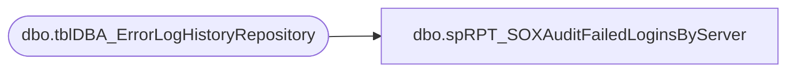

# dbo.spRPT_SOXAuditFailedLoginsByServer

**Database:** DBAUtilityMaster  
**Server:** papamart  

## Architecture Diagram



## Table Dependencies

| Referenced Table |
|---|
| dbo.tblDBA_ErrorLogHistoryRepository |

## Stored Procedure Code

```sql
/****** Script for SelectTopNRows command from SSMS  ******/
CREATE PROCEDURE [dbo].[spRPT_SOXAuditFailedLoginsByServer]
@dteStart DATETIME = NULL, @dteEnd DATETIME = NULL, @ServerName varchar(100) = NULL
AS
-----------------------------------------------------------------------------------------------------------
--Description: Proc used as source for SOX SQL Role Security Audit report.
--
--Revisions
--	MikeP		20130417		Removed BNHDB01, added EntSCDB01
--  TimB		11/24/2015		Updated Instance Name List
--  TimB		03/16/2016		Updated Instance Name List

-----------------------------------------------------------------------------------------------------------
SET NOCOUNT ON 

SET @dteStart = ISNULL(@dteStart, DATEADD(MONTH, DATEDIFF(MONTH, 0, GETDATE()) - 1, 0))
SET @dteEnd = ISNULL(@dteEnd, DATEADD(MILLISECOND, -3, DATEADD(MONTH, DATEDIFF(MONTH, 0, GETDATE()), 0)))

SELECT [InstanceName]
      ,[LogType]
      ,[LogDate]
      ,[ProcessInfo]
      ,[MessageText]
      ,[InsertDate]
      ,@dteStart StartDate
      ,@dteEnd EndDate
  FROM [DBAUtilityMaster].[dbo].[tblDBA_ErrorLogHistoryRepository] (NOLOCK)
   WHERE InstanceName IN ('BEDROCKDB01', 'BEDROCKDB02')
  AND LogType = 'SQL Server'
  AND MessageText LIKE 'Login Failed%'
  AND [LogDate] BETWEEN @dteStart AND @dteEnd
  and InstanceName=@ServerName
  ORDER BY InstanceName, LogDate
```

