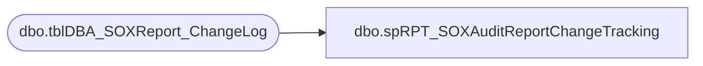

# dbo.spRPT_SOXAuditReportChangeTracking

**Database:** DBAUtilityMaster  
**Server:** papamart  

## Architecture Diagram



## Table Dependencies

| Referenced Table |
|---|
| dbo.tblDBA_SOXReport_ChangeLog |

## Stored Procedure Code

```sql
CREATE PROCEDURE [dbo].[spRPT_SOXAuditReportChangeTracking] 
@strYear CHAR(4), @strQuarter CHAR(2)
AS
SET NOCOUNT ON

SELECT ChangeDate, ChangeDescription
FROM DBAUtilityMaster.dbo.tblDBA_SOXReport_ChangeLog
WHERE RunYear = @strYear AND RunQuarter = @strQuarter
ORDER BY 1, 2
```

