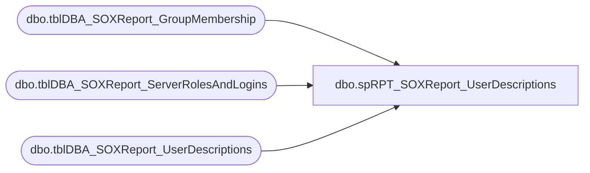

# dbo.spRPT_SOXReport_UserDescriptions

**Database:** DBAUtilityMaster  
**Server:** papamart  

## Architecture Diagram



## Table Dependencies

| Referenced Table |
|---|
| dbo.tblDBA_SOXReport_GroupMembership |
| dbo.tblDBA_SOXReport_ServerRolesAndLogins |
| dbo.tblDBA_SOXReport_UserDescriptions |

## Stored Procedure Code

```sql
CREATE PROCEDURE [dbo].[spRPT_SOXReport_UserDescriptions]
@strYear CHAR(4), @strQuarter CHAR(2), @strServerName VARCHAR(50)
AS


--DECLARE @strYear CHAR(4), @strQuarter CHAR(2), @strServerName VARCHAR(50)
--SELECT @strYear = '2012', @strQuarter = 'Q2', @strServerName = 'CHESAPEAKE'

SET NOCOUNT ON
DECLARE @RunDate DATE

SELECT @RunDate = CONVERT(DATE, MAX(RunDate))  
FROM DBAUtilityMaster.dbo.tblDBA_SOXReport_ServerRolesAndLogins 
WHERE RunYear = @strYear AND RunQuarter = @strQuarter AND InstanceName = @strServerName 

 
SELECT distinct srl.name, ud.Description, grp.MemberName
FROM DBAUtilityMaster.dbo.tblDBA_SOXReport_ServerRolesAndLogins srl
LEFT JOIN DBAUtilityMaster.dbo.tblDBA_SOXReport_UserDescriptions ud ON srl.name = ud.UserName
LEFT JOIN --Group Members
(
	SELECT GroupName, CHAR(9) + CHAR(9) + CHAR(9) + MemberName MemberName, InstanceName
	FROM DBAUtilityMaster.dbo.tblDBA_SOXReport_GroupMembership
	WHERE RunDate = @RunDate
) grp ON ud.UserName = grp.GroupName AND srl.InstanceName = grp.InstanceName
WHERE RunYear = @strYear AND RunQuarter = @strQuarter AND srl.InstanceName = @strServerName 
AND CONVERT(DATE, RunDate) = @RunDate
ORDER BY 1
```

