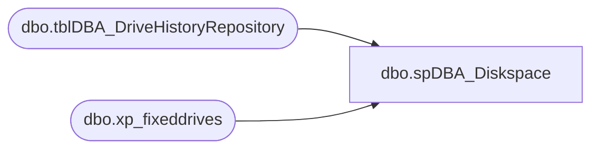

# dbo.spDBA_Diskspace

**Database:** DBAUtility_new  
**Server:** papamart  

## Architecture Diagram



## Table Dependencies

| Referenced Table |
|---|
| dbo.tblDBA_DriveHistoryRepository |
| dbo.xp_fixeddrives |

## Stored Procedure Code

```sql
CREATE PROCEDURE [dbo].[spDBA_Diskspace] 
@Action VARCHAR(100) = 'Process'
AS
-- =============================================================================================================
-- Name: spDBA_Diskspace
--
-- Description:	Checks free diskspace and write to a table
--
-- Output: Optional error logging.
-- Available actions:
--	
--
-- Dependencies: 
--
-- Revision History
--		Name:			Date:			Comments:
--		Gary Derikito	04/20/2009		Created based on SQL Server article http://www.sqlmag.com/Articles/ArticleID/100178/pg/2/2.html
--		Gary Derikito	05/14/2009		Modify to write resutls directly to repository.
--		Mike Pelikan	06/19/2012		Changed Repository and added versioning
--		Mike Pelikan	06/26/2012		added portion for SQL above > 2000 to use fsutil
--		Mike Pelikan	01/12/2014		made xp_cmdshell lower case.

DECLARE @Revision DATETIME
SET @Revision = '01/12/2014'
 	
/*
EXECUTE spDBA_Diskspace

*/
-- =============================================================================================================


SET NOCOUNT ON
----------------------------------------------------------------------------------------------------
--// Revision Return		                                                                    //--
----------------------------------------------------------------------------------------------------
IF @Action = 'ReturnVersion' GOTO Logging

----------------------------------------------------------------------------------------------------
IF  CAST(LEFT(CAST(SERVERPROPERTY('ProductVersion') AS VARCHAR(100)), 4) AS NUMERIC(5,3)) < 9
BEGIN

	DECLARE @hr int
	DECLARE @fso int
	DECLARE @drive VARCHAR(10)
	DECLARE @odrive int
	DECLARE @TotalSize varchar(20)
	DECLARE @MB float
	SET @MB = 1048576
	DECLARE @PercentFree int
	DECLARE @FreeSpace int

	DECLARE @date varchar(40)
	SET @date = convert(varchar, getdate(), 109)

	-- this table must exist locally or the remote query will fail
	IF (Object_ID('tempdb..##drives') IS NOT NULL) DROP TABLE ##drives
	CREATE TABLE ##drives (
		drive char(1) PRIMARY KEY,
		FreeSpace int NULL,
		TotalSize int NULL,
		PercentFree	int null,
		DateStamp	datetime)

	--truncate table dbo.drives

	INSERT into ##drives(drive,FreeSpace)
	EXEC master.dbo.xp_fixeddrives

	EXEC @hr=sp_OACreate 'Scripting.FileSystemObject',@fso OUT

	IF @hr <> 0 EXEC sp_OAGetErrorInfo @fso
	DECLARE dcur CURSOR LOCAL FAST_FORWARD
	FOR SELECT drive, FreeSpace from ##drives
	ORDER by drive
	OPEN dcur
	FETCH NEXT FROM dcur INTO @drive, @FreeSpace
	WHILE @@FETCH_STATUS=0
	BEGIN
		EXEC @hr = sp_OAMethod @fso,'GetDrive', @odrive OUT, @drive
		IF @hr <> 0 EXEC sp_OAGetErrorInfo @fso

		EXEC @hr = sp_OAGetProperty @odrive,'TotalSize', @TotalSize OUT
		IF @hr <> 0 EXEC sp_OAGetErrorInfo @odrive

		-- do the percentfree first!!
		set @PercentFree = @FreeSpace/(cast(@TotalSize as float)/@MB)* 100
		set @TotalSize = floor(@TotalSize/@MB)


		INSERT INTO COREDB01_MAINT.DBAUtilityMaster.dbo.tblDBA_DriveHistoryRepository (InstanceName, Drive, FreeSpace, TotalSize, PercentFree, ExecutionTime) 
		VALUES( @@servername, @drive, cast(@FreeSpace as varchar), @TotalSize, cast(@PercentFree as varchar),@date) 
			
		FETCH NEXT FROM dcur INTO @drive, @FreeSpace
	END
	CLOSE dcur
	DEALLOCATE dcur
END
ELSE
BEGIN
	DECLARE @varSQL varchar(1000), @varDrive VARCHAR(10)

	CREATE TABLE #tmpDriveSpaceInfo
	(drive varchar(10),
	xpFixedDrive_FreeSpace_MB bigint,
	FSutil_FreeSpace_Bytes integer,
	FSutil_Space_Bytes integer,
	FSutil_AvailSpace_Bytes integer	
	)

	CREATE TABLE #tmpFSutilDriveSpaceInfo
	(drive varchar(10),
	info varchar(50)
	)

	INSERT INTO #tmpDriveSpaceInfo (drive, xpFixedDrive_FreeSpace_MB)
	EXEC master..xp_fixeddrives

	DECLARE CUR_DriveLooper CURSOR FOR SELECT drive FROM #tmpDriveSpaceInfo

	OPEN CUR_DriveLooper
	FETCH NEXT FROM CUR_DriveLooper INTO @varDrive
	WHILE @@FETCH_STATUS = 0
	BEGIN
		SET @varSQL = 'EXEC master..xp_cmdshell' + ''''+ 'fsutil volume diskfree ' + @varDrive + ':' + ''''

		INSERT INTO #tmpFSutilDriveSpaceInfo (info)
		EXEC(@varSQL)
		UPDATE #tmpFSutilDriveSpaceInfo SET drive = @varDrive WHERE drive IS NULL
		FETCH NEXT FROM CUR_DriveLooper INTO @varDrive
	END

	DELETE FROM #tmpFSutilDriveSpaceInfo WHERE info IS NULL

	SELECT drive,
	ltrim(rtrim(left(info,29))) as InfoType,
	ltrim(rtrim(substring (info, charindex (':',info) + 2, 20))) as Size_Bytes
	INTO #tmpFSutilDriveSpaceInfo_Fixed
	FROM #tmpFSutilDriveSpaceInfo

	INSERT INTO COREDB01_MAINT.DBAUtilityMaster.dbo.tblDBA_DriveHistoryRepository (InstanceName, Drive, FreeSpace, TotalSize, PercentFree, ExecutionTime) 
	SELECT @@servername, a.drive,
	a.xpFixedDrive_FreeSpace_MB,
	(SELECT cast(Size_Bytes as bigint) FROM #tmpFSutilDriveSpaceInfo_Fixed WHERE drive = a.drive and InfoType = 'Total # of bytes')/1048576 AS FSutil_TotalSpace_MB,
	a.xpFixedDrive_FreeSpace_MB/((SELECT cast(Size_Bytes as bigint) FROM #tmpFSutilDriveSpaceInfo_Fixed WHERE drive = a.drive and InfoType = 'Total # of bytes')/1048576)* 100,
	GETDATE()	
	FROM #tmpDriveSpaceInfo a


	CLOSE CUR_DriveLooper
	DEALLOCATE CUR_DriveLooper
	DROP TABLE #tmpFSutilDriveSpaceInfo
	DROP TABLE #tmpDriveSpaceInfo
	DROP TABLE #tmpFSutilDriveSpaceInfo_Fixed
END
Logging:
IF @Action = 'ReturnVersion'
BEGIN
	SELECT @Revision
END
```

