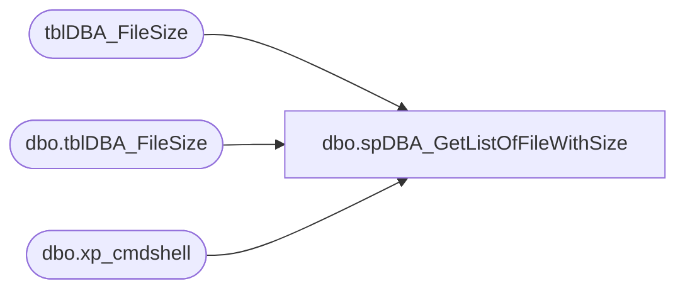

# dbo.spDBA_GetListOfFileWithSize

**Database:** DBAUtility_new  
**Server:** papamart  

## Architecture Diagram



## Table Dependencies

| Referenced Table |
|---|
| tblDBA_FileSize |
| dbo.tblDBA_FileSize |
| dbo.xp_cmdshell |

## Stored Procedure Code

```sql
CREATE PROCEDURE   [dbo].[spDBA_GetListOfFileWithSize]   
( 
    @Dir    VARCHAR(1000)
) 
AS 
-- =============================================================================================================
-- Name: spDBA_GetListOfFileWithSize
--
-- Description:	Gets List of Files with Sizes

-- Available actions:
--	
-- Dependencies: 
--
----------------------------------------------------------------------------------------------------
--// Original Source: http://stackoverflow.com/questions/7952406/get-each-file-size-inside-a-folder-using-sql                                                     //--
----------------------------------------------------------------------------------------------------
--
-- Revision History
--		Name:			Date:			Comments:
--		Mike Pelikan	02/10/2012		Created based on script from http://stackoverflow.com/questions/7952406/get-each-file-size-inside-a-folder-using-sql  
--		Mike Pelikan	04/09/2012		Updated version number to show correction using global temp table
--		Mike Pelikan	05/14/2012		Corrected Capitilaztion of @Counter for case sensitive servers
--		Mike Pelikan	05/16/2012		Corrected more Capitilaztion of for case sensitive servers
--										Added logic to return version date of backup script if @Databases = 'ReturnVersion'
--		Mike Pelikan	05/24/2012		Added Last Modified Date
--		Mike Pelikan	06/06/2012		Added case statement to correct for older systems returning date times with out m on am or pm
--		Mike Pelikan	06/14/2012		Converted temp table to perm table.
--		Mike Pelikan	06/17/2012		Got last reference to temp table

DECLARE @Revision DATETIME
SET @Revision = '06/17/2012'
--

SET NOCOUNT ON 

----------------------------------------------------------------------------------------------------
--// Revision Return		                                                                    //--
----------------------------------------------------------------------------------------------------
IF @Dir = 'ReturnVersion' GOTO Logging

--------------------------------------------------------------------------------------------- 
-- Variable decleration 
--------------------------------------------------------------------------------------------- 
    declare @curdir nvarchar(400) 
    declare @line varchar(400) 
    declare @command varchar(400) 
    declare @Counter int 
 
    DECLARE @1MB    DECIMAL 
    SET     @1MB = 1024 * 1024 
 
    DECLARE @1KB    DECIMAL 
    SET     @1KB = 1024  
 
--------------------------------------------------------------------------------------------- 
-- Temp tables creation 
--------------------------------------------------------------------------------------------- 
CREATE TABLE #dirs (DIRID int identity(1,1), directory varchar(400)) 
CREATE TABLE #tempFilePaths (Files VARCHAR(500)) 
CREATE TABLE #tempFileInformation (FilePath VARCHAR(500), FileSize VARCHAR(100), ModifiedDate DATETIME) 
 
--------------------------------------------------------------------------------------------- 
-- Cleanup
---------------------------------------------------------------------------------------------  
DELETE FROM DBAUtility.dbo.tblDBA_FileSize 
FROM DBAUtility.dbo.tblDBA_FileSize fs
LEFT JOIN master.dbo.sysprocesses sp ON fs.Process = sp.spid AND fs.UserName = sp.loginame COLLATE SQL_Latin1_General_CP1_CI_AS

--------------------------------------------------------------------------------------------- 
-- Call xp_cmdshell 
---------------------------------------------------------------------------------------------     
 
     SET @command = 'dir "'+ @Dir +'" /S/O/B/A:D' 
     INSERT INTO #dirs exec master.dbo.xp_cmdshell @command 
     INSERT INTO #dirs SELECT @Dir 
     SET @Counter = (select count(*) from #dirs) 
 
--------------------------------------------------------------------------------------------- 
-- Process the return data 
---------------------------------------------------------------------------------------------       
        WHILE @Counter <> 0 
          BEGIN 
            DECLARE @filesize INT 
            SET @curdir = (SELECT directory FROM #dirs WHERE DIRID = @Counter) 
            SET @command = 'dir "' + @curdir +'"' 
            ------------------------------------------------------------------------------------------ 
                -- Clear the table 
                DELETE FROM #tempFilePaths 
                INSERT INTO #tempFilePaths 
                EXEC master.dbo.xp_cmdshell @command  
 
                --delete all directories 
                DELETE #tempFilePaths WHERE Files LIKE '%<dir>%' 
				
				--delete File Not Found
				DELETE #tempFilePaths WHERE Files = 'File Not Found'
				
                --delete all informational messages 
                DELETE #tempFilePaths WHERE Files LIKE ' %' 
 
                --delete the null values 
                DELETE #tempFilePaths WHERE Files IS NULL 
 
                --get rid of dateinfo 
                --UPDATE #tempFilePaths SET Files =RIGHT(Files,(LEN(Files)-20)) 
 
                --get rid of leading spaces 
                UPDATE #tempFilePaths SET Files =LTRIM(Files) 
 
                --split data into size and filename 
                ---------------------------------------------------------- 
                -- Clear the table 
                DELETE FROM #tempFileInformation; 
 
                -- Store the FileName & Size 
                INSERT INTO #tempFileInformation 
                SELECT   
                        RIGHT (Files, PATINDEX('% %', REVERSE(Files)))
                        AS FilePath, 
                        REPLACE(LTRIM(RTRIM(SUBSTRING (Files,21, LEN(Files) -20 -PATINDEX('% %', REVERSE(Files))))), ',','')  AS FileSize, 
                        CASE RIGHT(LTRIM(RTRIM(SUBSTRING(Files, 0, 21))),1) 
                        WHEN 'a' THEN LTRIM(RTRIM(SUBSTRING(Files, 0, 21))) + 'm'
                        WHEN 'p' THEN LTRIM(RTRIM(SUBSTRING(Files, 0, 21))) + 'm' 
						ELSE LTRIM(RTRIM(SUBSTRING(Files, 0, 21)))
                        END ModifiedDate
                        
                FROM    #tempFilePaths 
              
                -------------------------------------------------------------- 
                -- Store the results in the output table 
                -------------------------------------------------------------- 
 
                INSERT INTO tblDBA_FileSize(Process, UserName, Directory, FilePath, SizeInMB, SizeInKB, ModifiedDate)
                SELECT  @@SPID, SYSTEM_USER, 
                        @curdir, 
                        FilePath, 
                        CAST(CAST(FileSize AS DECIMAL(13,2))/ @1MB AS DECIMAL(13,2)), 
                        CAST(CAST(FileSize AS DECIMAL(13,2))/ @1KB AS DECIMAL(13,2)),
                        ModifiedDate 
                FROM    #tempFileInformation 
 
            -------------------------------------------------------------------------------------------- 
 
 
            Set @Counter = @Counter -1 
           END 
 
 
    DELETE FROM DBAUtility.dbo.tblDBA_FileSize WHERE Directory is null        
---------------------------------------------- 
-- DROP temp tables 
----------------------------------------------            
DROP TABLE #dirs   
DROP TABLE #tempFilePaths   
DROP TABLE #tempFileInformation   
 
 
Logging:
	IF @Dir = 'ReturnVersion'
	BEGIN
		SELECT @Revision 
	END
```

